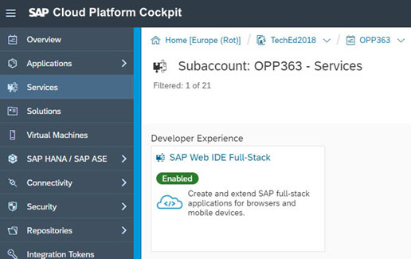
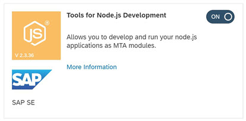
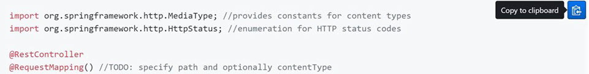

- - - -
Next Exercise: [Exercise 02 What is Org and Space CF](../Exercise-02-What-is-OrgandSpace-CF)

[Back to the Overview](../README.md)
- - - -
# Setup

## 1. SAP Web IDE Full-Stack
The primary development tool for this hands-on is [SAP Web IDE Full Stack](https://help.sap.com/viewer/825270ffffe74d9f988a0f0066ad59f0/CF/en-US/c175c03da2534e4b9b3ea28687f6cb0a.html) - a browser-based IDE to easily develop, test, build, deploy, and extend role-based, consumer-grade apps for business users. For the sake of simplicity, we will refer the SAP Web IDE Full-Stack tooling as Web IDE Full-stack or simply Web IDE in the current documentation.

In order to use Web IDE Full-Stack, you would normally need to configure the service and assign  appropriate authorizations, etc. For the purposes of this session, the user account provided by the instructor to you is preconfigured to access the Web IDE tooling.

Access Web IDE Full-Stack by simply [clicking here](https://webidecp-aevblwuamw.dispatcher.hana.ondemand.com/) and using the login information provided to you.

If for some reason, the above link for accessing Web IDE Full-Stack does not work, please follow these steps:
1. [Click here](https://account.hana.ondemand.com/cockpit) to open your SAP Cloud Platform cockpit and go to _Services-Web IDE Full-Stack_

2. Launch Web IDE Full-Stack by clicking on the tile for  _SAP Web IDE Full-Stack_, followed by clicking on the link for _Go to Service_.

3. Notice that when you try to access Web IDE Full-Stack, you will be prompted to log on again. This is because the subaccount you are using is configured to use a dedicated identity provider (IDP) set up for the purposes of TechEd `teched20.accounts.ondemand.com`. Log on with the same username and password information provided to you.

## 2. Configure Cloud Foundry
Before proceeding with development, we will need to configure our workspace for Cloud Foundry. We will need to assign a space for our development.

1. Open Web IDE Full Stack and _Click Preferences_ (the gear icon at the bottom on the left hand side or by following the menu option _Tools - Preferences_).
2. Choose _Workspace Preferences - Cloud Foundry_ 

3. Select the API Endpoint https://api.cf.eu10.hana.ondemand.com 
4. Enter your User Name and password when prompted to log on to Cloud Foundry
4. Verify that the Organization is set to `TechEd2018_OPP363` and the Space is set to `OPP363_SPACE_XX` (where XX is the student number assigned to you)
5. Click _Install Builder_
6. Click _Save_

## 3. Enable Web IDe Full-Stack Features

We will be using additional Web IDE features that are not enabled by default. The following steps describe how to enable specific features as required.

1. Open Web IDE Full Stack and _Click Preferences_ (the gear icon at the bottom on the left hand side or by following the menu option _Tools - Preferences_).
2. Choose _Workspace Preferences - Features_ 

3. Search for **SAP HANA Database Explorer** 

4. Set to _ON_
5. Click _Save_
6. Click Refresh to reload SAP Web IDE for the changes to take effect. 
7. Verify that the feature has been enabled by making sure the database explorer button is in the left-hand toolbar.
8. Repeat these steps to enable the Tools for Node.js Development. 

## 4. Simplify the Copying of Code Blocks from GitHub
Many of the exercises you will complete during the course of this session will require you to copy large blocks of code from the REAMME.md documentation files. To make this easier and reduce the risk of copy-paste errors in your code, you can install a simple add-on for Chrome called _Tampermonkey_ and then a GitHub-specific user script to provide you with a copy to clipboard button for the code blocks in the exercises.

1. Open your Chrome browser.
2. Open the URL https://chrome.google.com/webstore/detail/tampermonkey/dhdgffkkebhmkfjojejmpbldmpobfkfo?hl=en-US - this is the Tampermonkey extension.
3. Click _Add to Chrome_.
4. When the extension has been added to Chrome, close all browser windows and open Chrome again.
5. You should see the TamperMonkey toolabat button in the top right of your browser.

5. Opn the URL https://raw.githubusercontent.com/Mottie/GitHub-userscripts/master/github-copy-code-snippet.user.js to install the _ Github copy code snippet_ user script.

6. Restart Chrome. During the exercises, you should see the copy to clipboard icon when you hover your mouse over the code blocks.

This completes the system setup for your exercises.
- - - -
© 2018 SAP SE
- - - -
Next Exercise: [Exercise 02 What is Org and Space CF](../Exercise-02-What-is-OrgandSpace-CF)

[Back to the Overview](../README.md)
- - - -

