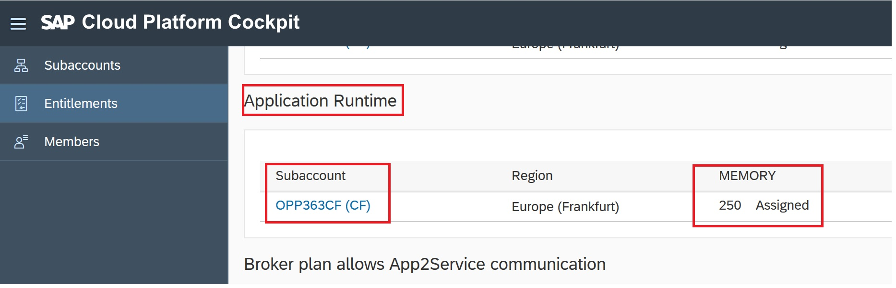

- - - -
Next Exercise: [Exercise 2 - Setup](../Exercise-02-Setup)

[Back to the Overview](../README.md)
- - - -

# Exercise 01 - Gain Basic Understanding of the Account Structure on SAP Cloud Platform

## Introduction 
In rest of the exercises, you will encounter various terms such as Global Account, Subaccount, Quota, Organization, Spaces, API endpoint, Applications and Services. The purpose of the current exercise is to help you get familiar with the terminology and the overall Account structure in SAP Cloud Platform. As such, the current exercise is not essential for completing the rest of the exercises. 

1.	When you login to [SAP Cloud Platform cockpit](https://account.eu1.hana.ondemand.com/cockpit#/home/allaccounts) with your student credentials, you will see the home page which has a listing of Global Accounts. For the purpose of the current exercise, you will see a single Global Account listed - TechEd2018.

Global Accounts: When a Customer or Partner purchases a license for SAP Cloud Platform, they are provided with a Global Account, which represents the scope of the functionality and the level of support based on their entitlement to the platform resources and services. 
A Global Account can contain one or more Subaccounts. 

2.	On the left side you will see the regions on which SAP Cloud Platform is available, description of Services that can be used and different notifications.  

3.	Click on the link with text _TechEd2018_. 

4.	You will see two tiles for the two Subaccounts that are preconfigured for you:
- OPP363 is a Subaccount in the SAP Cloud Platform Neo environment 
- OPP363CF is a Subaccount in the SAP Cloud Platform Cloud Foundry environment

The entitlement of resources (e.g. memory, diskspace) listed for the Global Account are allocated to the Subaccounts, and it is the Subaccounts  in which you deploy applications, use services, and manage your subscriptions. In a typical customer account, you may see several Subaccounts created for the different phases of application lifecycle e.g. Dev, QA and Production, or for the different lines of busineses, etc. You can find more information on this topic in this [help guide](https://help.sap.com/viewer/e275296cbb1e4d5886fa38a2a2c78c06/Cloud/en-US/c165d95ee700407eb181770901caec94.html?q=global%20accounts) 

The exercises of the current hands-on are designed to use the Subaccount in the Cloud Foundry environment -- OPP363CF (represented by the tile on the right side). 

There are different environments in SAP Cloud Platform. See the help guide to know more about the [environments in SAP Cloud Platform](https://help.sap.com/viewer/65de2977205c403bbc107264b8eccf4b/Cloud/en-US/ab512c3fbda248ab82c1c545bde19c78.html).  At any point, you can refer to the links in the cockpit for more information.

5.	In the left panel, in addition to Subaccounts, you will also see links for _Entitlements_ and _Members_ of your Global account.

6.	Click on _Entitlements_ to see the resources available for the Global account and to which subaccount those resources are assigned. Scroll below to the section for _Application Runtime_ and check the overall memory assigned to the Subaccount _OPP363CF_.

7.	Click on the link for _Subaccounts_ on the top in the left panel to go back to the listing of Subaccounts.

8.	Click on the link for _OPP363CF_ (in the right tile) to go the Overview page for this Subaccount.

9.	On right you can see the API endpoint and subaccount details. This is the API endpont that was used for SAP Web IDE Full-Stack  configuration in the previous exercise. 

API Endpoint: The API endpoint, or target URL, for your Cloud Foundry instance is the URL of the Cloud Controller. More information on our [help guide](https://help.sap.com/viewer/65de2977205c403bbc107264b8eccf4b/Cloud/en-US/350356d1dc314d3199dca15bd2ab9b0e.html)

10.	On the left, you will see variou menu options: _Oveview, Spaces, Connectivity, Security, Quota Plans, Usage Analytics and Members_. You may spend a few minutes to browse and get familiar with these areas. 

For the current hands-on exercise, you may have to repeatedly visit the _Spaces_ link

11.	Click on Spaces. 

12.	You should see a single _Space_ pre-configured for you, along with the _Space_ related information like the number of started and stopped applications, number of members, and Quota assigned for the _Space_.

Note that the resources allocated to the _Subaccount OPP363CF_ are further divided into multiple spaces. Each participant is provided with an isolated _Space_ for his / her application development, deployment and maintenance needs. For further information, please check out the [help guide](https://help.sap.com/viewer/e275296cbb1e4d5886fa38a2a2c78c06/Cloud/en-US/8426b2c65ebe4b1fa3ad9e1e571a2f28.html) 

Make sure you have the available resources as noted in the above picture. 

13.	Click on your _Space_ name.  

Note that the trailing number in your _Space_ name will be different from what is displayed in the above picture.

14.	This is the overview page of the _Space_. 

15.	On the left, you can see links for Applications, Services and other entities. By default, Applications option (the first in the list) should be selected and on the right side, you should see a list of deployed applicatoins. Since you may not have deployed any applications yet, this page may appear empty.

16.	Click on the _Services_ link on the left panel to expand it.

Under the _Services_ tab, you will see links for _Service Marketplace, Service Instances and User-Provided Services_. 

17.	Click on _Service Marketplace_. This shows you all the services available for you to create instance of and consume them from the applications deployed in your _Space_. 

18.	Click on _Service Instances_. On this page, you will be able to see the instances of the services that you have created, and the applications  using those services. 

Since you may not have yet created any Service instances, this page should also look empty at this point of time.

User provided Service: User-provided service instances enable you to use services that are not available in the marketplace with your applications running in the Cloud Foundry environment. More information can be found in the [help guide](https://help.sap.com/viewer/65de2977205c403bbc107264b8eccf4b/Cloud/en-US/a44355e200b44b968d98ddaa42f07c3a.html?q=User-Provided%20Services) 

19. By now, you should be familiar with the basic terminologies and the key areas of the SAP Cloud Platform cockpit you will visit in the current hands-on session. 

In adition, the following steps should help you to understand how to quickly navigate to the different areas of the cockpit. 

20. If you are already on a page with overview of your _Space_, you should see a hierarchy of clickable links on the top (bread crumbs for how you started with the Home page and entered your _Space_).

Click the link pointed out to go to your space.  

Note that the trailing number in the _Space_ name will be different for each participant.

21. Click the link pointed out to go to your Subaccount (or the Organization in Cloud Foundry terminology).  

22. Click the link pointed out to go to your Global account.  

23. Click on the link pointed out to go to the Home page. 

- - - -
© 2018 SAP SE
- - - -
Next Exercise: [Exercise 2 - Setup](../Exercise-02-Setup)

[Back to the Overview](../README.md)
