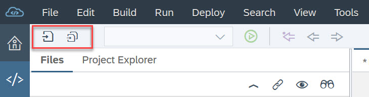
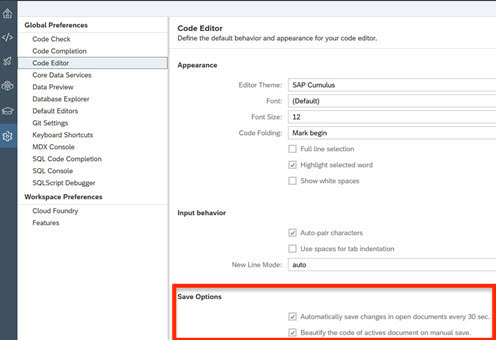

- - - -
Previous Exercise: [Exercise 01 What is Org and Space CF](../Exercise-01-What-is-OrgandSpace-CF) Next Exercise: [Exercise 3 - Publish Wishlist](../Exercise-03-Publish-Wishlist)

[Back to the Overview](../README.md)
- - - -
# Exercise 02 - Setup

## 1. SAP Web IDE Full-Stack
The primary development tool for this hands-on is [SAP Web IDE Full Stack](https://help.sap.com/viewer/825270ffffe74d9f988a0f0066ad59f0/CF/en-US/c175c03da2534e4b9b3ea28687f6cb0a.html) - a browser-based IDE to easily develop, test, build, deploy, and extend role-based, consumer-grade apps for business users. For the sake of simplicity, we will refer to the 'SAP Web IDE Full-Stack' as 'Web IDE Full-stack' or simply 'Web IDE' in the current documentation.

In order to use Web IDE Full-Stack, you would normally need to configure the service and assign appropriate authorizations, etc. For the purpose of this session, the user account provided to you by the instructor is preconfigured to access the Web IDE tool.

Access Web IDE Full-Stack by simply [clicking here](https://webidecp-aevblwuamw.dispatcher.hana.ondemand.com/) and using the login information provided to you.

## 2. Configure Cloud Foundry
Before proceeding with development, we will need to configure our workspace for Cloud Foundry. We will need to assign a space for our development. In the assigned space, we then need to install the Builder i.e. The [MTA archive builder](https://help.sap.com/viewer/58746c584026430a890170ac4d87d03b/Cloud/en-US/ba7dd5a47b7a4858a652d15f9673c28d.html), which is a tool that builds a deployment-ready MTAR (.mtar file) from the artifacts of an MTA project according to the project’s MTA development descriptor (mta.yaml file).

1. In Web IDE Full Stack and _Click Preferences_ (the gear icon at the bottom on the left hand side or by following the menu option _Tools - Preferences_).
2. Choose _Workspace Preferences - Cloud Foundry_ 

3. Select the API Endpoint https://api.cf.eu10.hana.ondemand.com 
4. Enter your User Name and password when prompted to log on to Cloud Foundry
4. Verify that the Organization is set to `TechEd2018_OPP363` and the Space is set to `OPP363_SPACE_XX` (where XX is the student number assigned to you)
5. Click _Install Builder_ (The install might take a few seconds)
6. Click **_Save_** (The builder and API endpoint configuration will be lost if not saved).

## 3. Enable Web IDe Full-Stack Features

We will be using additional Web IDE features that are not enabled by default. The following steps describe how to enable specific features as required.

1. In Web IDE Full Stack and _Click Preferences_ (the gear icon at the bottom on the left hand side or by following the menu option _Tools - Preferences_).
2. Choose _Workspace Preferences - Features_ 

3. Search for **SAP HANA Database Explorer** 

4. Set to _ON_
5. Click _Save_
6. Click Refresh to reload SAP Web IDE for the changes to take effect. 
7. Verify that the feature has been enabled by making sure the database explorer button is in the left-hand toolbar.
8. Repeat these steps to enable the Tools for Node.js Development. 

**TIP** It is advised to enable features one by one i.e. do NOT enable both features at once.

## 4. Simplify the Copying of Code Blocks from GitHub
Many of the exercises you will complete during the course of this session will require you to copy large blocks of code from the README.md documentation files. To make this easier and reduce the risk of copy-paste errors in your code, you can install a simple add-on for Chrome called _Tampermonkey_ and then a GitHub-specific user script to provide you with a _copy to clipboard_ button for the code blocks in the exercises.

1. Open your Chrome browser.
2. Open the URL https://chrome.google.com/webstore/detail/tampermonkey/dhdgffkkebhmkfjojejmpbldmpobfkfo?hl=en-US - this is the Tampermonkey extension.
3. Click _Add to Chrome_.
4. When the extension has been added to Chrome, close all browser windows and open Chrome again.
5. You should see the TamperMonkey toolbar button in the top right of your browser.

5. Opn the URL https://raw.githubusercontent.com/Mottie/GitHub-userscripts/master/github-copy-code-snippet.user.js to install the _ Github copy code snippet_ user script.

6. Restart Chrome. During the exercises, you should see the copy to clipboard icon when you hover your mouse over the code blocks.

## 5. Tips on Saving your Changes in SAP Web IDE Full-Stack
As in any environment it's important to save your work regularly to avoid losing your changes, this is particularly true in Web-based IDEs. As a general rule of thumb, try to follow the policy of: _"Save early, save often."_

1. Note that there are 2 _Save_ buttons in SAP Web IDE Full-Stack, _Save_ will only save the file currently being edited, _Save All_ will save all currently open and unsaved files.

2. It is optional to enable the "Automatically save changes in open documents every 30 sec" and "Beautify the code of active documents on manual save" options in SAP Web IDE Full-Stack. To do so, open _Preferences-Code Editor_ and check the options for automatic saving and beautify code.

## 6. Verify installation of CLoud Foundy CLI
Open a _Commnand Prompt_ and run the command `cf plugins` to verify that the Cloud Foundry CLI along with the required plugins (_MtaPlugin and blue-green-deploy_) are installed on your image

This completes the system setup for your exercises.
- - - -
© 2018 SAP SE
- - - -
Previous Exercise: [Exercise 01 What is Org and Space CF](../Exercise-01-What-is-OrgandSpace-CF) Next Exercise: [Exercise 3 - Publish Wishlist](../Exercise-03-Publish-Wishlist)

[Back to the Overview](../README.md)
- - - -

