- - - -
Previous Exercise: [Exercise 02 What is Org and Space CF](../Exercise-02-What-is-OrgandSpace-CF) Next Exercise: [Exercise 4 - Order New Items](../Exercise-04-Order-New-Items)

[Back to the Overview](../README.md)
- - - -
# Exercise 03 - Publish Wishlist

Franck is the retail category manager in a home furniture franchise. In this exercise we will create the wishlist application which will allow Franck to see the catalogue of furniture wishlist items for the store. 

We will create a business application using SAP WebIDE Full-Stack using the template for application programming model. We will define a data model, a service to expose entities from the data model and an application UI for the furniture wishlist.

The application programming model for SAP Cloud Platform enables you to quickly create business applications by allowing you to focus on your domain logic. It offers a consistent end-to-end programming model that includes languages, libraries and APIs tailored for full-stack development on SAP Cloud Platform. The application programming model uses Core Data & Services (CDS) to build data models and service definitions on a conceptual level. These CDS models are used as inputs for the data, service and UI layers. They are then translated to native artifacts, for example SQL database schemas, and interpreted to automatically serve requests at runtime.

Core Data & Services (CDS) was adopted as known from S/4 HANA and ABAP to define data models as well as service interfaces on a conceptual level. As with S/4 HANA, you can annotate the CDS models with annotations for Fiori UIs. The application programming model allows us to add Java or Node.js modules to the project for custom logic such as handling database connections, including tenant isolation, parsing input and serialising responses etc. 

## 1. Create Wishlist Application

We will create a new business application using Web IDE Full-Stack. We will define a model and CDS to create an OData service which will be consumed by the Wishlist application.

1. Open your cloud platform cockpit and go to _Services-Web IDE Full-Stack_.
2. Click _Go to Service_.
3. Log into Web IDE Full-Stack.
4. Click _File-New-Project from Template_.
5. Choose `SAP Cloud Platform Business Application`.

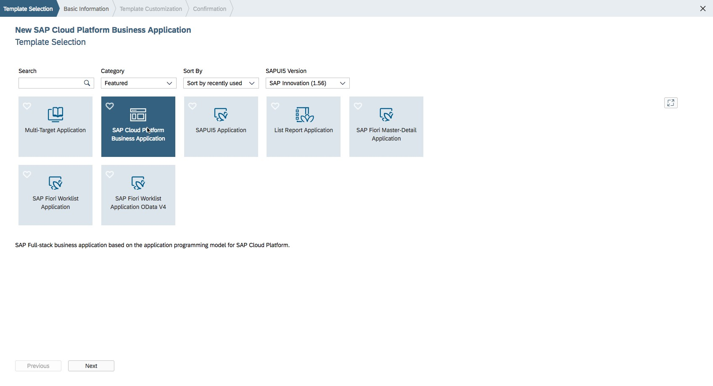

6. Click _Next_.
7. Enter Project Name `furnitureshop`.<br>

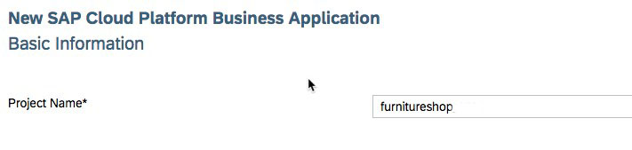

8.	Click _Next_.
9.	Choose 
```
Service (srv): Java
Java Package: com.company.furnitureshop
Database (db): SAP HANA Database
```

**Please do not select the option Enable User authentication(UAA), we will enable this in the next exercise**
<br>

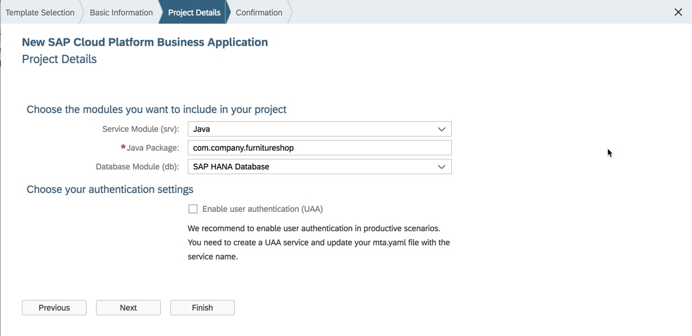

10.	Note the value for Service, Java Package and Database.
11.	Click _Finish_.<br>


Notice that  the project gets created with two modules by default, a database module (db) and a service module (srv), each with their own CDS namely `db/data-model.cds` and `srv/my-service.cds` respectively.

`srv/src/main/` is the location for your java code.

`Package.json` is used to configure CDS (for example adding reuse models).

`mta.yaml` configures your overall application.

12.	Open the `data-model.cds` under the db module and replace the source code of the file with the following:
```
namespace com.company.furnitureshop;

entity Wishlist {
  key ProductID : String;
  categoryName : String; 
  productName : String;
  productDesc : String;
  productColor : String;
  productWidth : Integer;
  productHeight : Integer;
  productDepth : Integer;
  productWeight : Integer;
  productPrice : Decimal(10,2);
  productWarranty : Integer;
  materialType : String;
  supplierID : String;
  supplierName : String;
  supplierLocation : String;
  pictureURL : String;
  productRating : Decimal(3,2);
}
```

14. Click _Save_. The save button is highlighted in the picture below. It is always a good practise to save your work often. The button next to Save is Save All, which saves all the files modified in the WebIDE

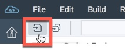

15.	Open the `my-service.cds` under the srv module and replace the source code of the file with following:

```
using com.company.furnitureshop from '../db/data-model';

service CatalogService {
  entity Wishlist @read @update as projection on furnitureshop.Wishlist;
}
```

In this step, we define a Service called CatalogService having an Entity called Wishlist which allows methods read and update as a projection on the table Wishlist, Click _Save_.

16. Open the `mta.yaml` file. Click the Code Editor tab to switch to the code editing view.<br>
17. Take a look at the mta.yaml file which was automatically generated, you have 2 modules defined, the db module and the srv module
18. Right-click on your  project and _click Build CDS_.<br>

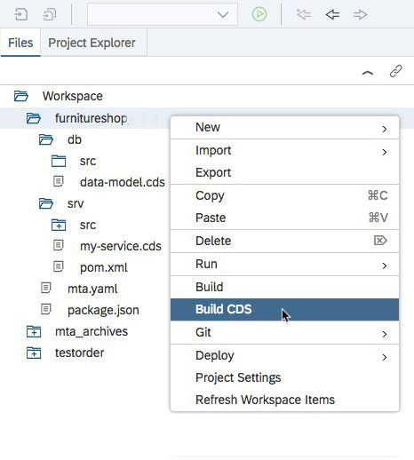

19. Note that right-clicking at the project, the CDS(s) for every module will be built – to build CDS at an individual module level, you could right click just the module you wish to build and select build.
20. Make sure the build is successful and no errors. You can see this in the console log by choosing View menu -> Console if the console is not already visible<br>

21. Download the [csv.zip](csv.zip) from this link to your student laptop, please remember where you have saved this file, you will upload it into WebIDE in the next step<br>

22. Right-click on `src` folder under the `db` module and choose _Import - File or Project_.<br>


Click on Browse and locate the csv.zip file that you downloaded in the previous step


23. Click _OK_.
24. Expand the `db` module for your project in the workspace explorer and confirm that the csv folder has been created and that the two files `Data.hdbtabledata` and `Wishlist.csv` have been imported.<br>


25. Open the file `Data.hdbtabledata` under `db\src\csv` 
```
{
	"format_version": 1,
	"imports": [
		{
		"target_table": "COM_COMPANY_FURNITURESHOP_WISHLIST",

```

Notice that the target table created on HANA will be named according to the namespace you have used for your project plus the entity name. For example if the namespace was `com.company.furnitureshop` and the entity name in your data-model.cds was wishlist, the table created on HANA would be 
`COM_COMPANY_FURNITURESHOP_WISHLIST` (where the period in the namespace are replaced with underscores).

26.	Right-Click on the `db` module and click _Build_.<br>

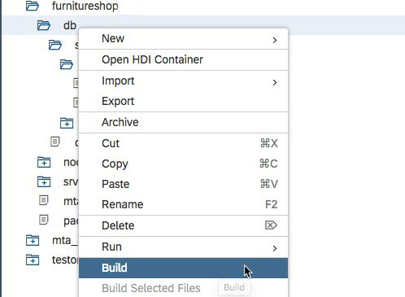

27. Note this will build just the CDS in the db module.
28. Right Click on the db module and click on Open HDI Container
29. Click _No_ if you are prompted to add a database.
30. You will see the HDI Container as shown

31.	Your database will be loaded, Click Tables to expand the list of tables. You will see that the table `COM_COMPANY_FURNITURESHOP_WISHLIST` was created. (based on the namespace for your project and the entity name specified in data-model.cds)<br>

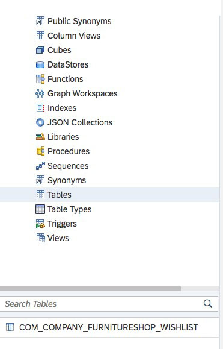

32.	Click on the table to view the column definitions.<br>

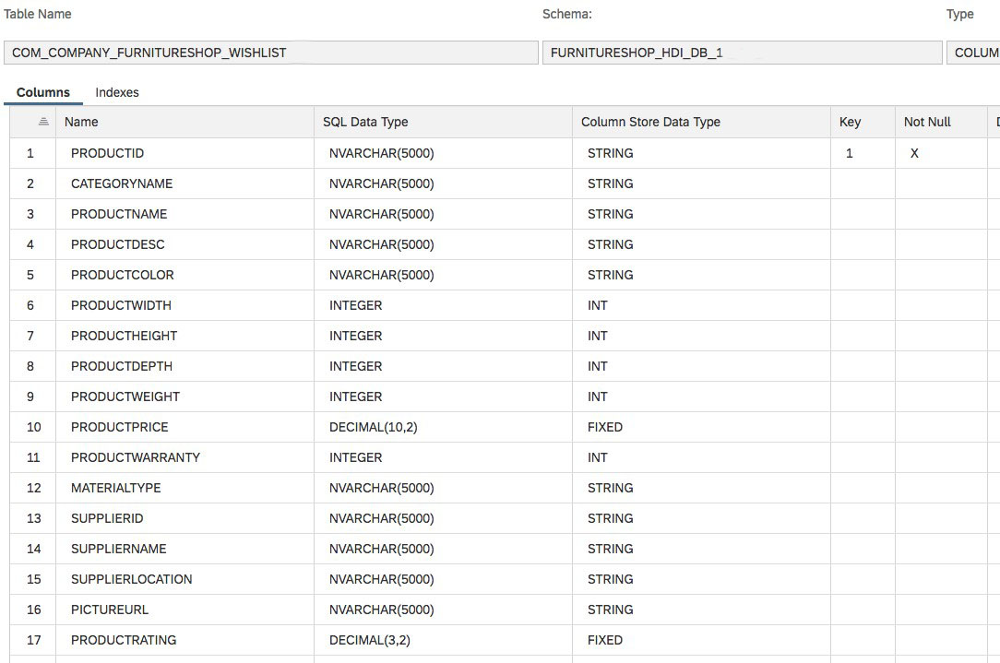

33.	Click _Open Data_ to view the table data as per the uploaded CSV file.<br>


34.	Click on Development icon  on the left pane to go back to the development view and then Right-click on the srv module and click _Run-Run as-Java Application_.<br>


35. This will deploy the Java application in Cloud Foundry. Once the deploy is complete, you should see a success message and will notice a URL to the application in the `Run` console.<br>

(Optionally you can login to the SAP Cloud Platform cockpit -> Applications and you will notice the java application being deployed.)

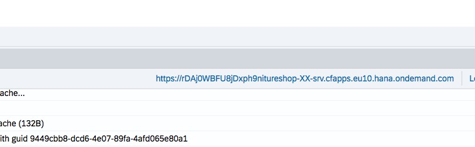

36.	You can click on this link to run the application.
37.	The application provides a link to the Odata service that is defined in our srv module.<br>

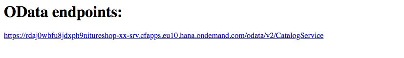

38. Click the link to the OData endpoint.
You will notice the collection `Wishlist` in the Odata service.<br>


39.	Append `/Wishlist` to the end of the URL to view the Wishlist collection.

40.  The Web IDE Full-Stack tool is connected to your Cloud Foundry environment in the SAP Cloud Platform. When you build the database module or run the Java application in your project, the Web IDE Full-Stack tool is creating instances of backing services and applications in your _Space_ on the SAP Cloud Platform. To check, follow the following steps.

If the SAP Cloud Platform cockpit is not already open, please open it by [clicking here]( https://account.hana.ondemand.com/cockpit). Go to your _Space_ by clicking on _TechEd2018 - OPP363CF - Spaces - OPP363_SPACE_XYZ_.

Now, on the Applications page, you should see an instance of the Java Application with the name of <random string>furnitureshop-srv.  This instance was created during the above steps of the current exercise. Click on the application name and check out its Service Bindings, etc.
	
Note: You should also see a Builder instance that was created as part of the earlier exercise for Set up. 

We have now modeled the database and we have created an Odata service, in the next part we will create a UI application to consume the data provided by the Odata service.

## 2. Create Wishlist Application User Interface
We willl now create an SAPUI5 application using WebIDE by consuming the OData service created in the previous step to create the wishlist.
1.	Right-click on your project and click _New-HTML5 Module_.<br>


2.	Make sure you **Choose SAPUI5 version 1.52** and then Choose `SAP Fiori-Master-Detail Application`.<br>

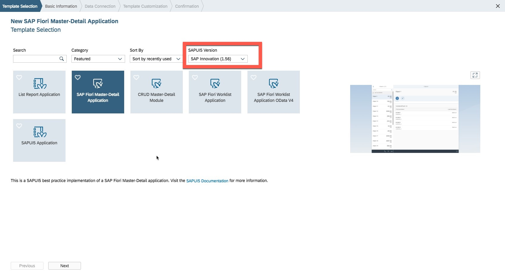

3.	Click _Next_.
4.	Enter the following details:
    - Module Name: `ui`
    - Title: `Wishlist`
    - Namespace: `com.company.wishlist`

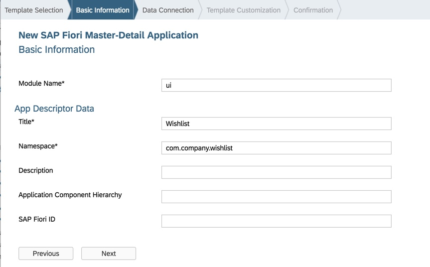

5. Click _Next_.
6. In the _Data Connection_ screen, choose `Current project`, this will list the Catalog Service that we created in the previous part.<br>


7. Choose the `CatalogService` and click _Next_.
8. Choose the following values:
   - App Type: `Standalone App`
   - Object Collection: `Wishlist`
   - Object Collection ID: `Productid`
   - Object Title: `productName`
   - Object Numeric Attribute: `productPrice` 


9. Click _Finish_.
10. You will notice that the user interface module (ui) is created.
11. Open the `mta.yaml` file.
12. Change the disk-quota and memory parameter from `256M` to `512M`
13. Click _Save_.
14. Open the file xs-security.json and edit the `xsappname` parameter to `furnitureshop_XX`, XX being the unique student number assigned to you, Click _Save_. 
15. Expand the ui module and then expand the `webapp` folder, choose the `webapp` folder.
16. Download the [img.zip](img.zip) from this link to your student laptop, please remember where you have saved this file, you will upload it into WebIDE in the next step

17. Right-click _Import-File or Project_. 
Choose the img.zip that you just downloaded.<br>


18. Click _OK_.
19. You will see the image files imported into the `webapp/img` folder.
20. Open the `Master.view.xml` under `webapp/view` folder.
21. Locate and edit `<ObjectListItem>` to include the code as shown:
```
<ObjectListItem
type="{= ${device>/system/phone} ? 'Active' : 'Inactive'}"
press="onSelectionChange"
title="{productName}"
number="{
	path: 'productPrice',
	formatter: '.formatter.currencyValue'
}"
numberState="Success"
numberUnit="USD"
icon="img/ico_{pictureURL}"
>
</ObjectListItem>
```
22. This will add the image icon to the master view as well as add the currency formatting.
23. Open the `Detail.view.xml` under `webapp/view` folder.
24. Locate and Replace the `<ObjectHeader>` as shown.
```
<ObjectHeader
id="objectHeader" icon="img/ico_{pictureURL}"
iconDensityAware="false" iconAlt="{productName}"
title="{productName}" intro="{ProductID}"
number="{path: 'productPrice', formatter: '.formatter.currencyValue'}"
numberState="Success" numberUnit="USD">
<attributes> <ObjectAttribute text="{productDesc}"/> </attributes>
</ObjectHeader>
```
25. This will add the image to the detail view as well as the product name, price currency formatting.
26. Locate and replace the `<IconTabBar>` as shown:
```
<IconTabBar
	id="iconTabBar"
	class="sapUiResponsiveContentPadding">
	<items>
	<IconTabFilter
	id="iconTabBarFilter1" icon="sap-icon://hint"
	tooltip="{i18n>detailIconTabBarInfo}">
	<VBox class="sapUiSmallMargin">			<f:SimpleForm id="SimpleFormDisplay471"
	minWidth="1024" maxContainerCols="2"
	editable="false" layout="ResponsiveGridLayout"
	title="Product Details" labelSpanL="4" labelSpanM="4" emptySpanL="1" emptySpanM="1" columnsL="1" columnsM="1"><f:content>
<Label text="Product ID" /><Text text="{ProductID}" />
<Label text="Product Name" /><Text text="{productName}" />
<Label text="Category" /><Text text="{categoryName}" />
<Label text="Color" /><Text text="{productColor}" />
<Label text="Width" /><Text text="{productWidth}" />
<Label text="Height" /><Text text="{productHeight}" />
<Label text="Depth" /><Text text="{productDepth}" />
<Label text="Weight" /><Text text="{productWeight}" />
<Label text="Warranty" /><Text text="{productWarranty}" />
<Label text="Material Type" /><Text text="{materialType}" />
<Label text="Supplier" /><Text text="{supplierName}" />
<Label text="Supplier Location" /><Text text="{supplierLocation}" />
</f:content>
</f:SimpleForm>
</VBox>
</IconTabFilter>
<IconTabFilter id="iconTabBarFilter2"
	icon="sap-icon://picture" tooltip="{i18n>detailIconTabBarAttachments}">
	<Image src="img/{pictureURL}"
	densityAware="false">
	<layoutData>
	<FlexItemData growFactor="1" />
	</layoutData>
	</Image>
</IconTabFilter>
</items>
</IconTabBar>
```
27. This will add 2 items to the icon tab bar, one for product details with the labels and details for the selected product and a second toolbar icon to view the full size product image.
28. Finally add the following includes to the `Detail.view.xml`.
```
xmlns:l="sap.ui.layout"
xmlns:f="sap.ui.layout.form"
xmlns:vk="sap.ui.vk"
```


29. Chose the ui module and right-click _Run-Run as - Web Application_.<br>


30. Choose `index.html` and then in the pop up, enter your SAP Cloud Platform user ID and password. This is required in the design time to run the web application (this is the same student userid and password you have used to login to the Cloud Platform Cockpit and WebIDE)<br>


31. Click _Create_.
32. You should see the application running.<br>

Unlike the Java application, the ui applciation runs in the WebIDE design time and this is not yet deployed to the SAP Cloud Platform, you can check the SAP Cloud Platform cockpit -> Applications 


Have a look at the application, you will see the list of products with an icon, product name and price on the left, and on click of any product, you will notice the details of the products in the detail screen with two tab, product details and image


- - - -
© 2018 SAP SE
- - - -
Previous Exercise: [Exercise 02 What is Org and Space CF](../Exercise-02-What-is-OrgandSpace-CF) Next Exercise: [Exercise 4 - Order New Items](../Exercise-04-Order-New-Items)

[Back to the Overview](../README.md)

