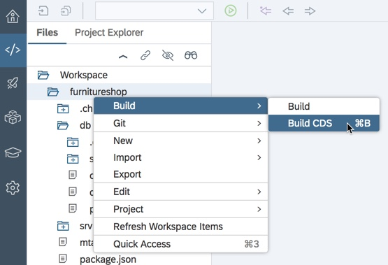
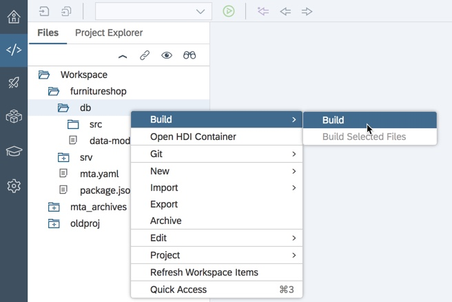
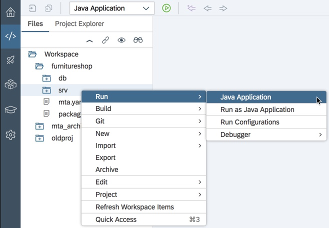
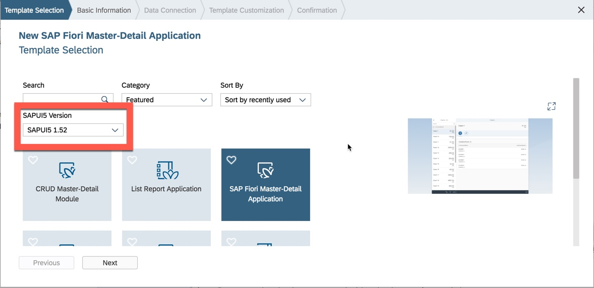
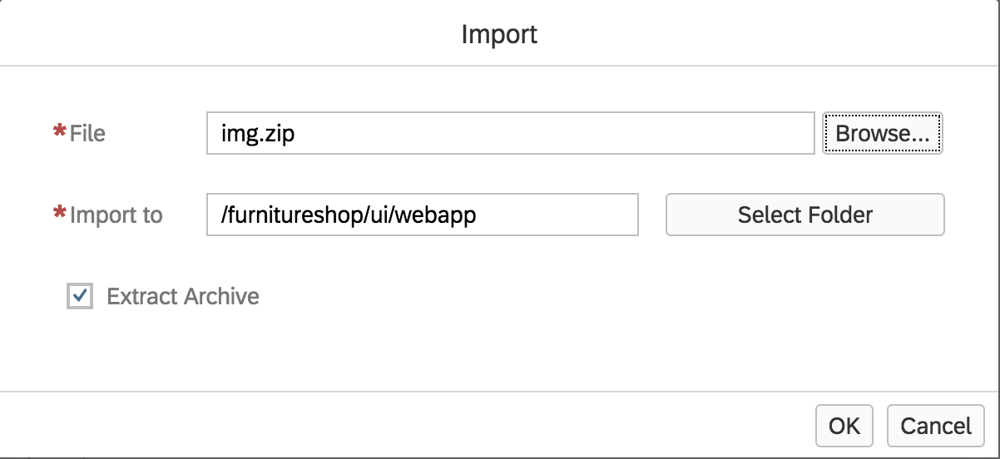

<a name="top"></a>
# Navigation

| Exercise | Link |
|---|---|
| Previous | [Exercise 2 - Setup](../Exercise-02-Setup)
| Next | [Exercise 4 - Order New Items](../Exercise-04-Order-New-Items)
| Start | [Overview](../README.md)

## Table of Contents
1. [Business Scenario](#1-business-scenario)
1. [Create Wishlist Application](#2-create-wishlist-app)
1. [Create Wishlist User Interface](#3-create-wishlist-ui)
1. [Cleanup](#4-cleanup)


# Exercise 3 - Publish Wishlist

<a name="1-business-scenario"></a>
## 1. Business Scenario

Franck is the retail category manager in a home furniture franchise. In this exercise we will create a wishlist application that allows Franck to see a wishlist of furniture items he would like to have in his store.

Using Web IDE, we will create a business application for Franck using the template for a Business Application Programming Model application.

The Business Application Programming Model for SAP Cloud Platform enables you to create business applications by following a three-step approach:

1. Create a database agnostic data model
1. Expose that data model to the outside world by means of a service
1. Consume that service in a UI application

This approach allows you to focus on your domain logic without needing to be concerned with the technical details of the underlying database or a particular programming language. This three-layered approach of `data model + service + UI application` offers a consistent end-to-end programming model that can be implemented using languages, libraries and APIs tailored for full-stack development on SAP Cloud Platform.

Using Core Data Services, you will define your data model and its relevant service definitions.  The implementation agnostic CDS model definitions are then translated to native artefacts for implementation in some specific database, and then configured to automatically serve requests at runtime.

The version of CDS used in Web IDE has been adapted and extended from CDS used in S/4 HANA and ABAP systems. As with S/4 HANA, you can extend a CDS model with annotations for Fiori UIs.

The Business Application Programming Model allows us to add Java or Node.js modules to the project for custom logic such as handling database connections, including tenant isolation, parsing input and serialising responses etc. 

[Top](#top)

<a name="2-create-wishlist-app"></a>
## 2. Create Wishlist Application

We will create a new business application using Web IDE. We will define a CDS data model and an OData service which will then be consumed by the Wishlist application.

1. Launch Web IDE using the direct link <https://webidecp-aevblwuamw.dispatcher.hana.ondemand.com/>
1. Enter your user ID and Password.
1. Select _File -> New -> Project from Template_.
1. Choose `SAP Cloud Platform Business Application`.

    

1. Click _Next_.
1. Enter Project Name `furnitureshop`.

    

1.	Click _Next_.
1.	Choose 

    ```
    Service (srv): Java
    Java Package: com.company.furnitureshop
    Database (db): SAP HANA Database
    ```

    **Please do not select the option Enable User authentication(UAA), we will enable this in the next exercise**

    

1.	Note the value for Service, Java Package and Database.
1.	Click _Finish_.

    

    Notice that by default, the project has been created with two modules: a database module (`db`) and a service module (`srv`).  Each of these modules contains its own CDS file:

    * `db/data-model.cds` and
    * `srv/my-service.cds`

    Your Java code is located in the `srv/src/main/` folder
    
    The top level `package.json` file is used to configure CDS (for example adding reuse models).

    The file `mta.yaml` is used to configure your overall application

1.	Open the `data-model.cds` under the `db` module and replace the entire file with the following:

    ```
    namespace com.company.furnitureshop;

    entity Wishlist {
      key ProductID        : String;
          categoryName     : String; 
          productName      : String;
          productDesc      : String;
          productColor     : String;
          productWidth     : Integer;
          productHeight    : Integer;
          productDepth     : Integer;
          productWeight    : Integer;
          productPrice     : Decimal(10,2);
          productWarranty  : Integer;
          materialType     : String;
          supplierID       : String;
          supplierName     : String;
          supplierLocation : String;
          pictureURL       : String;
          productRating    : Decimal(3,2);
    }
    ```

1. Click _Save_ or press Ctrl-s (on Windows) and Command-s (on Mac).  (It is recommended to switch on the auto-save function in the Web IDE preferences)

    

1.	Open the `my-service.cds` under the srv module and replace the source code of the file with following:

    ```
    using com.company.furnitureshop from '../db/data-model';

    service CatalogService {
      entity Wishlist @read @update as projection on furnitureshop.Wishlist;
    }
    ```

    In this step, we have defined a Service called `CatalogService` that contains a single Entity called `Wishlist`.  The `Wishlist` Entity allows the read and update methods to be performed on a projection of the database table `furnitureshop.Wishlist`
    
    Again, click _Save_.

1. Open the `mta.yaml` file. At the very bottom of the editor screen, click the "Code Editor" tab to switch to the code editing view.

1. Take a look at the contents of the `mta.yaml` file.  This content has been automatically generated and contains our two modules, `db` and `srv`.

1. Run the CDS compiler to compile your database agnostic data module (found in `db/data-model.cds`) into a form suitable for deployment to HANA.  To do this, right-click on your project and select _Build -> Build CDS_.

    

    If you now expand the folder `db/src` you will see the compiler output has been placed into a new `gen` folder.  This is the HANA-specific definition of your data model. 

    Note that right-clicking at the project level and selecting _Build -> Build CDS_ will cause the CDS compiler to compile every CDS file in every module.   However, to compile one module individually, right-click on the module name and then select _Build -> Build CDS_.

1. Make sure the build is successful. You can see the compiler output in the console log by choosing _View -> Console_ if the console is not already visible.

    You should see output similar to that shown below.  The important part is the `CDS return code: 0`.
    
    ```
    16:51:07 (DIBuild) [INFO] Injecting source code into builder...
    [INFO] Source code injection finished
    [INFO] ------------------------------------------------------------------------
    npm install
    up to date in 0.206s
    npm run build
    
    > furnitureshop@1.0.0 build /home/vcap/app/.java-buildpack/tomcat/temp/builder/sap.cds.mta/builds/build-5735012828943919909/furnitureshop
    > cds build --clean
    
    This is CDS 2.10.1, Compiler 1.1.3, Home: node_modules/@sap/cds
    
    Compiled 'db/data-model.cds' to
      db/src/gen/.hdinamespace
      db/src/gen/CATALOGSERVICE_WISHLIST.hdbcds
      db/src/gen/COM_COMPANY_FURNITURESHOP_WISHLIST.hdbcds
    
    Compiled 'srv/my-service.cds' to
      srv/src/main/resources/edmx/CatalogService.xml
      srv/src/main/resources/edmx/csn.json
    
    CDS return code: 0
    16:51:07 (DIBuild) ********** End of /furnitureshop Build Log **********
    ```

1. Download the [csv.zip](https://github.com/SAP/cloud-cf-furnitureshop-documentation/raw/master/Exercise-03-Publish-Wishlist/csv.zip) and save it locally.  Remember where you have saved this file, as you will need to upload it into WebIDE in the next step

1. Right-click on `src` folder under the `db` module and choose _Import - File or Project_.

    

    Click on Browse and locate the `csv.zip` file that you downloaded in the previous step

    

1. Click _OK_.

    In case you see a pop-up message that the import will over write an existing folder, please ignore this message and proceed further by clicking 'Import'.

1. Expand the `db` module for your project in the workspace explorer and confirm that the `csv` folder has been created and that the two files `Data.hdbtabledata` and `Wishlist.csv` have been imported.

    
    
1. The purpose of the `Data.hdbtabledata` file is to give HANA instructions on how to populate our database table at the time it is created.  This file instructs HANA to transfer the data found in the `Wishlist.csv` file into the database.

    For you information, open the file `Data.hdbtabledata` under `db\src\csv` and you will see a JSON object:

    ```
    {
      "format_version": 1,
      "imports": [
      {
        "target_table": "COM_COMPANY_FURNITURESHOP_WISHLIST",
    ```

    Notice that the target table created in the HANA database has been named according to the namespace you used for your project followed the entity name. For example if the namespace is `com.company.furnitureshop` and the entity name in your `data-model.cds` is `wishlist`, then the table created on HANA will be `COM_COMPANY_FURNITURESHOP_WISHLIST` (where the dots in the namespace have been replaced with underscores).

1. Having compiled our CDS data model into a form suitable for the HANA database, we now need to deploy this definition to HANA. The `Data.hdbtabledata` file seen above will then additionally allow HANA to pre-fill this table with data.

    To deploy this definition to HANA, right-click on the `db` module and select _Build -> Build_.

    

1. Now that our database has been deployed to HANA (built) and loaded with data, we can now look at this information.

    Right Click on the `db` module and select _Open HDI Container_.
    
    If you do not see this option, then check that the **SAP HANA Database Explorer** feature has been switched _ON_ as mentioned in [exercise 2](../Exercise-02-Setup/README.md#3-enable-web-ide-features).

1. Click _No_ if you are prompted to add a database.

1. You will see the HDI Container as shown

1. Select Tables to expand the list of tables. Our database contains only the one table `COM_COMPANY_FURNITURESHOP_WISHLIST`.

    

1.	Click on the table name to view its metadata.

    

1.	Click on the _Open Data_ button near the top right to view the table data that was uploaded from the `CSV` file.

    

1.	Now select the Development icon  from the vertical toolbar on the left to go back to the development view.

    Right-click on the `srv` module and select _Run -> Run as-Java Application_

    

1. This will deploy the Java application to Cloud Foundry. The Run Console will appear at the bottom of the screen and to start with, you will the message "Application is starting"

    When the message changes to "application is running", a URL will appear in the header of the Run Console.
    
    

    Click on this link to view the running application. Optionally you can login to your SAP Cloud Platform cockpit, then select "Applications" and you will see the deployed Java application.  Select the application and then click on the link under "Application Routes".

1.	The application now provides a link to the OData service that has been generated by our `srv` module.

    

1. Click the link and you will notice XML definition of the service, a collection called `Wishlist`.

    

1.	Append `/Wishlist` to the end of the URL to view the Wishlist collection.

1.	To see the service's metadata, remove `/Wishlist` from the end of the URL and replace it with `/$metadata`.

1.  If the SAP Cloud Platform cockpit is not already open, please open it by following this link <https://account.hana.ondemand.com/cockpit>. Go to your _Space_ by clicking on _TechEd2018 - OPP363CF - Spaces - OPP363\_SPACE\_\<Your\_Student\_Number\>_.

    Now, on the Applications page, you should see an instance of the Java Application with the name of `<random string>furnitureshop-srv`.
    
    Note: You should also see a Builder instance that was created as part of the earlier exercise for Set up. 

We have now used two of the three layers in CDS:
    
* Created a CDS data model, then compiled and deployed it to HANA
* Exposed the data model as an OData service using a generated Java application

In the next part, we will create a UI application to consume the data provided by the Odata service.

[Top](#top)


<a name="3-create-wishlist-ui"></a>
## 3. Create a Wishlist User Interface

We will now make use of the third layer in CDS and create a SAPUI5 application in order to make the business data accessible to the end user.  This app will consume the OData service we have just created.

1.	Right-click on your project and click _New -> HTML5 Module_.

    

1.	Make sure you choose **SAPUI5 version 1.52** and then Choose `SAP Fiori-Master-Detail Application`.<br>

    

1.	Click _Next_.

1.	Enter the following details:

    - Module Name: `ui`
    - Title: `Wishlist`
    - Namespace: `com.company.wishlist`

    

1. Click _Next_.

1. In the _Data Connection_ screen, choose `Current project`, this will list the Catalog Service that we created in the previous part.<br>

    

1. Choose the `CatalogService` and click _Next_.

1. Choose the following values:

    - App Type: `Standalone App`
    - Object Collection: `Wishlist`
    - Object Collection ID: `Productid`
    - Object Title: `productName`
    - Object Numeric Attribute: `productPrice` 

    

1. Click _Finish_.

1. You will notice that the user interface module (ui) is created.

1. Open the `mta.yaml` file.

1. For the `UI` module, change the disk-quota and memory parameter from `256M` to `512M`

1. Click _Save_.

1. Open the file `xs-security.json` and edit the `xsappname` parameter to `furnitureshop_XXX`, where `XXX` is your student number. Click _Save_. 

1. Download the [img.zip](https://github.com/SAP/cloud-cf-furnitureshop-documentation/raw/master/Exercise-03-Publish-Wishlist/img.zip) file and save it locally.

    Please remember where you have saved this file, as you will need to upload it into Web IDE in the next step.

1. Expand the `ui/webapp` folder, then right-click on the `webapp` folder and select _Import -> File or Project_.

    Choose the `img.zip` file that you have just downloaded.

    

1. Click _OK_.  You can ignore any warnings about over writing an existing folder.

    You will see that lots of image files have now been imported into the `webapp/img` folder.

1. Open the `Master.view.xml` under `webapp/view` folder.

1. On or near line 62, you will find the `<ObjectListItem>` object.  Edit it to include the code as shown:

    ```
    <ObjectListItem
        type="{= ${device>/system/phone} ? 'Active' : 'Inactive'}"
        press="onSelectionChange"
        title="{productName}"
        number="{
          path: 'productPrice',
          formatter: '.formatter.currencyValue'
        }"
        numberState="Success"
        numberUnit="USD"
        icon="img/ico_{pictureURL}"
    >
    </ObjectListItem>
    ```

    This will add both the image icon and currency formatting to the master view.

1. Open the `Detail.view.xml` under `webapp/view` folder.

1. On or near line 16, you will find an `<ObjectHeader>` object.  Edit it be as shown below.

    ```
    <ObjectHeader
        id="objectHeader" icon="img/ico_{pictureURL}"
        iconDensityAware="false" iconAlt="{productName}"
        title="{productName}" intro="{ProductID}"
        number="{path: 'productPrice', formatter: '.formatter.currencyValue'}"
        numberState="Success" numberUnit="USD">
        <attributes> <ObjectAttribute text="{productDesc}"/> </attributes>
    </ObjectHeader>
    ```

    As in the Master View. this will add not only the image and currency formatting to the detail view, but also the product name.

1. On or near line 24, you will find the `<IconTabBar>` object.  Edit it to be as shown below:

    ```
    <IconTabBar
      id="iconTabBar"
      class="sapUiResponsiveContentPadding">
      <items>
      <IconTabFilter
      id="iconTabBarFilter1" icon="sap-icon://hint"
      tooltip="{i18n>detailIconTabBarInfo}">
      <VBox class="sapUiSmallMargin">      <f:SimpleForm id="SimpleFormDisplay471"
      minWidth="1024" maxContainerCols="2"
      editable="false" layout="ResponsiveGridLayout"
      title="Product Details" labelSpanL="4" labelSpanM="4" emptySpanL="1" emptySpanM="1" columnsL="1" columnsM="1"><f:content>
    <Label text="Product ID" /><Text text="{ProductID}" />
    <Label text="Product Name" /><Text text="{productName}" />
    <Label text="Category" /><Text text="{categoryName}" />
    <Label text="Color" /><Text text="{productColor}" />
    <Label text="Width" /><Text text="{productWidth}" />
    <Label text="Height" /><Text text="{productHeight}" />
    <Label text="Depth" /><Text text="{productDepth}" />
    <Label text="Weight" /><Text text="{productWeight}" />
    <Label text="Warranty" /><Text text="{productWarranty}" />
    <Label text="Material Type" /><Text text="{materialType}" />
    <Label text="Supplier" /><Text text="{supplierName}" />
    <Label text="Supplier Location" /><Text text="{supplierLocation}" />
    </f:content>
    </f:SimpleForm>
    </VBox>
    </IconTabFilter>
    <IconTabFilter id="iconTabBarFilter2"
      icon="sap-icon://picture" tooltip="{i18n>detailIconTabBarAttachments}">
      <Image src="img/{pictureURL}"
      densityAware="false">
      <layoutData>
      <FlexItemData growFactor="1" />
      </layoutData>
      </Image>
    </IconTabFilter>
    </items>
    </IconTabBar>
    ```

    This will add 2 items to the icon tab bar, one for product details with the labels and details for the selected product and a second toolbar icon to view the full size product image.

1. Finally add the following includes to the `Detail.view.xml`.

    ```
    xmlns:l="sap.ui.layout"
    xmlns:f="sap.ui.layout.form"
    xmlns:vk="sap.ui.vk"
    ```

    

1. Save all your changes, then right-click on the `ui` module and select _Run -> Run as Web Application_.

    

1. In the `Choose File to Run` pop-up, scroll the list down and select `index.html` and press OK.

1. Enter your SAP Cloud Platform user ID and password and press "Create".

    This is required by the design time to run the web application (this userid is the same student userid and password you have used to login to the Cloud Platform Cockpit and WebIDE)

    

    If you see an error message about a pop-up blocker, then select the pop-up blocker icon at the far right of the browser's address line and select "Allow all pop-ups and redirects from ...".  You will now need rerun the Web Application.

1. After a few seconds, you should now see the application running.

    

    Have a look at the application, you will see the list of products with an icon, product name and price on the left, and on click of any product, you will notice the details of the products in the detail screen with two tab, product details and image

Unlike the Java application, this UI application runs in the Web IDE design time ***not*** in the SAP Cloud Platform.  You can verify that the running application has not been deployed to the SAP Cloud Platform by looking in your SAP Cloud Platform cockpit at your list of Applications.  At the moment you will only see the Web IDE Builder and your Java OData service app.


[Top](#top)


<a name="4-cleanup"></a>
## 4. Clean-up

1. Login to your SAP Cloud Platform Cockpit, navigate to your space and your Service Instances.

1. Delete the instance `furnitureshop-furnitureshop-hdidb<random_string>`.

[Top](#top)


<hr>
© 2018 SAP SE
<hr>

# Navigation

| Exercise | Link |
|---|---|
| Previous | [Exercise 2 - Setup](../Exercise-02-Setup)
| Next | [Exercise 4 - Order New Items](../Exercise-04-Order-New-Items)
| Start | [Overview](../README.md)


