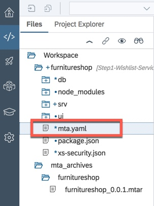
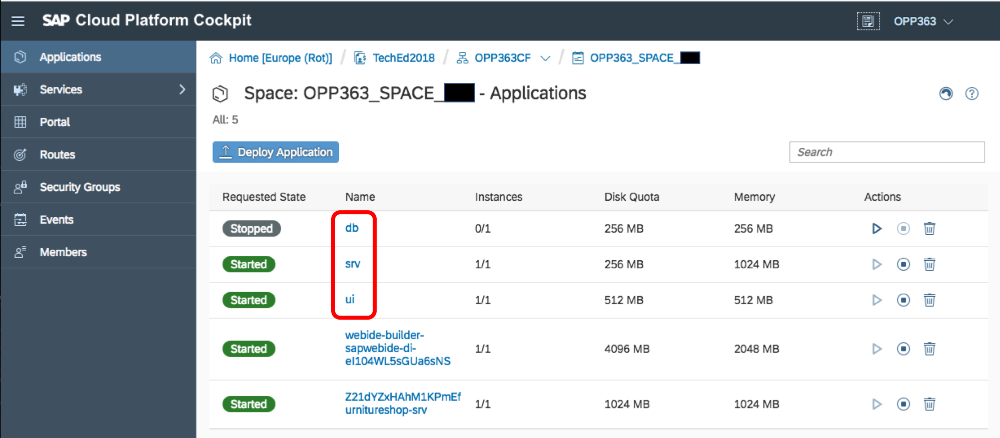
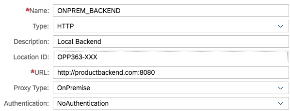

<a name="top"></a>
# Exercise 4 - Order New Items

## Navigation

| Previous | | Next
|---|---|---|
| [Exercise 3 - Publish Wishlist](../Exercise-03-Publish-Wishlist) | [Overview](../README.md) | [Exercise 5 - Logging](../Exercise-05-Logging)


## Table of Contents
* [Overview](#Intro)
* [Deploy Product Backend OData Service](#Step1)
* [Configure the SAP Cloud Connector](#Step2)
* [Enhance the Service for the Wishlist Application](#Step3)
* [Extend the User Interface to Display On-Premise Product Data](#Step4)
* [Build and Deploy Application to SAP Cloud Platform](#Step5)
* [Create Destination Configuration on SAP Cloud Platform](#Step6)
* [Test the Application](#Step7)


name="user-content-Intro
<a name="Intro"></a>
# Overview

In our scenario, Franck wants to determine which products to add to his inventory. To do this, he needs to review the votes and comments received via the Wishlist app from his colleagues and the company’s customers through a customer portal.

Franck also needs to view the existing product inventory from the on-premise backend system. Once he has decided which products to order, he will place an order on the backend system and update the backend system inventory accordingly.

To simulate our on premise backend system, we will deploy a simple Java application which exposes product information via an OData service.  To create this OData service, we will create a service based on Apache Olingo Java libraries.

We will use Web IDE to modify our existing wishlist application so that it in addition to the data stored in the SAP HANA database, it also displays data from our simulated backed system.

[Top](#top)


<a name="user-content-Step1"></a>
# 1. Deploy Product Backend OData Service

We first need to deploy a pre-built Java application in order to simulate our backend system. The OData service it provides will expose product information that can be consumed by our wishlist application.

1. A Tomcat bundle is available in the TechEd student image in the folder `D:\Files\Session\OPP363\apache-tomcat-9.0.11`
1. Navigate to the `bin` folder
1. Start the Tomcat server by double clicking on `startup.bat`.
1. The OData service provided by this local Tomcat server can be viewed at this URL <http://localhost:8080/backend-odata/Product.svc>.

    

    Notice that the OData service exposes a collection called `OnPremiseProductData`.

1. Append `/OnPremiseProductData` to the URL and press enter, or click on this link <http://localhost:8080/backend-odata/Product.svc/OnPremiseProductData>.

    

    Now you can see the additional product information provided by this little server.

[Top](#top)


<a name="user-content-Step2"></a>
# 2. Configure the SAP Cloud Connector

The Cloud Connector is an optional on-premise component that integrates applications running on the SAP Cloud Platform with customer services running in on-premise systems.  It is the counterpart of SAP Cloud Platform Connectivity.

In the case of these TechEd exercises, this component has already been installed.

1. Before we can configure the SAP Cloud Connector, we need to get our Subaccount ID.

1. Login to the SAP Cloud Platform cockpit [TechEd 2018](https://account.hana.ondemand.com/cockpit#/globalaccount/8fd39023-a237-4d71-9b6a-ed9d1719d275/subaccounts)

1. Click the  icon in the bottom left corner of the Cloud Foundry subaccount tile (OPP363CF).

    

1. The subaccount ID (`dabec0d5-6df7-495d-9c96-f6b25dfd78a4`) is now displayed.  
You will need this value when configuring the cloud connector.

    

1. Launch SAP Cloud Connector URL <https://localhost:8443> and login with the credentials:

    | Userid | Password |
    |---|---|
    |`Administrator`|`welcome`|

1. If you see any existing entires in the Subaccount Dashboard table, please delete these as they are left over from a previous exercise

1. Click on the _Add Subaccount_ button in the top right of the screen

    

1. Enter the following configuration values:

    | Property | Value | Description
    |---|---|---|
    | Region Host | Select "Europe (Frankfurt)" | `cf.eu10.hana.ondemand.com`
    | Subaccount | Paste in the GUID you copied in step 4 above | During TechEd 2018, this value will be `dabec0d5-6df7-495d-9c96-f6b25dfd78a4`
    | Display Name | `ProductData Connector` |
    | Login Email ID | `<your_login_email>` | 
    | Password | `<your_password>` |
    | Location ID |`OPP363-XXX`<br>where XXX is your three digit student number | For the TechEd hands-on sessions, all participants share a single SAP Cloud Platform subaccount. To ensure the SAP Cloud Connector can identify each connection, each student must provide a unique Location ID.<br>You can have multiple SAP Cloud Connectors configured to work with a single sub account as long as each is identified by a unique Location ID
    | Description | `ProductData Connector` | 

    ***IMPORTANT***  
    The value of Location ID is case sensitive! For the current exercise, ensure that you have entered ***OPP*** in upper case characters, since we will be using exactly this string value elsewhere in the exercise.
    
    Ignore the fields under the section HTTPS Proxy on the right side, leave them blank 


1. Click _Save_.

1. From the Subaccount Dashboard table, select the newly created subaccount by clicking the `>` icon on the far right of the table row.

    

1. Under Tunnel Information, ensure that the status is Connected. If you see an error, check that you have entered your Region, Subaccount and login information correctly.

    

    We have now configured the SAP Cloud Connector running on our local laptop to connect to our SAP Cloud Platform account.  Next, we need to configure the SAP Cloud Connecter to grant access to the resources available from our simulated backend system.

1. In the SAP Cloud Connector UI, click on `Cloud To On-Premise` from the left-hand menu.

1. In the toolbar of the "Mapping Virtual to Internal System" table, click on the `+` icon.

    

1. Choose Back-end Type as `Non-SAP System` and click _Next_.
1. Choose Protocol as `HTTP` and click on _Next_.
1. For Internal Host, enter:

    - Internal Host: `localhost`
    - Internal Port: `8080`

1.	Click _Next_.
1.	For Virtual Host, enter:

    - Virtual Host: `productbackend.com`
    - Virtual Port: `8080`

1.	Click Next.
1.	Leave Principal Type as `None` and click _Next_.
1. Enter a Description and click _Next_.
1. In the Summary Screen check the `Check Internal Host` check box and click _Finish_.

    

1. The "Check Result" column should now say `Reachable` in Green.

    

1. Under the **Resources Accessible On productbackend.com:8080** section, click the `+` icon to define which resources will be exposed from this system.
1. Enter `/backend-odata/` under URL Path.
1. Select the option `Path and all Sub paths`.

    

1. Click _Save_.
1. The Status should now be Green.
1. If it is not green, check that the value for URL Path is correct

This completes the configuration of the SAP Cloud Connector.

[Top](#top)


<a name="user-content-Step3"></a>
# 3. Enhance the Service for the Wishlist Application

Using Web IDE, we can now enhance the service module of our existing wishlist application to include data from our simulated premise system.

1. In Web IDE, open your existing `furnitureshop` application.
1. Under the `db` folder, edit the file `data-model.cds` and append a new entity called `BackendProductData` to the end of the file:

    ```javascript
    entity BackEndProductData {
      key ProductID    : String;
          SUPPLIERID   : String;
          SUPPLIERNAME : String;
          PRICE        : String;
          STOCK        : String;
          DELIVERYDATE : String;
          DISCOUNT     : String;
    }
    ```

    We have now extended our data model to include the metadata of a table that exists in our backend system - ***not*** in our HANA database.

    As you save the `data-model.cds` file, think about the consequences of that last statement.

1. Under the `srv` folder, edit the file `my-service.cds` to add a new entity `BackendProductData`as shown below (or simply replace the entire contents of the file with the following):

    ```javascript
    using com.company.furnitureshop from '../db/data-model';

    service CatalogService {  
      entity Wishlist @read @update as projection on furnitureshop.Wishlist; 

      @cds.persistence.skip
      entity BackEndProductData as projection on furnitureshop.BackEndProductData;
    }
    ```

    The purpose of the `@cds.persistence.skip` annotation it to tell the CDS compiler that following entity does ***not*** need to be created as a table in the HANA database.
    
    Think about why this annotation is needed...
    
    Where does the backend product data come from?  Our HANA database, or somewhere else?
    
    When we modified `data-model.cds`, we explicitly include the metadata of a table that we know does not exist in our HANA database, but instead, exists in an independent, backend service running on our local laptop.  Therefore, it is necessary to do two things:
    
    * Modify the data model to include the definition of entity `BackEndProductData`
    * Modify the service to expose this new entity as part of the OData service, yet at the same time, explicitly exclude this entity from being created in the HANA database.  This is because the data comes from an alternative source that we must now define.

    Save the `my-service.cds` file

1.	Since the entity `BackendProductData` is exposed as part of the OData service, yet it does not exist in the HANA database, unless we implement how this data should be retrieved, any OData `GET` operations on this entity will always return an empty collection. Therefore, the `Query` and `Read` operations against the `BackendProductData` entity must be supplied by a custom implementation in Java.

    This custom implementation will read the OData service provided by the service running in our local Tomcat server. In order to access that local Tomcat server, we will make use of the virtual URL exposed by the SAP Cloud Connector.  So the confoguration in our SAP Cloud Connector acts as the connectivity bridge between apps running in the cloud and data available from on-premise system (or in our case, the laptop)

1.	Under the `srv` folder, navigate to `src/main/java/com/company/furnitureshop`

    Right-click on the `furnitureshop` folder name and choose _New -> Java Class_.
    
    Enter the class name `BackEndProductEntity`
    
    ***IMPORTANT***  
    Do not add a `.java` extension to the class name as Web IDE will do this for you

    Replace the file with the code below:

    ```java
    package com.company.furnitureshop;

    import com.sap.cloud.sdk.result.ElementName;
    import com.sap.cloud.sdk.service.prov.api.annotations.Key;

    public class BackEndProductEntity {
      @ElementName("ProductID")
      @Key
      private String ProductID;

      @ElementName("SUPPLIERID")
      private String SUPPLIERID;

      @ElementName("SUPPLIERNAME")
      private String SUPPLIERNAME;

      @ElementName("PRICE")
      private Float PRICE;

      @ElementName("STOCK")
      private String STOCK;

      @ElementName("DELIVERYDATE")
      private String DELIVERYDATE;

      @ElementName("DISCOUNT")
      private String DISCOUNT;

      public String getPRODUCTID() {
        return ProductID;
      }

      public void setPRODUCTID(String PRODUCTID) {
        this.ProductID = PRODUCTID;
      }

      public String getSUPPLIERID() {
        return SUPPLIERID;
      }

      public void setSUPPLIERID(String SUPPLIERID) {
        this.SUPPLIERID = SUPPLIERID;
      }

      public String getSUPPLIERNAME() {
        return SUPPLIERNAME;
      }

      public void setSUPPLIERNAME(String SUPPLIERNAME) {
        this.SUPPLIERNAME = SUPPLIERNAME;
      }

      public String getSTOCK() {
        return STOCK;
      }

      public void setSTOCK(String STOCK) {
        this.STOCK = STOCK;
      }

      public String getDELIVERYDATE() {
        return DELIVERYDATE;
      }

      public void setDELIVERYDATE(String DELIVERYDATE) {
        this.DELIVERYDATE = DELIVERYDATE;
      }

      public String getDISCOUNT() {
        return DISCOUNT;
      }

      public void setDISCOUNT(String DISCOUNT) {
        this.DISCOUNT = DISCOUNT;
      }
    }
    ```

    This coding is the Java implementation of the entity definition we just added in `data-model.cds` in which we define the getter and setter methods for `BackEndProductEntity`.

1. In the same folder create another Java class and name it as `BackendService`.  

    Paste in the code shown below:

    ```java
    package com.company.furnitureshop;
    
    import java.util.List;
    import java.util.Map;
    import org.slf4j.Logger;
    import org.slf4j.LoggerFactory;
    import com.sap.cloud.sdk.service.prov.api.request.QueryRequest;
    import com.sap.cloud.sdk.service.prov.api.request.ReadRequest;
    import com.sap.cloud.sdk.service.prov.api.response.ErrorResponse;
    import com.sap.cloud.sdk.service.prov.api.response.QueryResponse;
    import com.sap.cloud.sdk.service.prov.api.response.ReadResponse;
    import com.sap.cloud.sdk.service.prov.api.operations.Query;
    import com.sap.cloud.sdk.service.prov.api.operations.Read;
    import com.sap.cloud.sdk.odatav2.connectivity.ODataQueryBuilder;
    import com.sap.cloud.sdk.odatav2.connectivity.ODataQueryResult;
    
    public class BackendService {
      private static final String BACKEND_DESTINATION_NAME = "ONPREM_BACKEND";
      private static final Logger logger = LoggerFactory.getLogger(BackendService.class);
    
      @Query(serviceName = "CatalogService", entity = "BackEndProductData")
      public QueryResponse getProducts(QueryRequest queryRequest) {
        logger.info("Class:BackendService - now in @Query getProducts()");
    
        QueryResponse queryResponse = null;
        try {
          logger.info("Class:BackendService - now execute query on Products");
          ODataQueryBuilder qb = ODataQueryBuilder.
            withEntity("/backend-odata/Product.svc", "OnPremiseProductData").
            select("ProductID", "SUPPLIERID", "SUPPLIERNAME", "PRICE", "STOCK", "DELIVERYDATE","DISCOUNT");
    
          logger.info("Class:BackendService - After ODataQueryBuilder: ");
          ODataQueryResult result = qb.enableMetadataCache().
            build().
            execute(BACKEND_DESTINATION_NAME);
    
          logger.info("Class:BackendService - After calling backend OData V2 service: result: ");
    
          List<Map<String, Object>> v2BackEndProductsMap = result.asListOfMaps();
          queryResponse = QueryResponse.setSuccess().setData(v2BackEndProductsMap).response();

          return queryResponse;
        }
        catch (Exception e) {
          logger.error("Class:BackendService ==> Exception calling backend OData V2 service for Query of Products: " + e.getMessage());
    
          ErrorResponse errorResponse = ErrorResponse.getBuilder().
            setMessage("Class:BackendService ==> There is an error.  Check the logs for the details.").setStatusCode(500).
            setCause(e).
            response();
          queryResponse = QueryResponse.setError(errorResponse);
        }

        return queryResponse;
      }
    
      @Read(entity = "BackEndProductData", serviceName = "CatalogService")
      public ReadResponse getProduct(ReadRequest readRequest) {
        logger.info("Class:BackendService - at Read "+readRequest.getKeys().get("ProductID").toString());
        ReadResponse readResponse = null;
    
        try {
          logger.info("Class:BackendService - getProduct inside with ProductID = " + readRequest.getKeys().get("ProductID").toString());
          ODataQueryResult readResult = ODataQueryBuilder.
            withEntity("/backend-odata/Product.svc",
              "OnPremiseProductData('" +
              readRequest.getKeys().get("ProductID").toString() +
              "')").
            select("ProductID", "SUPPLIERID", "SUPPLIERNAME", "PRICE", "STOCK", "DELIVERYDATE", "DISCOUNT").
            enableMetadataCache().
            build().
            execute(BACKEND_DESTINATION_NAME);
    
          BackEndProductEntity readProdEntity = readResult.as(BackEndProductEntity.class);
          readResponse = ReadResponse.setSuccess().setData(readProdEntity).response();
    
          logger.info("Class:BackendService - After calling backend OData V2 READ service: readResponse : " + readResponse);
        }
        catch (Exception e) {
          logger.error("==> Exception calling backend OData V2 service for READ of Products: " + e.getMessage());
    
          ErrorResponse errorResponse = ErrorResponse.getBuilder().
            setMessage("There is an error.  Check the logs for the details.").
            setStatusCode(500).
            setCause(e).
            response();
          readResponse = ReadResponse.setError(errorResponse);
        }

        return readResponse;
      }
    }
    ```
    
    This coding uses the SAP Cloud Platform SDK to implement the OData service exposed by the SAP Cloud Platform, but under the surface, it uses the SAP Cloud Connector connection (via a destination called `ONPREM_BACKEND` that we haven't created yet) to call the OData service running in our local Tomcat server.
    
    The `@Query` annotation implements the query operation for the `BackEndProductData` entity set and the `@Read` annotation for reading a single `BackEndProductData` entity.

1. In the same folder create another Java class and name it as `WishlistHandler`. Replace the contents of file with the code shown below:

    This Java Class handles the Wishlist collection's update method which will be used in the next exercise

    ```java
    package com.company.furnitureshop;
    
    import org.slf4j.Logger;
    import org.slf4j.LoggerFactory;
    import com.sap.cloud.sdk.service.prov.api.operations.Update;
    import com.sap.cloud.sdk.service.prov.api.response.UpdateResponse;
    import com.sap.cloud.sdk.service.prov.api.request.UpdateRequest;
    import com.sap.cloud.sdk.service.prov.api.EntityData;
    import com.sap.cloud.sdk.service.prov.api.ExtensionHelper;
    import com.sap.cloud.sdk.service.prov.api.DataSourceHandler;
    import java.util.Map;
    import java.util.HashMap;
    import java.util.List;
    import java.util.ArrayList;
    import com.sap.cloud.sdk.service.prov.api.response.ErrorResponse;
    
    public class WishlistHandler {
      private static final Logger logger = LoggerFactory.getLogger(WishlistHandler.class.getName());
      @Update(entity = "Wishlist", serviceName = "CatalogService")
      public UpdateResponse updateWishlist(UpdateRequest updateRequest, ExtensionHelper extensionHelper) {

        EntityData entityData = updateRequest.getData();

        Map<String, Object> keyMap = new HashMap<String, Object>();
        keyMap.put("ProductID", entityData.getElementValue("ProductID"));
        DataSourceHandler handler = extensionHelper.getHandler();

        try {
          EntityData existingWishlistData = handler.
            executeRead("Wishlist", keyMap, getWishlistPropertyNames());

          EntityData updatedWishlistData = EntityData.
            getBuilder(existingWishlistData).
            removeElement("productRating").
            addElement("productRating",entityData.getElementValue("productRating")).
            buildEntityData("Wishlist");

          handler.executeUpdate(updatedWishlistData, updateRequest.getKeys(), false);
        }
        catch (Exception e) {
          ErrorResponse err = ErrorResponse.
            getBuilder().
            setMessage("Failed to Update Wishlist. Check log for more details.").
            setStatusCode(500).
            response();

          return UpdateResponse.setError(err);
        }

        return UpdateResponse.setSuccess().response();
      }
      
      public static List<String> getWishlistPropertyNames() {
        List<String> propertyNames = new ArrayList<String>();
        
        propertyNames.add("ProductID");
        propertyNames.add("categoryName");
        propertyNames.add("productName");
        propertyNames.add("productDesc");
        propertyNames.add("productColor");
        propertyNames.add("productWidth");
        propertyNames.add("productHeight");
        propertyNames.add("productDepth");
        propertyNames.add("productWeight");
        propertyNames.add("productPrice");
        propertyNames.add("productWarranty");
        propertyNames.add("materialType");
        propertyNames.add("supplierID");
        propertyNames.add("supplierName");
        propertyNames.add("supplierLocation");
        propertyNames.add("pictureURL");
        propertyNames.add("productRating");
        
        return propertyNames;
      }
    }
    ```

1. Save the file

[Top](#top)


<a name="user-content-Step4"></a>
# 4. Extend the User Interface to Display On-Premise Product Data

We will next extend the user interface both to display the on-premise product data and show the wishlist product ratings. The ratings will be captured in the next exercise.

There are 2 things we need to change in the UI:  

* Add a new Tab to show Backend Product Data that we fetch from on-Premise system.
* Update the code to Display Product Ratings.

1. Expand the folder `ui/module/webapp/view` and open the file `Detail.view.xml`.

    Replace the contents of the file with this [DetailView.xml](https://raw.githubusercontent.com/SAP/cloud-cf-furnitureshop-demo/step2-order-service/ui/webapp/view/Detail.view.xml)

1. Save the file

1. Now expand the folder `ui/webapp/controller` and open `Detail.controller.js`.

    Replace the contents of the file with this [Detail.controller](https://raw.githubusercontent.com/SAP/cloud-cf-furnitureshop-demo/step2-order-service/ui/webapp/controller/Detail.controller.js)

1. Open the `mta.yaml` file in the top-level project folder

    

    Replace the contents of `mta.yaml` with this version [mta.yaml](https://raw.githubusercontent.com/SAP/cloud-cf-furnitureshop-demo/step2-order-service/mta.yaml)

[Top](#top)


<a name="user-content-Step5"></a>
# 5. Build and Deploy Application to SAP Cloud Platform

We are now ready to build the `furnitureshop` project and deploy it to Cloud Foundry.

1. Now that we have changed both the data model and the service definition, we must rerun the CDS compiler.  
Right-click on the `furnitureshop` project name and select _Build -> Build CDS_.

1. In the console, confirm that the CDS compiler gave a zero return code.

1. Now we can use the CDS tools to build a `.mtar` file for us.  This is the file that contains our entire application and will become the unit of deployment to SAP Cloud Foundry.

    Right-click on the project name and select _Build -> Build_.

    

    The build process may take a couple of minutes to complete, but when it does, you will see a new folder in your workspace called `mta_archives` within which your new `furnitureship_0.0.1.mtar` file can be found

1. Right-click the `furnitureshop_0.0.1.mtar` file and select _Deploy -> Deploy to SAP Cloud Platform_.

    

1. You may get a popup asking you to enter your credentials, please enter your id/password, then in the _Deploy to SAP Cloud Platform_ dialog, enter:

    - Cloud Foundry API Endpoint: `https://api.cf.eu10.hana.ondemand.com`
    - Organization: `TechEd2018_OPP363`
    - Space: `<your space>`

    

    Wait until the deployment is complete (this will take several minutes) and ensure it was successful, meanwhile you can login to the cockpit to view the applications being deployed.
    
    ***IMPORTANT***  
    Please do not attempt to run your `furnitureshop` application until the deployment has completed!

1. Once the deployment has completed successfully, in the Applications section of your SAP Cloud Platform cockpit, you will see that three new applications have been deployed: `db`, `srv` and `ui`.

    
    
    * `db`  
    This is the implementation of your data model.  It was deployed as part of the MTA deployment and will be stopped by default.  Please do not delete or modify this app.

    * `srv`  
    This is the service created to expose your data model.  This module has been implemented in Java and was deployed as part of the MTA deployment

    * `ui`  
        This is the HTML5 wishlist application containing the UI logic that was deployed as part of the MTA deployment

    You will also see application `webide-builder-sapwebide-di-<some_random_string>`.  This is the CDS builder tool that you installed in Exercise 1. Every time you select "Build CDS" or "Build" from a context menu, you are invoking this tool.  Please ***do not*** delete this application!
    
    There will also be the application `<some_random_string>furnitureshop-srv` that was created in an earlier exercise.
    

1. Select the `srv` service and make a note of the URL under Application Routes.  This is the URL to start your service and will be needed when we create a destination in the next step.

[Top](#top)


<a name="user-content-Step6"></a>
# 6. Create Destination Configuration on SAP Cloud Platform

Before proceeding with this step, please make sure the deployment is complete.

Next, we need to create an instance of a destination service on the SAP Cloud Platform.  Once the destination service instance has been created, we can configure it to point to our SAP Cloud Connector. This configuration will allow us to access our local Tomcat server that is behaving as if it were an on-premise backend system.

1. In your SAP Cloud Platform admin cockpit, go to your Cloud Foundry Subaccount and navigate to your space.

1. Expand Services, then select Service Instances

    

1. Click on the `destination` service instance, then from the menu on the left, select Destinations
1. Click on New Destination and enter the following:

    | Property | Value | Notes |
    |---|---|---|
    | Name | `getWishlist` |
    | Type | `HTTP` |
    | Description | `Get Wishlist` |
    | URL | Paste the `srv` application URL you copied in step 5.7 above | Make sure you add `https://` to the beginning of the URL
    | Proxy Type | `Internet` |
    | Authentication | `NoAuthentication` |

   Your destination should now look like this:

    

1. Click on Save and add a second destination with the following values:
      
    | Property | Value | Notes |
    |---|---|---|
    | Name | `ONPREM_BACKEND` | This is the destination referenced in your `BackendService.java` class
    | Type | `HTTP` |
    | Description | `Local Backend` |
    | Location ID | `OPP363-XXX`  | `XXX` is your two-digit student number<br>***Important***<br>This field value is case-sensitive and will only become visible ***after*** you have selected a Proxy Type of `OnPremise`
    | URL | `http://productbackend.com:8080` | The virtual URL defined in your SAP Cloud Connector
    | Proxy Type | `OnPremise` |
    | Authentication | `NoAuthentication` |

1. Your destination should now look like this:

    

    Click on Save

[Top](#top)


<a name="user-content-Step7"></a>
# 7. Test the Application

1. In the SAP Cloud Platform Cockpit, navigate to your Space and then select Applications

1. Click on the `srv` application, then click on the link under Application Routes to launch the application

    

1. You should now be able to see the URL to the ODATA service that the `srv` application has created.  On clicking the link you should now see a new collection `BackEndProductData`

    

1. Append `/BackEndProductData` to the url to view the Collection

    

1. To test the `ui` application, navigate to the wishlist application in the SAP Cloud Platform cockpit and launch the URL.  You will see a new tab showing the Backend Product information.  However, you will not see any rating information yet as this functionality will be added in the next exercise

    

[Top](#top)

<hr>
© 2018 SAP SE
<hr>


## Navigation

| Previous | | Next
|---|---|---|
| [Exercise 3 - Publish Wishlist](../Exercise-03-Publish-Wishlist) | [Overview](../README.md) | [Exercise 5 - Logging](../Exercise-05-Logging)
