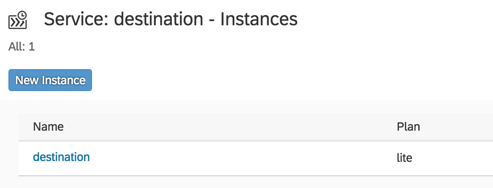
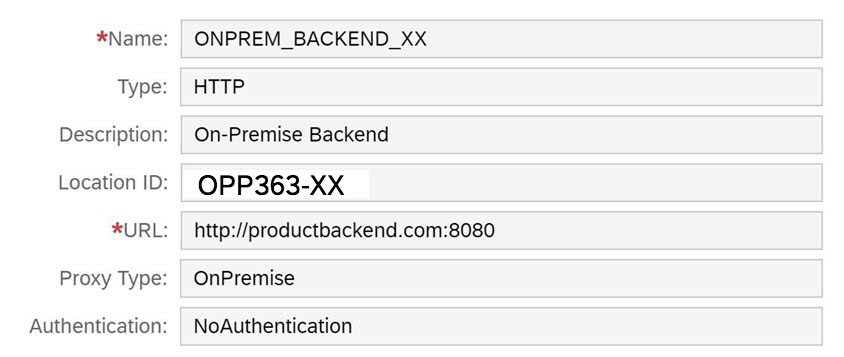
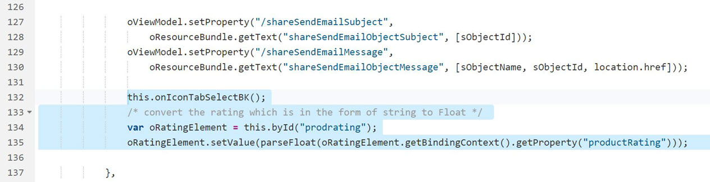
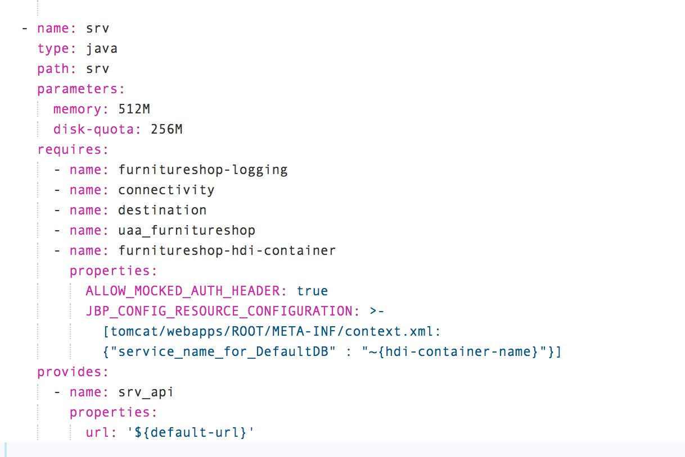
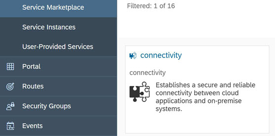
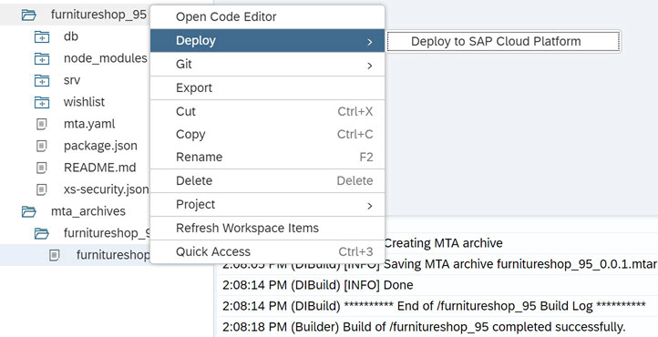

- - - -
Previous Exercise: [Exercise 3 - Publish Wishlist](../Exercise-03-Publish-Wishlist) Next Exercise: [Exercise 5 - Logging](../Exercise-05-Logging)

[Back to the Overview](../README.md)
- - - -

# Exercise 04 - Order New Items

In our scenario, Franck will need to determine which products to add to his inventory based on the feedback received on the wishlist. To do this, he will need to review the wishlist voting and comments received from his colleagues and the company’s customers through a customer portal. Franck will also need to view the existing product inventory from the on-premise backend system. Once he has decided which products to order, he will need to be able to place an order on the backend system and update the backend system inventory accordingly.

To simulate our on premise backend system, we will deploy a simple Java application which exposes product related backend APIs via OData services based on Apache Olingo Java libraries.

We will use Web IDE Full-Stack to modify our existing wishlist application to include the retreival of data from the backed system as well as from the data stored in the SAP HANA database from the wishlist application.

1.	Deploy product backend OData service.
2.	Configure the SAP Cloud Connector: Add Cloud Platform Subaccount add local backend). Configure subaccount and access OData URL.
3.	Create an instance of destination service and a destination configuration on your Cloud Foundry space to access the backend OData URL.
4.	Modify the wishlist front-end application in Web IDE and deploy your MTA to Cloud Foundry.

## 1. Deploy Product Backend OData Service

We first need to deploy a pre-built Java application which will simulate our backend system. The OData service will exposes product information that can be consumed by our wishlist application.

1. Download the Tomcat server bundle  [backend_odata_tomcat.zip](apache-tomcat-9.0.11_OPP363.zip). This bundle has the backend-odata service already deployed.
2. Extract the `backend_odata_tomcat.zip` archive.
3. Navigate to the `bin` folder  
4. Double Click on  startup.bat file. (this will launch a command prompt and start the tomcat server).
5. Launch the URL [http://localhost:8080/backend-odata/Product.svc](http://localhost:8080/backend-odata/Product.svc).


7. Notice that the OData service exposes a collection called OnPremiseProductData. Append `/OnPremiseProductData` to the URL so you have [http://localhost:8080/backend-odata/Product.svc/OnPremiseProductData](http://localhost:8080/backend-odata/Product.svc/OnPremiseProductData).


## 2. Configure the SAP Cloud Connector
The Cloud Connector is an optional on-premise component that is needed to integrate on-demand applications with customer backend services and is the counterpart of SAP Cloud Platform Connectivity. We will download the Cloud Connector from the SAP development tools site. We will use the portable version of the SAP Cloud Connector as it can be easily installed by simply extracting a compressed archive into an empty directory. It does not require administrator or root privileges for the installation.
1. Before we install and configure the SAP Cloud Connector, we will need to get our Subaccount ID for use during the configuration of the cloud connector.
2. Login to your SAP Cloud Platform cockpit [Teched 2018](https://account.hana.ondemand.com/cockpit#/globalaccount/8fd39023-a237-4d71-9b6a-ed9d1719d275/subaccounts)
3. Click the  link on the Cloud Foundry subaccount tile (OPP363CF).


4. The subaccount ID (`dabec0d5-6df7-495d-9c96-f6b25dfd78a4`) will be displayed. Keep this subaccount ID for use in the cloud connector configuration.


5. Locate the SAP Cloud connector folder on the teched Image `(D:\SAP\SCC20)`
6. Double-click `go.bat` to start the Cloud Connector.
7. Launch Cloud Connector URL [https://localhost:8443](https://localhost:8443) and login with the credentials:
   - User: `Administrator`
   - Password: `welcome`
8. For _Define Subaccount_ enter the following configuration:
   - Region Host: `cf.eu10.hana.ondemand.com`
   - Subaccount: `<ID that you copied in step 4>`
   - Display Name: `ProductData Connector`
   - Login Email ID: `<your_login_email>`
   - Password: `<Your_Password>`
   - Location ID: `OPP363-XX` (XX being your unique number assigned to you)
   - Description: `ProductData Connector`


For the current hands-on, all participants are sharing a single SAP Cloud Platform subaccount. To disambiguate the Cloud Connector, each participants provides a unique Location ID.

Location IDs are defined to identify a location of a cloud connector for a specific sub account. You can have multiple cloud connectors configured to work with a single sub account identified by unique Location IDs

9. Click _Save_.
10. Ensure that the Status under Tunnel Information is Connected. If you receive an error, recheck your Region, Subaccount and login information.


11. Now that we have configured the cloud connector and connected it from our local laptop to our SAP Cloud Platform account, the next thing we need to do is to configure access to the backend system.
12. In the Cloud Connector UI, go to `Cloud To On-Premise` from the left-hand menu.
13. Click the `+` icon to add a new mapping virtual to internal system.


14. Choose Back-end Type as `Non-SAP System` and click _Next_.
15. Choose Protocol as `HTTP` and click on _Next_.
16. For Internal Host, enter:
    - Internal Host: `localhost`
    - Internal Port: `8080`
17.	Click _Next_.
18.	For Virtual Host, enter:
    - Virtual Host: `productbackend.com`
    - Virtual Port: `8080`
19.	Click Next.
20.	Leave Principal Type as `None` and click _Next_.
21. Enter a Description and click _Next_.
22. In the Summary Screen check the `Check Internal Host` check box and click _Finish_.


23. You should notice that the Check Results column says `Reachable` in Green.


24. `Under Resources Accessible On productbackend.com:8080` section, click the `+` icon to add the resources under this system.
25. Enter `/backend-odata/` under URL Path.
26. Select the option `Path and all Sub paths`.


27. Click _Save_.
28. You should notice that the Status is Green.
29. If it is not green, recheck the value for URL Path.

This completes the configuration of the SAP Cloud Connector.

## 3. Create an instance of destination service and a Destination configuration on SAP Cloud Platform
The next thing we will need to do is create an instance of destination service on SAP Cloud Platform as well as a destination configuration. This will allow us to access the on premise backend system in our applications on SAP Cloud Platform by using the virtual URL we configured in the cloud connector.

1. In your SAP Cloud Platform admin cockpit, go to your Cloud Foundry Subaccount and navigate to your space.
2. Expand Services and choose Service Marketplace
2. Click on the tile _destination_
3. Click on Instance from the left menu and click on _New Instance_.
4. In the _Create Instance_ wizard, enter:
    - Plan: `lite`
5. For _Specify Parameters_ click _Next_.
6. For _Assign Application_ click _Next_.
7. Under the _Confirm_ section, enter:
    - Instance Name: `destination`
8. Click _Finish_.

You will see the instance of destination service is created



9. Click on the destination link
10. Click on Destinations link from the left menu
11. Click on New Destination

Enter the following:
   - Name: `ONPREM_BACKEND_XX` (substitute `XX` with your assigned student number)
   - Type: `HTTP`
   - Description: `Local Backend`
   - Location ID: `OPP363-XX` (XX being your unique number assigned to you)
   - URL: `http://productbackend.com:8080`
   - Proxy Type: `OnPremise`
   - Authentication: `NoAuthentication`
5. Your destination should look like this:



## 4. Enhance the Service for the Wishlist Application
We can now open the existing wishlist application in Web IDE and modify the service module to include the backend product data from our on premise system.

1. Open Web IDE Full-Stack and open your existing `furniturestore_xx` application.
2. Edit `data-model.cds` under the `db` module. Add a new entity called `BackendProductData` to the end of the file using the following definition:
```
entity BackEndProductData
{
	key ProductID : String;
	SUPPLIERID : String;
	SUPPLIERNAME : String;
	PRICE : String;
	STOCK : String;
	DELIVERYDATE : String;
	DISCOUNT : String;
}
```
3. Edit `my-service.cds` under the `srv` module to add the new entity `BackendProductData`

```
using my.furnitureshop from '../db/data-model';
service CatalogService {
  entity Wishlist @read @update as projection on furnitureshop.Wishlist;

@cds.persistence.skip
  entity BackEndProductData as projection on furnitureshop.BackEndProductData;
}
```
Note that the `@cds.persistence.skip` specifies not to create the table entity in HANA.

4.	The entity `BackendProductData` is not persistent in the HANA database and the odata get operation will return an empty set. We will override the `Query` and `Read` operations of the `BackendProductData` entity by our custom implementation in Java to read the onpremise odata that we created in the previous step via the destination pointing to the virtual url defined in the Cloud Connector configuration.
5.	Under the `srv` module, navigate to src - main - java - com - company - furnitureshop and right-click and choose _Create new Java Class_ enter the class name as `BackEndProductEntity` (do not add .java extension, WebIDE will add it automatically).
Replace the file with the code below:
```java
package com.company.furnitureshop;

import com.sap.cloud.sdk.result.ElementName;
import com.sap.cloud.sdk.service.prov.api.annotations.Key;


public class BackEndProductEntity {
	@ElementName("ProductID")
	@Key
	private String ProductID;

	@ElementName("SUPPLIERID")
	private String SUPPLIERID;

	@ElementName("SUPPLIERNAME")
	private String SUPPLIERNAME;

	@ElementName("PRICE")
	private Float PRICE;

	@ElementName("STOCK")
	private String STOCK;

	@ElementName("DELIVERYDATE")
	private String DELIVERYDATE;

	@ElementName("DISCOUNT")
	private String DISCOUNT;


	public String getPRODUCTID() {
		return ProductID;
	}
	public void setPRODUCTID(String PRODUCTID) {
		this.ProductID = PRODUCTID;
	}

	public String getSUPPLIERID() {
		return SUPPLIERID;
	}
	public void setSUPPLIERID(String SUPPLIERID) {
		this.SUPPLIERID = SUPPLIERID;
	}

	public String getSUPPLIERNAME() {
		return SUPPLIERNAME;
	}
	public void setSUPPLIERNAME(String SUPPLIERNAME) {
		this.SUPPLIERNAME = SUPPLIERNAME;
	}

	public String getSTOCK() {
		return STOCK;
	}
	public void setSTOCK(String STOCK) {
		this.STOCK = STOCK;
	}

	public String getDELIVERYDATE() {
		return DELIVERYDATE;
	}
	public void setDELIVERYDATE(String DELIVERYDATE) {
		this.DELIVERYDATE = DELIVERYDATE;
	}

	public String getDISCOUNT() {
		return DISCOUNT;
	}
	public void setDISCOUNT(String DISCOUNT) {
		this.DISCOUNT = DISCOUNT;
	}
}
```
Review the code that you just created, the class `BackEndProductEntity` defines the entity of the `BackEndProductData` Collection.

6. In the same folder create another Java class and name it as `BackendService`, paste the code below into the new file:
```java
package com.company.furnitureshop;

import java.util.List;
import java.util.Map;
import org.slf4j.Logger;
import org.slf4j.LoggerFactory;
import com.sap.cloud.sdk.service.prov.api.request.QueryRequest;
import com.sap.cloud.sdk.service.prov.api.request.ReadRequest;
import com.sap.cloud.sdk.service.prov.api.response.ErrorResponse;
import com.sap.cloud.sdk.service.prov.api.response.QueryResponse;
import com.sap.cloud.sdk.service.prov.api.response.ReadResponse;
import com.sap.cloud.sdk.service.prov.api.operations.Query;
import com.sap.cloud.sdk.service.prov.api.operations.Read;
import com.sap.cloud.sdk.odatav2.connectivity.ODataQueryBuilder;
import com.sap.cloud.sdk.odatav2.connectivity.ODataQueryResult;


public class BackendService {
	private static final String BACKEND_DESTINATION_NAME = "ONPREM_BACKEND_XX";
	private static final Logger logger = LoggerFactory.getLogger(BackendService.class);

	@Query(serviceName = "CatalogService", entity = "BackEndProductData")
	public QueryResponse getProducts(QueryRequest queryRequest) {
		logger.info("Class:BackendService - now in @Query getProducts()");

		QueryResponse queryResponse = null;
		try {
			logger.info("Class:BackendService - now execute query on Products");
			ODataQueryBuilder qb = ODataQueryBuilder.withEntity("/backend-odata/Product.svc", "OnPremiseProductData")
						.select("ProductID", "SUPPLIERID", "SUPPLIERNAME", "PRICE", "STOCK", "DELIVERYDATE","DISCOUNT");

			logger.info("Class:BackendService - After ODataQueryBuilder: ");
				ODataQueryResult result = qb.enableMetadataCache()
				 .build()
				 .execute(BACKEND_DESTINATION_NAME);

			logger.info("Class:BackendService - After calling backend OData V2 service: result: ");

			List<Map<String, Object>> v2BackEndProductsMap = result.asListOfMaps();
			queryResponse = QueryResponse.setSuccess().setData(v2BackEndProductsMap).response();
			return queryResponse;
		} catch (Exception e) {
			logger.error("Class:BackendService - ==> Exception calling backend OData V2 service for Query of Products: " + e.getMessage());

			ErrorResponse errorResponse = ErrorResponse.getBuilder()
					.setMessage("Class:BackendService - There is an error.  Check the logs for the details.").setStatusCode(500).setCause(e)
					.response();
			queryResponse = QueryResponse.setError(errorResponse);
		}
		 return queryResponse;
	}

	@Read(entity = "BackEndProductData", serviceName = "CatalogService")
	public ReadResponse getProduct(ReadRequest readRequest) {
	logger.info("Class:BackendService - at Read "+readRequest.getKeys().get("ProductID").toString());
		ReadResponse readResponse = null;

		try {
			logger.info("Class:BackendService - getProduct inside with ProductID = " + readRequest.getKeys().get("ProductID").toString());
			ODataQueryResult readResult = ODataQueryBuilder
					.withEntity("/backend-odata/Product.svc",
							"OnPremiseProductData('" + readRequest.getKeys().get("ProductID").toString() + "')")
					.select("ProductID", "SUPPLIERID", "SUPPLIERNAME", "PRICE", "STOCK", "DELIVERYDATE","DISCOUNT")
					.enableMetadataCache()
					.build().execute(BACKEND_DESTINATION_NAME);


			BackEndProductEntity readProdEntity = readResult.as(BackEndProductEntity.class);
			readResponse = ReadResponse.setSuccess().setData(readProdEntity).response();

			logger.info("Class:BackendService - After calling backend OData V2 READ service: readResponse : " + readResponse);


		} catch (Exception e) {
			logger.error("==> Exception calling backend OData V2 service for READ of Products: " + e.getMessage());

			ErrorResponse errorResponse = ErrorResponse.getBuilder()
					.setMessage("There is an error.  Check the logs for the details.").setStatusCode(500).setCause(e)
					.response();
			readResponse = ReadResponse.setError(errorResponse);
		}
		return readResponse;
	}

}

```
Modify the XX in the value ONPREM_BACKEND_XX in the above java code with your unique student number

Review the Java code that you created, the `@Query` annotation implements the query operation for the `BackEndProductData` entityset and the `@Read` annotation for reading a single `BackEndProductData` entity. We use SAP Cloud Platform sdk to query the backend via destinations.

## 4. Extend the User Interface to Display On-Premise Product Data
We will next extend the user interface to include capabilities to display the on-premise product data as well as the UI to show the ratings of the products in in the wishlist. The ratings will be captured in the next exercise.

There are 2 things we need to change in the UI:
a.	Add a new Tab to show Backend Product Data that we fetch from on-Premise system.
b.	Update the code to Display Product Ratings.

1. We will need to add a new tab to show backend product data that we fetch from on-premise system.
2. Expand _wishlist application - webapp - view_, open `Detail.view.xml`
3. Locate `<IconTabBar>`
4. Add an event - `select= "onIconTabSelectBK"` we will define this function in the controller to bind the `BackendProductData`

```
<IconTabBar id="iconTabBar" class="sapUiResponsiveContentPadding" select= "onIconTabSelectBK">
```
5. Currently we have 2 tabs in our application `<IconTabFilter>` one which displays product information and the other one which displays an image of the product. Locate this in your code:

```html
<IconTabFilter id="iconTabBarFilter2"
	icon="sap-icon://picture" tooltip="{i18n>detailIconTabBarAttachments}">
	<Image src="img/{pictureURL}"
	densityAware="false">
	<layoutData>
	<FlexItemData growFactor="1" />
	</layoutData>
	</Image>
</IconTabFilter>
```
6. Add this code below:
```html
<IconTabFilter id="iconTabBarFilter3" icon="sap-icon://factory" tooltip="{i18n>detailIconTabBarAttachments}" >
	<l:VerticalLayout
		class="sapUiContentPadding"
		width="50%">
		<l:content>
			<List id = "backendlist"
				headerText="On-Premise Data" >
				<DisplayListItem
					label="Product ID"
					value="{ProductID}" />
				<DisplayListItem
					label="Stock"
					value="{STOCK}" />
				<DisplayListItem
					label="Discount"
					value="{DISCOUNT}"/>
				<DisplayListItem
					label="Delivery Date"
					value="{DELIVERYDATE}"/>
			</List>
		</l:content>
	</l:VerticalLayout>
</IconTabFilter>
```
7. We will as well add a `RatingIndicator` to display ratings
For this, on the `Detail.view.xml`, at the end of `</ObjectHeader>`, add the below code:
```html
<!-- Display Average Product Rating -->
<Bar>
	<contentRight>
		<Label text = "Average Product Rating " />
		<RatingIndicator maxValue="5" id = "prodrating" class="sapUiSmallMarginBottom" editable = "false" value="" />
		<Label text = " ({productRating})" />
	</contentRight>
</Bar>
```
8. Now Expand _wishlist application - webapp - controller_ and open  `Detail.controller.js` Directly before the `onInit` function, define the function `onIconTabSelectBK`
```javascript
onIconTabSelectBK: function () {
var prodid = this.getView().getBindingContext().getProperty("ProductID");
var oListbackend = this.byId("backendlist");
oListbackend.bindElement("/BackEndProductData('" + prodid + "')");
},
```
9. In the same `Detail.controller.js`, locate the function `_onBindingChange` add the below lines of code at the end of the function:
```javascript
this.onIconTabSelectBK();
/* convert the rating which is in the form of string to Float */
var oRatingElement = this.byId("prodrating");
oRatingElement.setValue(parseFloat(oRatingElement.getBindingContext().getProperty("productRating")));
```



10. We need to add `xsuaa`, `connectivity` and `destination service` to `mta.yaml` file for the `srv` application.  In the _Code Editor_ view of your `mta.yaml` locate the `srv` module and insert the following lines in the `requires:` section:
```
    - name: uaa_furnitureshop_XX (XX is your unique student number)
    - name: connectivity
    - name: destination
```
Also add the below line of code to set logging level to info which we will use in the next exercise

```
properties:
      SET_LOGGING_LEVEL: '{com.company.furnitureshop: INFO}'
      ALLOW_MOCKED_AUTH_HEADER: true

```


11. Your srv module should look like this:



12. Next, in the `resources` section of your `mta.yaml` add connectivity and destination and make sure you have an entry for uaa_furnitureshop_XX as shown:

```
 - name: connectivity
   type: org.cloudfoundry.existing-service
 - name: destination
   type: org.cloudfoundry.existing-service
 - name: uaa_furnitureshop_XX (XX is your unique student number)
   parameters:
      path: ./xs-security.json
      service-plan: application
   type: com.sap.xs.uaa
```

12. Next, we need to create instance of `connectivity` and `destination service` in cockpit UI (this could also be done using the Cloud Foundry command line interface (cli). From your SAP Cloud Platform administration cockpit, in your Cloud Foundry subaccount, click _Spaces_ on the left menu.


13. Open your space by clicking on the link in the tile.
14. From the left menu, go to _Services-Service Marketplace_.
15. Search for Connectivity.



16. Click on _connectivity_ and from the left menu, select _Instances_.
17. Click _New Instance_.


18. In the _Create Instance_ wizard, enter:
    - Plan: `lite`
19. For _Specify Parameters_ click _Next_.
20. For _Assign Application_ click _Next_.
21. Under the _Confirm_ section, enter:
    - Instance Name: `connectivity`
22. Click _Finish_.
23. Return to the _Service Marketplace_ under _Services_ for your space.
24. Search for _destination_.
25. As you did for _connectivity_, select Instances from the left menu and click _New Instance_.
26. Leave everything default for _Service Plan_, _Specify Parameters_ and _Assign Application_.
27. Under _Confirm_, enter:
    - Instance Name: `destination`
28. Click _Finish_.
29. You can view your _Service Instances_ from the left menu:


13. We are now ready to build the project furnitureshop, deploy to Cloud Foundry.
14. Right-click your project and click _Build CDS_.
15. Confirm that the Build CDS has completed successfully.
16. Right-click your project and click _Build_.


17. Confirm that the build has completed successfully.
18. The result of the build should be a new folder in your project for the mta archives (`mta_archives`).
19. Expoand the mar_archives folder and the folder for your project and then right-click the furnitureshop0.0.1.mtar and click _Deploy-Deploy to SAP Cloud Platform_.



20. In the _Deploy to SAP Cloud Platform_ dialog, enter:
    - Cloud Foundry API Endpoint: `https://api.cf.eu10.hana.ondemand.com`
    - Organization: `TechEd2018_OPP363`
    - Space: `<your space>`


21. Let us next test the application
22. Login to SAP Cloud Platform Cockpit -> Navigate to your Space -> Applications
23. If you have followed all the steps from the start of Exercise 1, You should see 4 applications

 - db: This is the db module that was deployed as part of the mta deployment
 - srv: This is the srv module with CDS and Java code that was deployed as part of the mta deployment
 - <SOME_RANDOM_NAME>furnitureshop-srv: This was deployed when you did right click on srv module and Run as Java Application in Exercise 1
 - webide-builder-sapwebide-di-<SOME_RANDOM_NAME>: This is the builder that you installed in Exercise 1
 - wishlist: This is the wishlist html5 application with the UI logic was deployed as part of the mta deployment


24. Click on the srv application and click on the link to under Application Routes to launch the srv application

25. You shoild be able to see the URL to the ODATA service that the srv application has created on clicking the link you should now see a new collection - BackEndProductData

26. Append /BackEndProductData to the url to view the Collection

27. To test the ui application navigate to the wishlist application in the SAP Cloud Platform cockpit and launch the URL, you will see a new tab which shows Backend Product information, you may not see any ratings yes as this will be done in the next exercises


## 5. Clean-up
1. login to your SAP Cloud Platform Cockpit, navigate to your space and your applications
2. Stop the java application, <SOME_RANDOM_NAME>furnitureshop-srv to free up some application runtime space for the next exercises


- - - -
© 2018 SAP SE
- - - -
Previous Exercise: [Exercise 3 - Publish Wishlist](../Exercise-03-Publish-Wishlist) Next Exercise: [Exercise 5 - Logging](../Exercise-05-Logging)

[Back to the Overview](../README.md)
