- - - -
Previous Exercise: [Exercise 3 - Publish Wishlist](../../Exercise-03-Publish-Wishlist) Next Exercise: [Exercise 5 - Logging](../../Exercise-05-Logging)

[Back to the Overview](../../README.md)
- - - -

# Exercise 04 - Order New Items

In our scenario, Franck will need to determine which products to add to his inventory based on the feedback received on the wishlist. To do this, he will need to review the wishlist voting and comments received from his colleagues and the company’s customers through a customer portal. Franck will also need to view the existing product inventory from the on-premise backend system. Once he has decided which products to order, he will need to be able to place an order on the backend system and update the backend system inventory accordingly.

To simulate our on premise backend system, we will deploy a simple Java application which exposes product related backend APIs via OData services based on Apache Olingo Java libraries.

We will use Web IDE Full-Stack to modify our existing wishlist application to include the retreival of data from the backed system as well as from the data stored in the SAP HANA database from the wishlist application.

**This exercise involves the following main steps.**

1.	   Deploy product backend OData service.
2.	   Configure the SAP Cloud Connector: Add Cloud Platform Subaccount add local backend). Configure subaccount and access OData URL.
3.    Clone the Wishlist application from Git
4. 	Build and Deploy application to SAP Cloud Platform
5.	   Create Destination configuration on SAP Cloud Platform
6. 	Test the application

## 1. Deploy Product Backend OData Service

We first need to deploy a pre-built Java application which will simulate our backend system. The OData service will exposes product information that can be consumed by our wishlist application.

1. Tomcat bundle is available in the TechEd student image under D:\Files\Session\OPP363\apache-tomcat-9.0.11
2. Navigate to the bin folder
3. Double Click on  startup.bat file. (this will launch a command prompt and start the tomcat server).
4. Launch the URL [http://localhost:8080/backend-odata/Product.svc](http://localhost:8080/backend-odata/Product.svc).

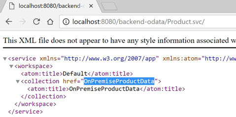

5. Notice that the OData service exposes a collection called OnPremiseProductData. Append `/OnPremiseProductData` to the URL so you have [http://localhost:8080/backend-odata/Product.svc/OnPremiseProductData](http://localhost:8080/backend-odata/Product.svc/OnPremiseProductData).

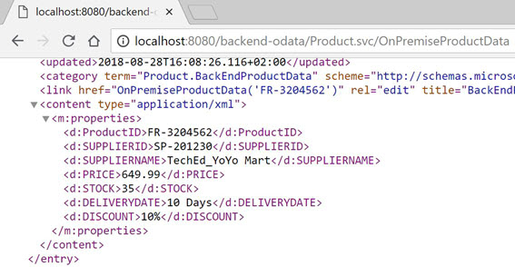

## 2. Configure the SAP Cloud Connector
The Cloud Connector is an optional on-premise component that is needed to integrate on-demand applications with customer backend services and is the counterpart of SAP Cloud Platform Connectivity. We will download the Cloud Connector from the SAP development tools site. We will use the portable version of the SAP Cloud Connector as it can be easily installed by simply extracting a compressed archive into an empty directory. It does not require administrator or root privileges for the installation.
1. Before we install and configure the SAP Cloud Connector, we will need to get our Subaccount ID for use during the configuration of the cloud connector.
2. Login to your SAP Cloud Platform cockpit [TechEd 2018](https://account.hana.ondemand.com/cockpit#/globalaccount/8fd39023-a237-4d71-9b6a-ed9d1719d275/subaccounts)
3. Click the  link on the Cloud Foundry subaccount tile (OPP363CF).

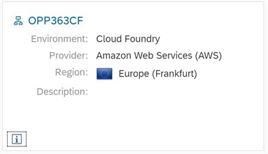

4. The subaccount ID (`dabec0d5-6df7-495d-9c96-f6b25dfd78a4`) will be displayed. Keep this subaccount ID for use in the cloud connector configuration.

5. Locate the SAP Cloud Connector folder on the TechEd Image `(D:\SAP\SCC20)`
6. Double-click `go.bat` to start the SAP Cloud Connector.
7. Launch SAP Cloud Connector URL [https://localhost:8443](https://localhost:8443) and login with the credentials:
   - User: `Administrator`
   - Password: `welcome`
8. For _Define Subaccount_ enter the following configuration:
   - Region Host: `cf.eu10.hana.ondemand.com`
   - Subaccount: `<ID that you copied in step 4>`
   - Display Name: `ProductData Connector`
   - Login Email ID: `<your_login_email>`
   - Password: `<Your_Password>`
   - Location ID: `OPP363-XX` (XX being your unique number assigned to you)
   - Description: `ProductData Connector`

Ignore the fields under the section HTTPS Proxy on the right side, leave them blank 

For the current hands-on, all participants are sharing a single SAP Cloud Platform subaccount. To disambiguate the SAP Cloud Connector, each participants provides a unique Location ID.

Location IDs are defined to identify a location of a cloud connector for a specific sub account. You can have multiple SAP Cloud Connectors configured to work with a single sub account identified by unique Location IDs

9. Click _Save_.
10. Ensure that the Status under Tunnel Information is Connected. If you receive an error, recheck your Region, Subaccount and login information.

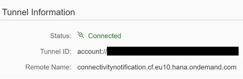

11. Now that we have configured the SAP Cloud Connector and connected it from our local laptop to our SAP Cloud Platform account, the next thing we need to do is to configure access to the backend system.
12. In the SAP Cloud Connector UI, go to `Cloud To On-Premise` from the left-hand menu.
13. Click the `+` icon to add a new mapping virtual to internal system.

14. Choose Back-end Type as `Non-SAP System` and click _Next_.
15. Choose Protocol as `HTTP` and click on _Next_.
16. For Internal Host, enter:
    - Internal Host: `localhost`
    - Internal Port: `8080`
17.	Click _Next_.
18.	For Virtual Host, enter:
    - Virtual Host: `productbackend.com`
    - Virtual Port: `8080`
19.	Click Next.
20.	Leave Principal Type as `None` and click _Next_.
21. Enter a Description and click _Next_.
22. In the Summary Screen check the `Check Internal Host` check box and click _Finish_.

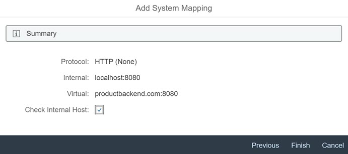

23. You should notice that the Check Results column says `Reachable` in Green.

24. `Under Resources Accessible On productbackend.com:8080` section, click the `+` icon to add the resources under this system.
25. Enter `/backend-odata/` under URL Path.
26. Select the option `Path and all Sub paths`.

27. Click _Save_.
28. You should notice that the Status is Green.
29. If it is not green, recheck the value for URL Path.

This completes the configuration of the SAP Cloud Connector.

## 3. Clone the Wishlist application from Git

1.	Delete the furnitureshop application if you have already created it
2.	Make sure you delete the application and instances of service from your SAP Cloud Platform Cockpit
3.	Launch WebIDE and Right click on Workspace and choose Git-> Clone Repository

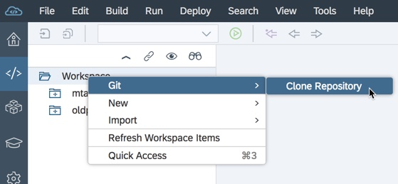

4.	Provide the URL to the git repository as - https://github.com/SAP/cloud-cf-furnitureshop-demo

5.	The git repository will be cloned and you will see the project like the below image

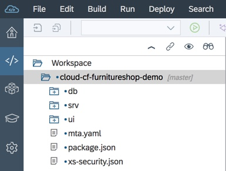

6.	Open the `xs-security.json` file and change the XX as highlighted in the below image to your student number 

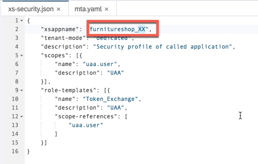

7.	Save the file

## 4. Build and Deploy application to SAP Cloud Platform

1. We are now ready to build the project furnitureshop and deploy to Cloud Foundry.
2. Right-click your project and click _Build and choose Build CDS_.
3. Confirm that the Build CDS has completed successfully.
4. Right-click your project and click _Build and Choose Build_.

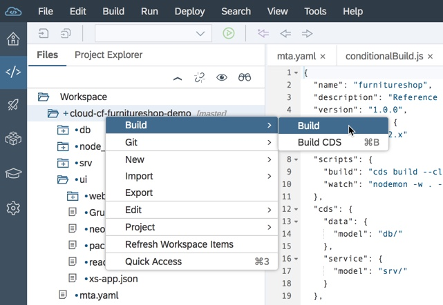

5. Confirm that the build has completed successfully.
6. The result of the build should be a new folder in your project for the mta archives (`mta_archives`).
7. Expoand the mar_archives folder and the folder for your project and then right-click the furnitureshop0.0.1.mtar and click _Deploy-Deploy to SAP Cloud Platform_.

8. You may get a popup to enter your credentials, please enter your id/password then In the _Deploy to SAP Cloud Platform_ dialog, enter:
    - Cloud Foundry API Endpoint: `https://api.cf.eu10.hana.ondemand.com`
    - Organization: `TechEd2018_OPP363`
    - Space: `<your space>`

Wait until the deployment is complete and ensure it was successful, meanwhile you can login to the cockpit to view the applications being deployed. Please do not click into application until the deployment is complete 

## 5. Create Destination configuration on SAP Cloud Platform
Please make sure the deployment is complete. The next thing we will need to do is create an instance of destination service on SAP Cloud Platform as well as a destination configuration. This will allow us to access the on premise backend system in our applications on SAP Cloud Platform by using the virtual URL we configured in the cloud connector.

1. In your SAP Cloud Platform admin cockpit, go to your Cloud Foundry Subaccount and navigate to your space.
2. Click on Applications from the left menu
3. Click on the srv application 
4. Under Application Routes, copy the url link to the srv application. This will be used in the next steps.
2. Click on the Service Bindings link on the left menu
3. Click on the destination service link under the Name Column
4. Click on Destinations link from the left menu, you will see the existing destination that you have created in the previous steps.
5. Click on New Destination

Enter the following:
   - Name: `getWishlist`
   - Type: `HTTP`
   - Description: `Get Wishlist`
   - URL: `<Paste the srv application url that you copied>` (Make sure you add `https://` to the begining of the URL)
   - Proxy Type: `Internet`
   - Authentication: `NoAuthentication`
6. Your destination should look like this:

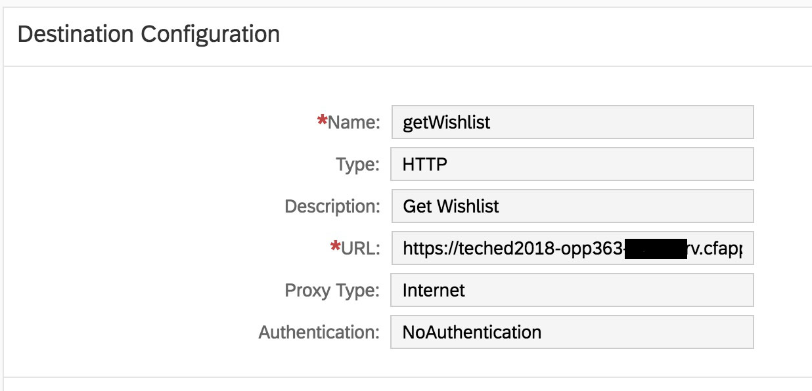

Click on Save

Click on New Destination

Enter the following:
   - Name: `ONPREM_BACKEND`
   - Type: `HTTP`
   - Description: `Local Backend`
   - Location ID: `OPP363-XX` (XX being your unique number assigned to you)
   - URL: `http://productbackend.com:8080`
   - Proxy Type: `OnPremise`
   - Authentication: `NoAuthentication`
12. Your destination should look like this:

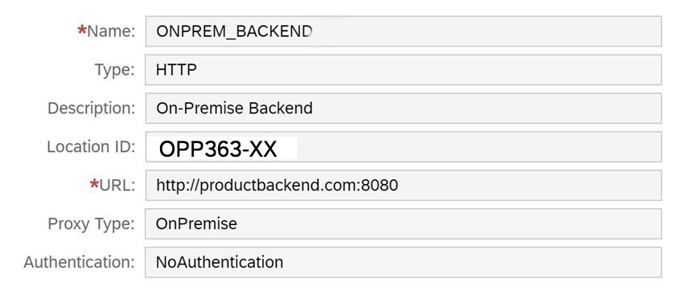

Click on Save

## 6. Test the application

1. In the SAP Cloud Platform Cockpit -> Navigate to your Space -> Applications
2. If you have followed all the steps from the start of Exercise 3, You should see 4 applications

 - db: This is the db module that was deployed as part of the mta deployment, it will be stopped by default, do not delete or modify this app.
 - srv: This is the srv module with CDS and Java code that was deployed as part of the mta deployment
 - webide-builder-sapwebide-di-<SOME_RANDOM_NAME>: This is the builder that you installed in Exercise 1. Please do not delete this application.
 - ui: This is the wishlist html5 application with the UI logic was deployed as part of the mta deployment

3. Click on the srv application and click on the link under Application Routes to launch the srv application

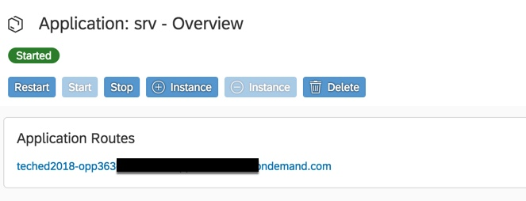

4. You should be able to see the URL to the ODATA service that the srv application has created on clicking the link you should now see a new collection - BackEndProductData

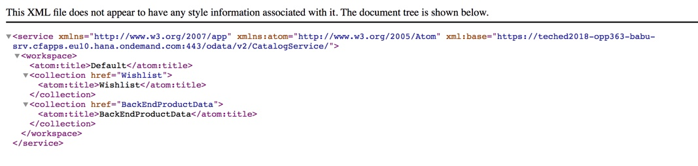

5. Append /BackEndProductData to the url to view the Collection

6. To test the ui application navigate to the wishlist application in the SAP Cloud Platform cockpit and launch the URL, you will see a new tab which shows Backend Product information, you may not see any ratings yet as this will be done in the next exercises

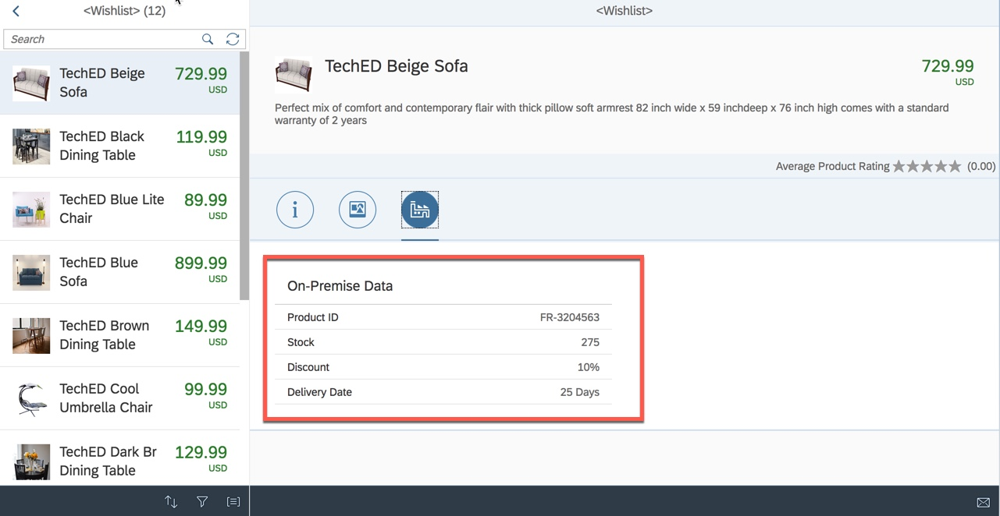

- - - -
© 2018 SAP SE
- - - -
Previous Exercise: [Exercise 3 - Publish Wishlist](../../Exercise-03-Publish-Wishlist) Next Exercise: [Exercise 5 - Logging](../../Exercise-05-Logging)

[Back to the Overview](../../README.md)
