- - - -
Previous Exercise: [Exercise 5 - Logging](../Exercise-05-Logging) Next Exercise: [Exercise 7 - Comments and Ratings Frontend](../Exercise-07-Comments-and-Ratings-Frontend)

[Back to the Overview](../README.md)
- - - -

# Exercise 06 - Comments and Ratings

We now switch to the persona of Mary. Mary is a loyal customer of the furniture franchise. She has access to the shop's customer portal, which allows her to browse the product catalogue and view the wishlist items, which the shop is planning to stock. Customers like Mary will now have the ability to provide their input by adding ratings and comments on products, which Frank/the furniture shop has uploaded in the wishlist.

## Technology choice

To help Mary provide her valuable inputs, we will create a 'Comments and Ratings' microservice. Following the guidelines of a microservice-based architecture of composing the application as a collection of loosely-coupled services, the choice of technology used by every service is based on the skillset in the team and more importantly on the requirements of the service.
With the SAP Cloud Platform Cloud Foundry environment, teams have the flexibility to pick technologies and databases which best fit their requirements.

To build a 'Comments and ratings' service which needs to collect inputs from the broad customer base of the furniture shop, we will need to use a technology which is simple and can work at lightning speeds. Hence the natural choice is to go with Node.js.

For persistence, we will require a simple, cost-effective, transactional database to quickly store the ratings and comments from the users. To satisfy this requirement, a relational database like PostgreSQL will be a good choice. The communication between this transactional store and the master data store on SAP HANA, will be via OData calls.

In this exercise, we will create a Multi-Target Application [MTA], consisting of a Node.js module which provides REST API’s to add ratings and comments. During the deployment of the Node.js module, it will fetch the wishlist information from SAP HANA database which was exposed as OData in [Exercise 3](../Exercise-03-Publish-Wishlist) and store it in a PostgreSQL database. Once this ratings backend is available, we will build the front-end i.e. user interface in Exercise 7, which will display the wishlist in the form of a list view and allow the user to rate and comment on any product in the list. Individual ratings and average ratings will be persisted in PostgreSQL and the average rating will also be pushed to SAP HANA. These ratings in SAP HANA will help Franck to decide which products to order.

In Exercise 8, we will see that Mary’s comments on the furniture products can be pushed to Twitter to spread the word and encourage other customers/patrons to engage with the furniture shop. To cater to this requirement, we will use an asynchronous message-broker like RabbitMQ to communicate and push messages to Twitter.

## Important - before we begin

In the upcoming sections, you will be required to clone the exercise content from a given git repository. In general, Node.js modules need to be built based on the requirement and cannot be easily templated. To explain relevant sections of the code, you will notice that certain parts/modules are commented. The exercises will guide you to uncomment individual pieces of code, while explaining the relevance of each piece and what it tries to achieve. Please take note that commenting/uncommenting will differ based on the type of file you are working with. Javascript files will consist of line comments "//" where as UI5/xml files might use block comments with "/*.. */" format. Please follow the instructions closely to have a smooth exercise experience.

## 1. Clone exercise content and code walkthrough

In this section, we will clone the exercise content from Git to SAP Web IDE Full-Stack.

1. Click on the _Home_ icon  on the navigation view.

2. On the main view of the home page, select _Clone from Git Repository_.

	 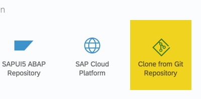

3. Enter the git repository URL to clone from and click on 'Clone'.

	

4. Click the development icon  on the navigation view, the cloned application is displayed; expand the application.

	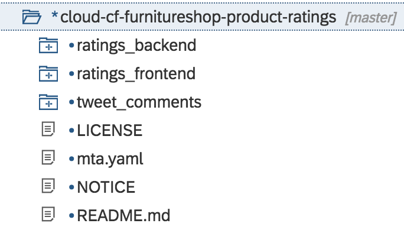

5. The application consists of 3 modules - `ratings_backend`, `ratings_frontend` and `tweets_comments`. In this exercise, we will focus on the `ratings_backend` module.

6. Open the `ratings_backend` module and navigate to the `package.json` file which lists all the packages that your module depends on.

     

   Note that the file contains dependencies on the following node/npm modules:

	 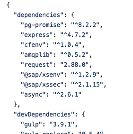

	  * `pg-promise` - handles automatic connections and transactions to the Postgres database instance

	  * `cfenv` - used to parse Cloud Foundry-provided environment variables

	  * `amqplib` - used to make amqp clients for Node.js

	  * `@sap\xsenv` - SAP provided module for working with environment variables

	  * `@sap\xssec`- SAP provided module for node.js Container Security API

## 2. Read wishlist data

In order to provide ratings (and comments) on products in the wishlist, the service will require the wishlist data published by the furniture shop. This data is stored in SAP HANA during Exercise 3. We will now have to read the wishlist data from Exercise 3 and persist the same in PostgreSQL.

Sharing of data between microservices is always a difficult architectural decision. In this exercise, we simplify this choice by opting for duplication of data via OData APIs. Let us see how this is realised.

1. The entry point to `ratings_backend` module is the `app.js`.

   

2. In this file we initialise the PostgreSQL database and load the required data from the Wishlist service to PostgreSQL. You will see 2 methods - `initializeDB` and `uploadInitialData` which are used to achieve this. Uncomment these 2 methods.

   Note: To uncomment, follow these steps:

   * Select the commented code
   * Right click mouse on the editor
   * Select the 'Toggle Line Comment' option

   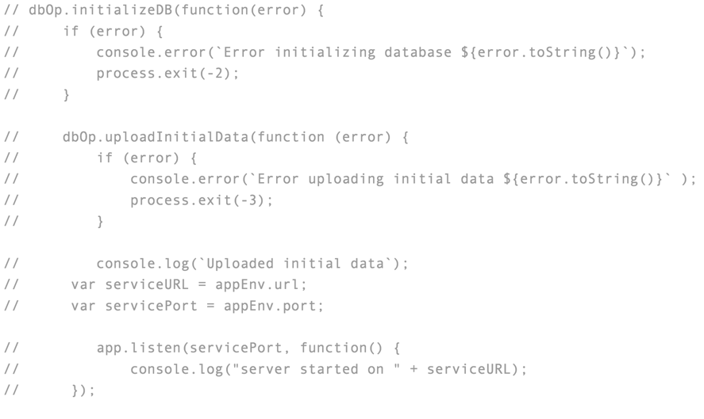

   These methods are defined in `dbOp.js` file under the `db` folder. Let us look at what these methods do.

   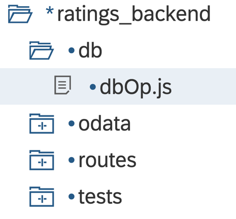

3. Open `dbOp.js. This module is used to perform all the required db operations.

   * The `initializeDB` function makes a connection to PostgreSQL with the help of `pg-promise` and creates 2 tables in PostgreSQL.

   * The `uploadInitialData` function makes a request to the OData endpoint of service 1 to get the wishlist and stores it in PostgreSQL tables.

   Uncomment the 2 functions (`initializeDB` and `uploadInitialData`) in `dbOp.js`

   Note: To uncomment, follow these steps:

   * Select the commented code
   * Right click mouse on the editor
   * Select the 'Toggle Line Comment' option

   

4. We already understand that data sharing between the 'Wishlist' service and 'Ratings and Comments' microservices will be realised by calling OData endpoints from Exercise 1. These requests are handled in `odata.js` file under `odata` folder.

   

   This is achieved using 2 functions (`readWishList` and `updateWishlistRating`).

   * `readWishList` is used to read Wishlist data from service 1. It looks for the destination where the OData endpoint is described. Once the OData URL is discovered, a GET request is made to     fetch the required data.

   * `updateWishlistRating` is used to share the average rating of a wishlist product to service 1. It looks for the destination where the OData endpoint is described. Once the OData URL is discovered, a PUT request is made to update average rating into the SAP HANA database.

   Uncomment the function (`readWishList`) in `odata.js`

   Note: To uncomment, follow these steps:

   * Select the commented code
   * Right click mouse on the editor
   * Select the 'Toggle Line Comment' option

5. The `route.js` module under the `route` folder is used to expose these functions as REST APIs. Have a look at this file to understand how this is achieved.

   

## 3. Deploy the application

We will now build and deploy the application that has been built above.

1. Using your Files explorer in Web IDE, right click on the **`product_ratings`** folder, go to Build &rarr; and click on **Build** as shown in the picture below.

   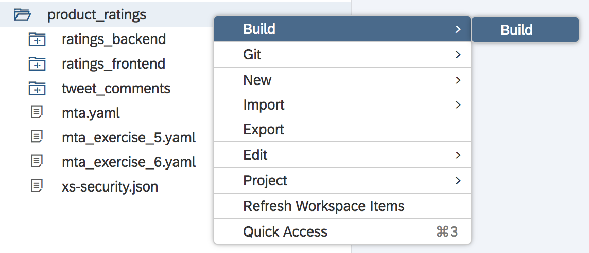

   Once the build is completed successfully, you will see a new folder created in your project with the name **`mta_archives`**.

2. Right click on the generated .mtar file **`product_ratings`**, and go to Deploy &rarr; and click on **Deploy to SAP Cloud Platform** as shown in the picture below.

   

3. In the popup that appears, please enter the following details and click on Deploy

   

   ```
   Cloud Foundry API Endpoint: https://api.cf.eu10.hana.ondemand.com
   Organization: TechEd2018_OPP363
   Space: <select your space from the drop down list>
   ```

4. The deployment may fail with errors. This is because, in `odata.js`, the application expects a destination to read data from the Wishlist service, as shown below. This is currently missing. We will create the destination in the next section.

   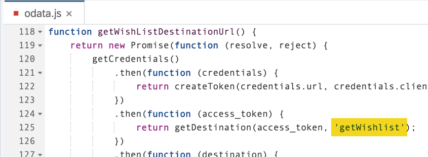

## 4. Create destination to consume wishlist data

1. From the SAP Cloud cockpit, navigate to your space and select _Applications_ tab. Click on the `ratings_backend` application.

   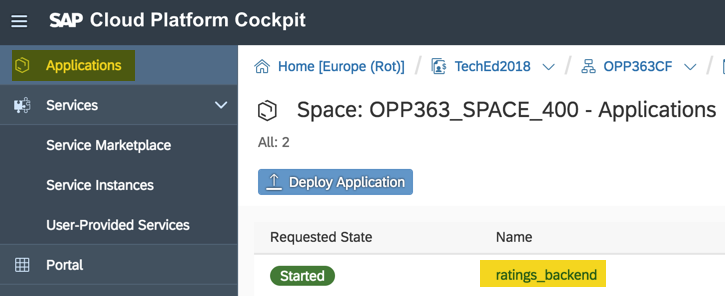

2. Click on _Service Bindings_, here you would see all the services bound with the current application.

   

3. Click on the `destination` service from the service instance list.

   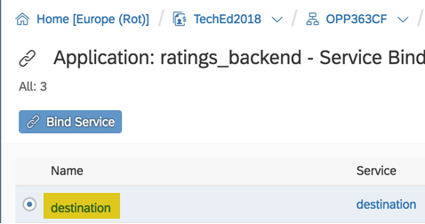

4. Click on _Destinations_ tab.

   

5. Click on _New Destination_  and use the below parameters to create the destination. Click _Save_.

   

        - Name: `getWishlist`
        - Type: `HTTP`
        - URL: `mention the application url of _srv_ module of service1`
        - Proxy type: `Internet`
        - Authentication: `NoAuthentication`

6. Navigate back to your _Applications_ view. Stop and Start the `ratings_backend` application.

   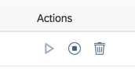

7. The application should go to a green **Started** state. Click on the application name link.

8. To test the application, click on the url below _Application Routes_. The application opens in a new tab. Append “/products” to the URL and check that the Wishlist product data is shown.

   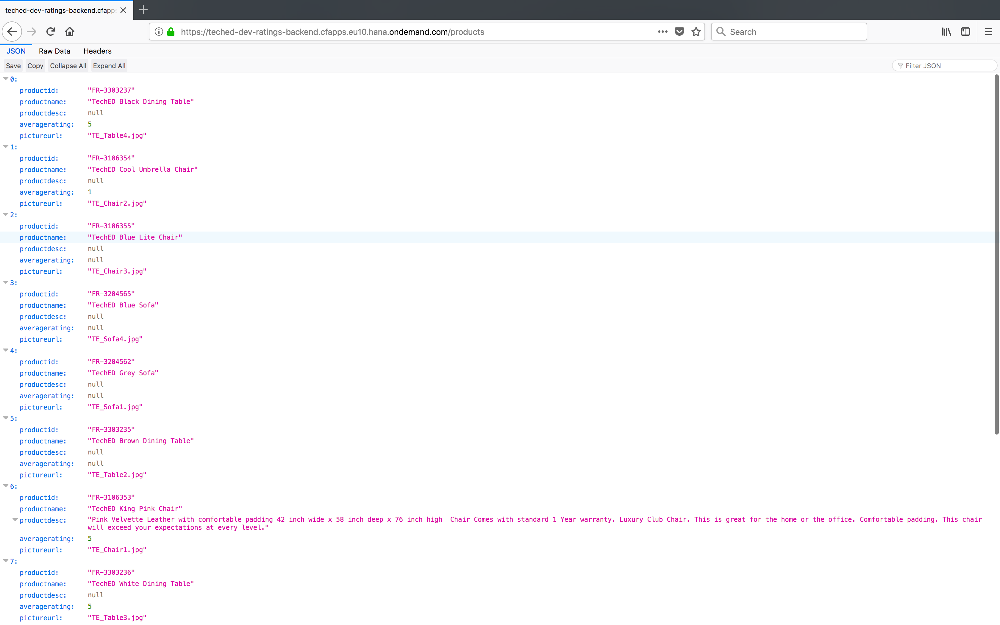

- - - -
© 2018 SAP SE
- - - -

Previous Exercise: [Exercise 5 - Logging](../Exercise-05-Logging) Next Exercise: [Exercise 7 - Comments and Ratings Frontend](../Exercise-07-Comments-and-Ratings-Frontend)

[Back to the Overview](../README.md)

