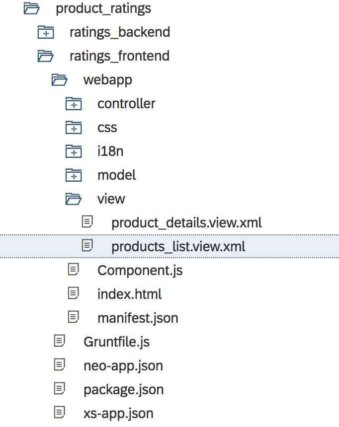
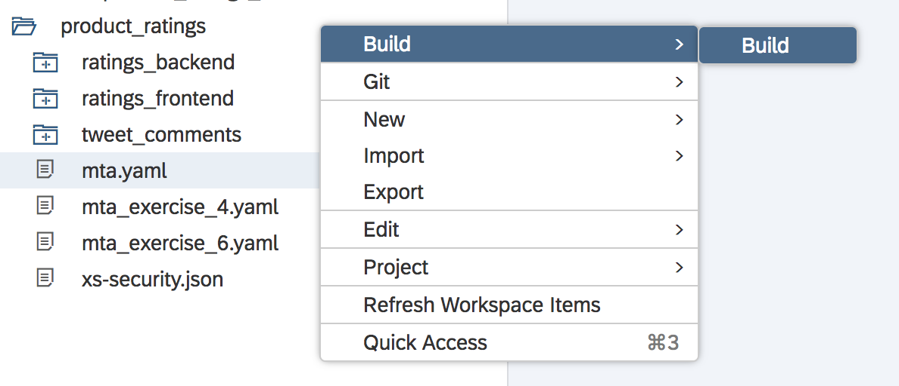

- - - -
Previous Exercise: [Exercise 4 - Comments and Ratings Backend](../Exercise4_Comments_and_Ratings_Backend) Next Exercise: [Exercise 6 - Tweet Comments Backend](../Exercise6_Tweet_Comments_Backend)

[Back to the Overview](../README.md)
- - - -
# Exercise 5 - Comments and Ratings Frontend

In this exercise, you will build the front-end application of the furniture shop's customer portal. The customer portal allows customers  to browse the store's product catalogue and see the whishlist items which the store is planning on stocking. You will build the screens that will enable customers like Mary to add ratings and comments on products which Franck has uploaded to the wishlist.

## Overview
The front end application has two views.

1. Products List View - Wish list items uploaded by Franck.

   

2. Product Details View - Details of the selected product.

    The Product Details View has two tabs.

    * Tab 1: Details - It shows the details and the image of the selected product.

        

    * Tab 2: Rate Item - The logged in user can provide rating and comments for the selected item from this tab.

        

    Underneath the tabs, there is a review feed which shows all the comments given for the selected product.
   

## 1. Fetching the Code
As a part of this session, you must have cloned the code required for this exercise (Exercise 5) in Exercise 4.

If you haven't done so, please follow the steps mentioned [here](../Exercise4_Comments_and_Ratings_Backend)


## 2. Setup the Products List View
In this section, you will setup controller for products list view - a view that shows the list of products.

1. Using your File Explorer in Web IDE, open the **`products_list.controller`** file as shown in the picture below.

   

2. Uncomment the following methods
   * **`getProductsList`** - Fetches the products list from ratings_backend app.
   * **`onProductSelection`** - Event handler for table row selection.

        Note: To uncomment, follow these steps:
        1. Select the commented code
        2. Use the mouse Right click
        3. Select the 'Toggle Line Comment' option

## 3. Setup the Product Details View
In this section, you will setup controller for product details view - a view that shows the details of a product. The view also allows the logged in user to rate the product and add a review.

1. Using your File Explorer in Web IDE, open the **`products_details.controller`** file as shown in the picture below.

   

2. Uncomment the following methods:
   * **`setReviewFeed`** - Fetch all the reviews for the selected
   * **`onSubmitRatingButtonPress`** - Handles the submit button click.

        At the end of Exercise 5, you will be able to see your comment in the review feed.

## 4. Understanding the HTML5 Application Code
*Please note that you don't have to make any changes to your code as a part of this step. This section is intended only to explain the SAP UI5 HTML application code*

In the UI5 application each controller has a respective view where we build our UI. We have developed the UIs using XML. Let's take a closer look at what we have done in these xml view files.

### product_list.view.xml
1. Using your Files explorer in Web IDE, open the **`products_list.view.xml`** file as shown in the picture below.

   

2. In this view we done the following:
    * Here, you have created a table with id `idProductsListTable` with three columns Product Id, Product Name and Average Rating.
    * The label names are fetched from i18 files, enabling globalization.
    * The UI elements are bound to a model, which is set in the *`products_list.controller`*
    * Making the Column List Item `Active` makes each item in the list clickable. The click action is bound to an event handler `onProductSelection` which gets a call when the user clicks on a row in the table.
    * A Refresh button is added with the corresponding event handler in the footer.

### product_details.view.xml
1. Using your Files explorer in Web IDE, open the **`product_details.view.xml`** file as shown in the picture below.

   

2. In this view we done the following:
    * Here, a details view UI with multiple tabs, comments feed and a back navigation button is created.
    * An IconTabBar  is used to create two tabs.
        * Details Tab - Where all the details of the product are selected
        * Rating Tab - Where the user can submit ratings
    * Underneath the tabs, the review comments for the selected product are shown.

When you create an SAP UI5 application using the SAP Web IDE, a file structure with all the relevant files are created such as *`style.css`*, *`i18n.properties`*, *`model.js`* etc.


Let us look at two such files *`manifest.json`* and *`xs-app.json`* where you specify some crucial settings for the front end application.


#### manifest.json

* Global Model

    You have created models such as **`products`** in *`products_list.controller`*; and **`productDetails`** and **`userRatingModel`** in *`product_details.controller`*. These models are view specific, i.e. such models can only be accessed from the corresponding view and controller. To access models from any view, you can setup global models in the *`manifest.json`* file under the **`models`** section.

    You have used two global models in this app *`selectedProductModel`* and *`userInfo`*.

* UI App Routing

    You use a router mechanism to navigate between different UI screens. You define the routes for your views in the *`manifest.json`* file under the **`routing` &rarr; `routes`** section

#### xs-app.json
* Backend Routing

    To forward our request sent from ratings_frontend app to the backend app, we define routes under the **`routes`** section inside *`xs-app.json`*


## 5. Deploying the Application
In this section you will build and deploy the application that you have built in Exercise 5.

1. Using your File Explorer in Web IDE, rename the **`mta.yaml`** file to **`mta_exercise_4.yaml`** as shown in the picture below.

   

2. Using your File Explorer in Web IDE, rename the **`mta_exercise_5.yaml`** file to **`mta.yaml`** as shown in the picture below.

   

3. Using your File Explorer in Web IDE, right click on the **`product_ratings`** folder, go to Build &rarr; and click on **Build** as shown in the picture below.

   

   Once the build is completed, you will see a new folder created in your Web IDE's File Explorer with the name **`mta_archives`**.

4. Using your File Explorer in Web IDE, right click on the generated .mtar file **`product_ratings`**, and go to Deploy &rarr; and click on **Deploy to SAP Cloud Platform** as shown in the picture below.

    

5. In the popup that appears, please enter the following details and click _Deploy_.

    

    ```
    Cloud Foundry API Endpoint: ``//TODO: Add the end point
    Organization: ``//TODO: Add your organization
    Space: Select your space from the drop down list
    ```
6. //TODO: @Sanjay to add the generic line about checking the services and logs as done in the earlier exercise.

7. Once your application is deployed launch the url for ratings_frontend app.

   Your app should look like the screenshots included in the [overview section](#overview).

8. Select a product and go to the `Rate Item` tab in the Product Details view.

9. Give the product a rating and comment and click on submit, as shown in the picture below.

    

    This will add a review to the product as show below.

    

### Troubleshooting
If you are facing issues, please read the following points
* Take caution about the commas `,` in the controller and JSON files. The last method/item doesn't end with a comma.
* Ensure that you maintain case sensitivity in routes.
* Ensure that the YAML files indentation is appropriate. You can do so by attempting to open your yaml file in MTA editor.
* Ensure that you have the privileges and your space has the ability to create the resources you've mentioned in your yaml file.

### Further Reading
* [Starting point for SAPUI5 and Fiori](https://sapui5.hana.ondemand.com/)
* [SAP UI5 Icon explorer](https://sapui5.hana.ondemand.com/test-resources/sap/m/demokit/iconExplorer/webapp/index.html#)
* [Github code repository]() //TODO: Add link here


- - - -
© 2018 SAP SE
- - - -
Previous Exercise: [Exercise 4 - Comments and Ratings Backend](../Exercise4_Comments_and_Ratings_Backend) Next Exercise: [Exercise 6 - Tweet Comments Backend](../Exercise6_Tweet_Comments_Backend)

[Back to the Overview](../README.md)
