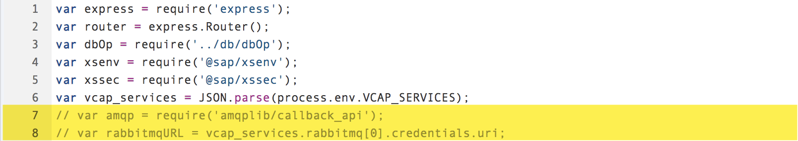
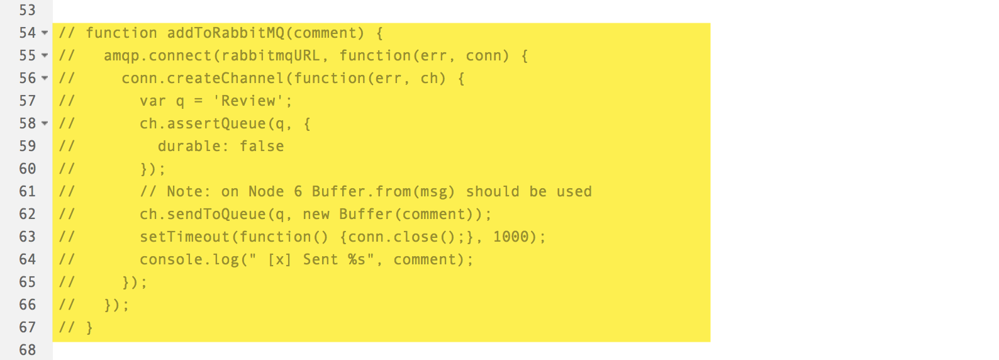
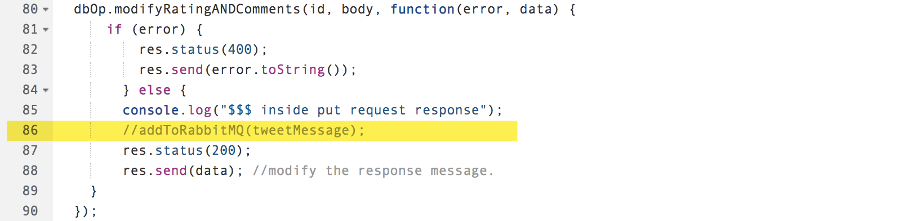
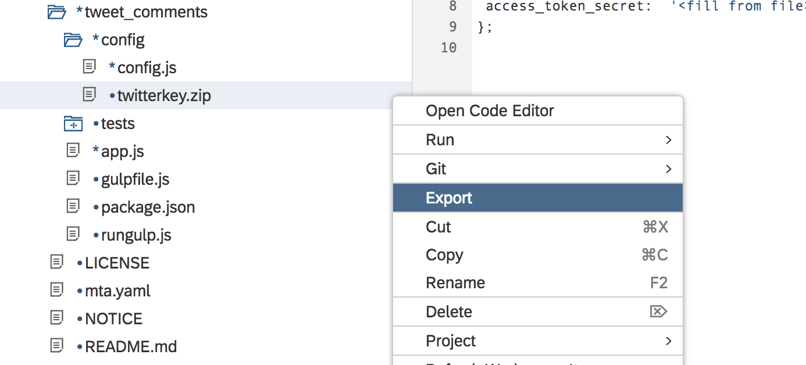
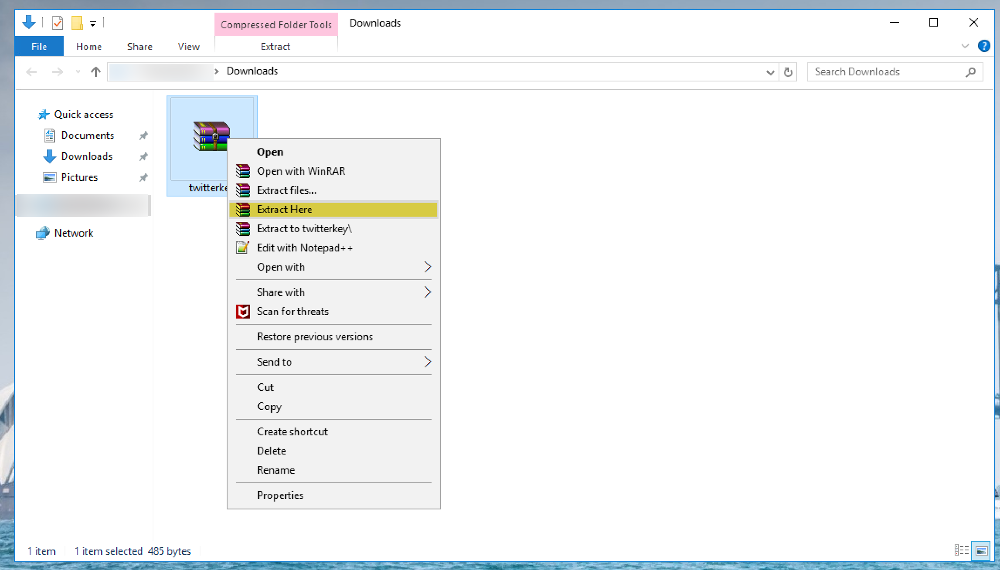
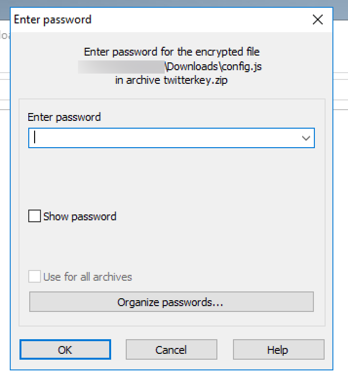
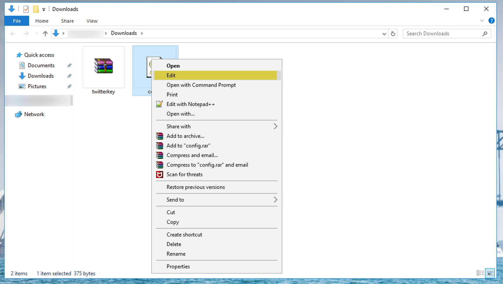
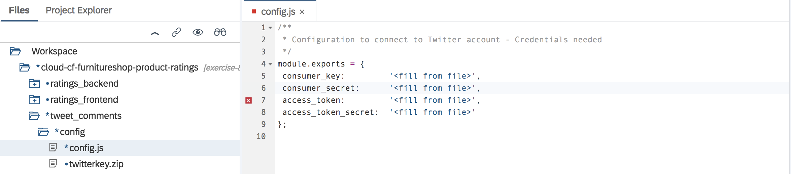

- - - -
Previous Exercise: [Exercise 07 - Comments and Ratings Frontend](../Exercise-07-Comments-and-Ratings-Frontend) Next Exercise: [Exercise-09 - Test Order New Items with User Input](../Exercise-09-Test-Order-New-Items-with-User-Input)

[Back to the Overview](../README.md)
- - - -

# Exercise 08 - Tweet Comments Backend

Till now we have seen that Furniture Shop/Franck have published a 'Wishlist' of products that it/he wishes to carry. We also saw that loyal customers like Mary have access to the customer portal to provide ratings and comments on the wishlist to influence the shop's decision. If we now provide a mechanism to spread the word about these wishlist reviews to a broader audience, more customers would be able to provide their inputs via the portal. And based on this feedback, Franck can order for the highly rated items into his furniture store inventory.

To achieve this reach, we can send out a **tweet** on the Furniture Store's twitter account whenever a customer posts a review of any particular product. We will build `tweet_comments`- a _headless_ microservice, i.e. a microservice without any UI & directly consumable in other microservices, to realise this functionality.

As the communication between our application and Twitter needs to be aysnchronous, we will use a message-broker like RabbitMQ to provide the queueing capability. Once a customer posts a review, the comments are published to a RabbitMQ queue. We will then pick the same message from the queue and publish it to Twitter.

## Important - before we begin

In the upcoming sections, you will be required to clone the exercise content from a given git repository. In general, Node.js modules need to be built based on the requirement and cannot be easily templated. To explain relevant sections of the code, you will notice that certain parts/modules are commented. The exercises will guide you to uncomment individual pieces of code, while explaining the relevance of each piece and what it tries to achieve. Please take note that commenting/uncommenting will differ based on the type of file you are working with. Javascript files will consist of line comments "//". Please follow the instructions closely to have a smooth exercise experience.

### 1. Clone exercise content and code walkthrough

As a part of the previous exercise, we have cloned the content required for this exercise too.

If you have not done so, please follow the steps 1 to 4 mentioned [here](../Exercise-06-Comments-and-Ratings-Backend#1-clone-exercise-content-and-code-walkthrough)

We know that the cloned application consists of 3 modules - `ratings_backend`, `ratings_frontend` and `tweets_comments`. In this exercise, we will focus on the `ratings_frontend` module.


To start working on *Exercise 8*, the `tweet_comments` module, we will switch to `exercise-8` branch in git.

1. Select the folder `cloud-cf-furnitureshop-product-ratings` in your Web IDE Files explorer and then using your Git Pane, click on `Discard All` (Discard all unstaged changes in the list) as shown in the picture below.
    

2. In the confirmation dialog that appears, click on `Discard`.
    

3. Using your Git Pane, click on `+` (Create Local Branch) as shown in the picture below.

    

4. In the popup that appears, select the source branch as `origin/exercise-8` and enter the branch name as `exercise-8` and click on **OK**.

    

5. Refer to the image below and ensure that you have successfully checked out branch `exercise-8`

    

Open the `tweets_comments` module and navigate to the `package.json` file which lists all the packages that your module depends on.


Note that the file contains dependencies on the following node/npm modules:


 * `cfenv` - used to parse Cloud Foundry-provided environment variables

 * `amqplib` - used to make amqp clients for Node.js

 * `twit` - Twitter API Client for Node.j


### 2. Setup RabbitMQ producer in 'ratings_backend' module

1. Go to the `ratings_backend` module built in Exercise 6 and open the `route.js` file under `route` folder.

   

2. Uncomment the rabbitmq libraries highlighted in the image.
   

   Note: To uncomment, follow these steps:

     1. Select the commented code
     2. Right click mouse on the editor
     3. Select the 'Toggle Line Comment' option

3. Uncomment the `addToRabbitMQ` method - the producer which creates a channel and sends the review data from the ratings service to the RabbitMQ queue.

   Note: To uncomment, follow these steps:

   1. Select the commented code
   2. Right click mouse on the editor
   3. Select the 'Toggle Line Comment' option

   

4. Uncomment the `addToRabbitMQ` method call.

   Note: To uncomment, follow these steps:

     1. Select the commented code
     2. Right click mouse on the editor
     3. Select the 'Toggle Line Comment' option

   

### 3. Setup RabbitMQ consumer in 'tweet_comments' module

1. The entry point to `tweets_comments` module is the `app.js`. Open this file.

   

2. Uncomment the consumer code in `app.js`. This piece creates a channel and reads message from the RabbitMQ queue. We then push this message i.e. in our case 'Reviews' to Twitter.

   Note: To uncomment, follow these steps:

     1. Select the commented code
     2. Right click mouse on the editor
     3. Select the 'Toggle Line Comment' option

   

### 4. Setup the API Key for posting comments on Twitter
In this section we will go over the configuration steps required to post the review comments on twitter. A Twitter account activated for development provides a set of access keys that can be used by an application to securely connect to twitter. As a part of this exercise, we will be using the API Keys to this [twitter handle](https://twitter.com/sapfurnishop). Since these keys are sensitive, we must gain access to them in a secure manner.

1. Export (download) the `twitterkey.zip` file as shown in the picture below.
   

2. Extract the archive as shown in the picture below.
   

3. While extracting, you will be prompted to enter a password. Please ask the presenters for the archive's password and continue extracting `twitterkey.zip`

   

    Once you've successfully extracted the archive, you should see `config.json` file.

4. Right click on the extracted file - `config.json`, click on the *Edit* option and copy the entire content of the file.
   

5. In you Web IDE, *open tweet_comments &rarr; config &rarr;* `config.js` and paste the content copied in the previous step.

   


### 5. Deploying the application and Test

We will now build and deploy the application that has been built above. Please note that the build and deploy may take few minutes. Please use this deployment time to login to the Cloud cockpit and check the creation of backing service instances, service bindings and applications. The order mentioned in your `mta.yaml` file will be followed during the deployment. You can also keep an eye on the flow of the deployment by watching the console logs from Web IDE or using the CF CLI command - **`cf logs <app name> --recent`**.

1.  To ensure that you do not deploy an incorrect MTAR it is advisable to delete the `product_ratings` folder under *mta_archives* folder as shown in the picture below.
   

2. Right click on the **`cloud-cf-furnitureshop-product-ratings`** folder, go to `Build` and click **Build** as shown in the picture below.

   

   Once the build is completed successfully, you will see a new folder created in your Web IDE's File Explorer with the name **`mta_archives`**.

3. Right-click on the generated .mtar file **`product_ratings_1.0.0`**, and go to Deploy &rarr; and click on **Deploy to SAP Cloud Platform** as shown in the picture below.

   

4. In the popup that appears, please enter the following details and click _Deploy_.

   

    ```
      Cloud Foundry API Endpoint: https://api.cf.eu10.hana.ondemand.com
      Organization: TechEd2018_OPP363
      Space: <select your space from the drop down list>
    ```

5. Once your application is deployed launch the url for ratings_frontend app. As `tweet_comments` is a headless service and is consumed by the `ratings` service.

6. Select a product from the list and navigate to the `Rate Item` tab. Give the product a rating and a comment and click on submit.

   

   You can also check the review feeds for a particular product.

   

7. In your browser, go to this [twitter handle](https://twitter.com/sapfurnishop) to see your comment posted as a tweet.

   


    Twitter handle URL: https://twitter.com/sapfurnishop

- - - -
© 2018 SAP SE
- - - -

Previous Exercise: [Exercise 07 - Comments and Ratings Frontend](../Exercise-07-Comments-and-Ratings-Frontend) Next Exercise: [Exercise-09 - Test Order New Items with User Input](../Exercise-09-Test-Order-New-Items-with-User-Input)

[Back to the Overview](../README.md)
