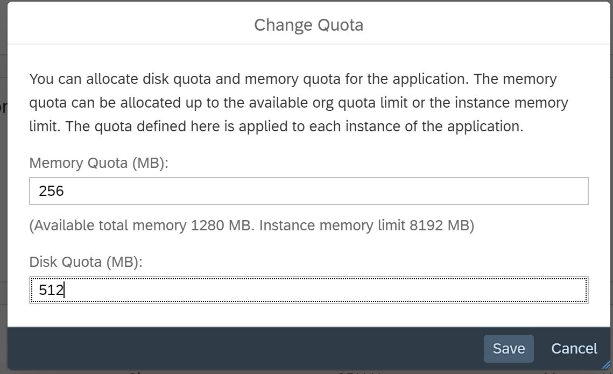
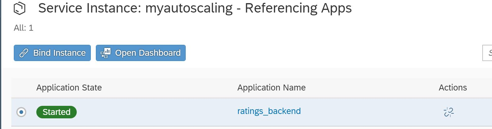
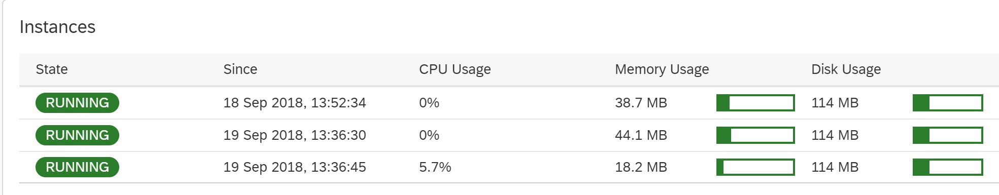

- - - -
Previous Exercise: [Exercise 6 -  Tweet Comments Backend](../Exercise6_Tweet_Comments_Backend) Next Exercise: [Exercise 8 - Blue Green Deployment of Comments and Ratings](../Exercise8_Blue_Green_Deployment_of_Comments_and_Ratings)

[Back to the Overview](../README.md)
- - - -

# Exercise 7 - Autoscaling of ratings backend app

Scaling of an application is adding more resources (Memory, CPU, Disk) to it and distributing the load between multiple servers. Two types of scaling that are available are:
- Scaling Up/Vertical Scaling: change the disk and memory quota.
- Scaling Out/Horizontal Scaling: increase/decrease the number of instances.

Key benefits:
- Provides failover capabilities - if one application process crashes, the application still works.
- Enabling parallel processing.

## 1. Configure Manual Scaling in the SAP Cloud Platform Cockpit
We will configure the scaling manually in the SAP Cloud Platform Cockpit. PLease make sure you complete the last step of the exercise and remove the additional instance(s) you create.

1. Open your SAP Cloud Platform cockpit and go to _Org - Space - Applications_.
2. Locate the `ratings_backend` application.
3. Click on the application to go to the _Overview_ page.
4. Scroll down to see the number of instances already running for the application. It should be 1 and will show _Memory usage_ and _Disk usage_. Check the quota assigned to the application which is `256 MB`.
5. Scroll up and increase the instance of the application by clicking the _+ Instance_ button. This will do the horizontal scaling i.e scaling out.

.

6. When you scroll down you will see the instances count increased to two.

.

7. Now click on _Change Quota_ under _Quota Information_ to do the vertical scaling i.e scaling up where we will increase the disk and memory quota from `256 MB` to `512 MB`.
8. Click _Save_ and you will see the quota increased.

.

8. Let’s get back the application to original state, click on change quota to reduce the quota back to `256 MB`.
9. Click _Save_.
10. Reduce the instance by removing it.

## 2. Configure Auto Scaling in the SAP Cloud Platform Cockpit

1.	Go to your SAP Cloud Platform cockpit under _Org - Space_.
2.	Expand the _Services_ tab on left.

.

3.	Click _Service Marketplace_.
4.	Click _Application Autoscaler_, we are performing this step to create an instance of application autoscaler.

.

5.	Click _Instances_ on the left side.
6.	Click _New Instance_.

.

7.	Click _Next_, on bottom right.
8.	Again, click _Next_ on bottom right.
9.	Click _Next_, on bottom right again.
10.	Enter the _instance name_ as `myautoscaling`.

.

11.	Click _Finish_, this will create a autoscaling instance for your applications to use.
12.	Click on the newly created myautoscaling instance.
13.	Click _Bind Instance_, we are performing this step to bind our application to this auto scaler instance.

.

14.	In the _Application_ dropdown select the ratings_backend app.
15.	Now edit the below `policy.json` file in notepad:

Download and edit this file in notepad: [policy.json](../Exercise7_Autoscaling_of_Comments_and_Ratings/policy.json)

16.	Save the file with name as `policy.json`
17.	Go to your SAP Cloud Platform cockpit, click _browse_ and the `select policy.json` file, you should see the policy getting uploaded as parameters.

. 

18.	Click _Save_.
19.	 Explanation of the above parameters used: Here we are increasing the instance from 1 to 3, and then bringing it down. Other parameters are mentioned below:

        schedules:	A schedule enables you to configure scaling rules for specific days or on a recurring basis. Schedule guards against expected high surges or low activity period.

        recurring_schedule:	Triggers the scaling rule recursively during the specified intervals.

        start_time:	Start time of a recurring schedule in 24-hr format (HH:MM).

        end_time:	End time of a recurring schedule in 24-hr format (HH:MM).

        days_of_week:	Trigger scaling on weekdays ranging from 1 (Monday) to 7 (Sunday). The rule will execute during the weekdays                             specified within the array.

        instance_min_count:	Minimum number of instances during the recurrence period.

        instance_max_count:	Maximum number of instances during the recurrence period.

        initial_min_instance_count:	Minimum number of instances to scale up during the start of recurrence period.

20.	You can now see your application under _Referencing Apps_.

.

21.	Click on your `ratings_backend` application, to go back to your _Application Service Bindings_ page. Here you can see the auto scaler instance being created.
22.	Click _Overview_, on the left side.
23.	Scroll down you can see the instances of your application increased to 3 as per the defined policy and the start time mentioned.

.

24.	As per the policy and the start time to reduce the instance the application instances will come down.

- - - -
© 2018 SAP SE
- - - -
Previous Exercise: [Exercise 6 -  Tweet Comments Backend](../Exercise6_Tweet_Comments_Backend) Next Exercise: [Exercise 8 - Blue Green Deployment of Comments and Ratings](../Exercise8_Blue_Green_Deployment_of_Comments_and_Ratings)

[Back to the Overview](../README.md)
