
# Exercise 9 - Debugging

## Navigation

| Previous | | Next
|---|---|---|
| [Exercise 8 - Tweet Comments Backend](../Exercise-08-Tweet-Comments-Backend) | [Overview](../README.md) | [Exercise 10 - Test Order New Items with User Input](../Exercise-10-Test-Order-New-Items-with-User-Input)

## Table of Contents

* [Overview](#user-content-intro)
* [Prepare an Application (`tweet_comments`) Instance for Debugging](#user-content-step1)
* [Attaching the Debugger to an Application Instance](#user-content-step2)
* [Debug the Application Instance](#user-content-step3)
* [Cleanup](#user-content-step4)

## Overview

SAP Web IDE Full-Stack provides built-in functionality for debugging cloud applications. Currently, [debugging of Java](https://help.sap.com/viewer/825270ffffe74d9f988a0f0066ad59f0/CF/en-US/a0f95901ab6c46a0b16c92eb313c6b08.html?q=debugging) and [debugging of NodeJS](https://help.sap.com/viewer/825270ffffe74d9f988a0f0066ad59f0/CF/en-US/af6cc561014f4763837be143a4173a0a.html?q=debugging) applications are supported.

When an application is run from within the Web IDE tool (using the _Run as_ option available for each module), you can attach the debugger and debug that application instance.

In the previous exercises, you have deployed applications by first creating a _.mtar_ file by issuing a **_Build_** command on the project, followed by a command to **_Deploy_** the created MTAR package to SAP Cloud Platform. In these cases, the debugger within the SAP Web IDE tool cannot attach to the running application instances. So, for the sake of the current exercise, we will first stop a running instance of an application (`tweet_comments` in our case), and instead start an application instance directly from within the Web IDE, in order to attach the debugger to the application instance.

This exercise demonstrates how to debug NodeJS applications.  You can check out  [this documentation](https://help.sap.com/viewer/825270ffffe74d9f988a0f0066ad59f0/CF/en-US/a0f95901ab6c46a0b16c92eb313c6b08.html?q=debugging) for debugging Java applications.

[Top](#Top)

# 1. Prepare an Application (`tweet_comments`) Instance for Debugging

1. Open your SAP Cloud Platform cockpit and go to your _Space - Applications_.

2. Locate the `tweet_comments` application.

3. Stop the running instance of the `tweet_comments` application.

    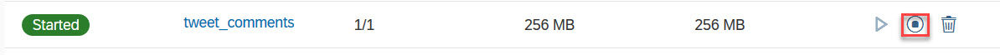

4. In the Web IDE Workspace, expand the project _cloud-cf-furnitureshop-product-ratings_, created during the previous exercise. Right-click on the tweet_comments module and select  _Run – Run as NodeJS Application_.

    

5. Wait for a few minutes for the application to start

    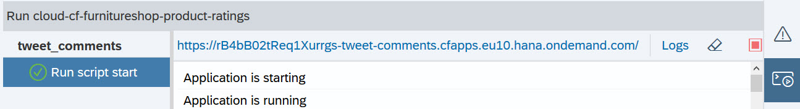

6. Let us test the overall product rating functionality using the newly created instance of the tweet_comments applications. In the _cockpit_, locate the `ratings_frontend` application and click on it. On the _Overview_ page for the application, click on the URL displayed under the _Application Routes_.

    * Select a product from the list and navigate to the `Rate Item` tab. Give the product a rating and a comment and click on the _Submit_ button. Note that your screen will look different based on the product you selected for rating.

        

    * You can also check the review feeds for a particular product.

        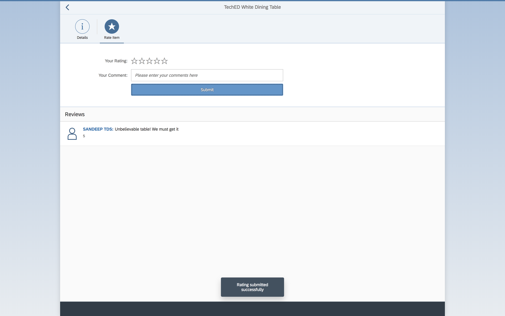

7. In your browser, go to this [twitter handle](https://twitter.com/sapfurnishop) to see your comment posted as a tweet.

    

[Top](#Top)

# 2. Attaching the Debugger to an Application Instance

1.	In the Web IDE, launch the _Debugger_ by clicking on the Debugger icon on the menu bar on the right (or by selecting _View - Debugger_ from the menu bar on top).

    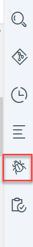

1.	In the Debugger pane, click on the icon for Attach Debugger

    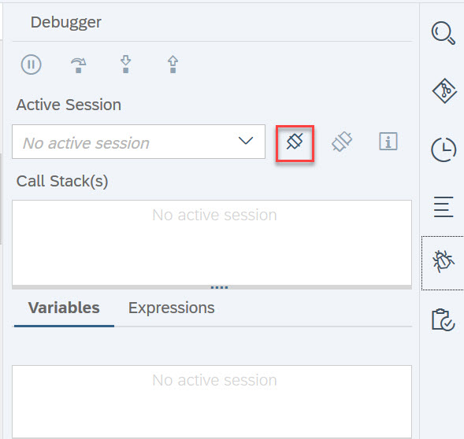

3.	You should see a pop-up window to select a _Debug Target_ as shown below. Confirm the value of debug target and click on _OK_. You should see a browser notification that the debugger is now successfully attached to the target application instance.

    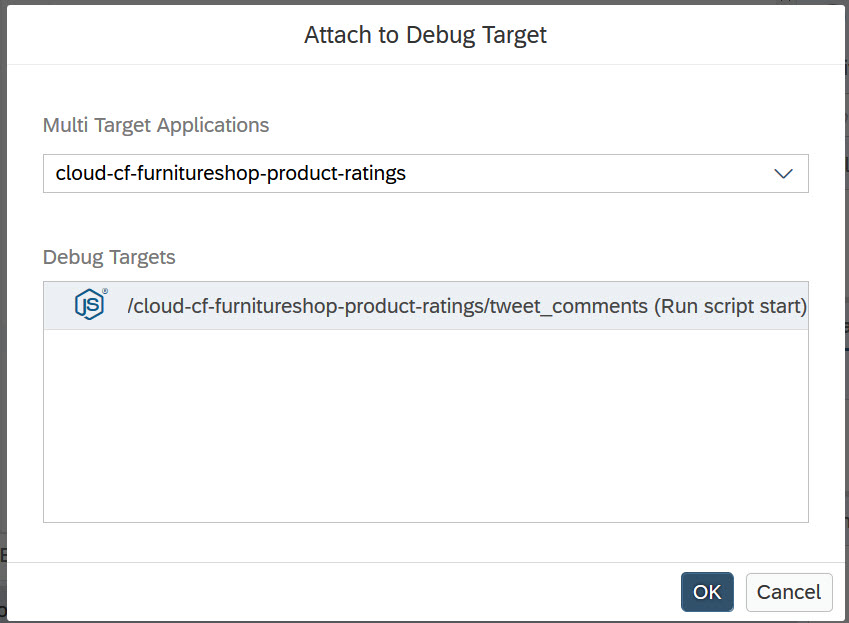

1. Open the `tweet_comments/app.js` file and set a breakpoint right before the function call for `Twit.post(...)` by clicking on the line number.

    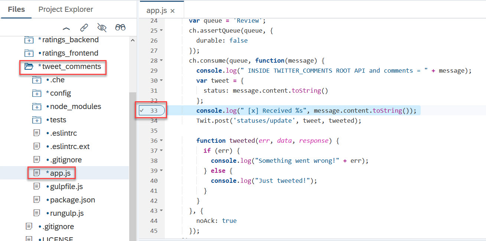

[Top](#Top)

# 3. Debug the Application Instance
We are now ready to debug the application instance running on the SAP Cloud Platform.
1.	Once again, use the _ratings_frontend_ application to submit rating and comment for any of the products.  You may see a browser notification that the Debugger has suspended the application.
  
    Note that the frontend application has submitted the rating and comment successfully. We have attached the Debugger to the tweet_comment application, which is watching for the submitted comments on a RabbitMQ channel and is publishing the comments via tweets. Since the Debugger has suspended the tweet_comments application, we will not see any tweet going out for the comment you have submitted just now, until the Debugger resumes the application.

2.	Switch the Web IDE and notice that the Debugger pane is now showing the details of the suspended application such as the _Call Stack_ and values of the _Variables_.

  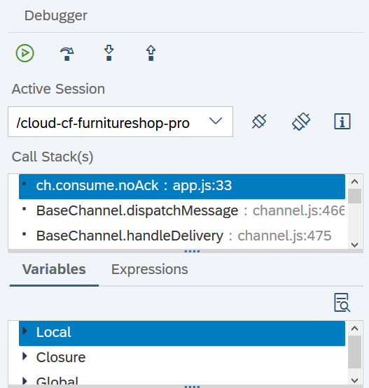

3.	Enlarge the _Variables_ window and navigate to _Local - tweet - status_ to verify that the tweet message is as expected.
  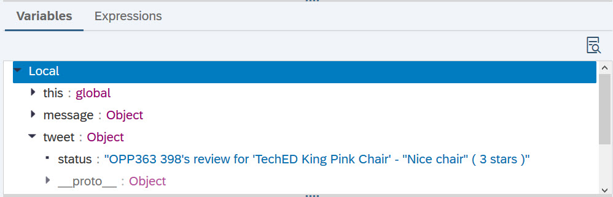

4.	You can now step-over, step-in or step-out of the current function. To resume the application, click on the icon as shown in the below picture.

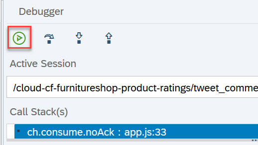

1. You can now refresh the [twitter page](https://twitter.com/sapfurnishop) where you should see a new tweet for the posted comment.

[Top](#Top)

# 4. Cleanup

Let us now clean up by reversing the changes we applied for the current exercise.

1.	Detach the Debugger from the running application.

    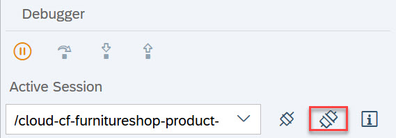

1. Stop the Application instance from the Web IDE (to get a view as shown in the below picture, you may have to first minimise the Debugger view by clicking on the Debugger icon on the right-side menu bar)

    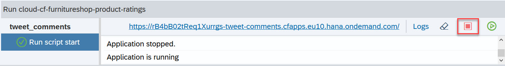

1. Start the tweet_comments application instance from the _SAP Cloud Platform cockpit_

    

[Top](#Top)

© 2018 SAP SE

# Navigation

| Previous | | Next
|---|---|---|
| [Exercise 8 - Tweet Comments Backend](../Exercise-08-Tweet-Comments-Backend) | [Overview](../README.md) | [Exercise 10 - Test Order New Items with User Input](../Exercise-10-Test-Order-New-Items-with-User-Input)
