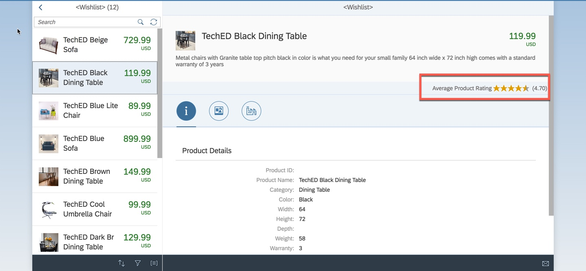

- - - -
Previous Exercise: [Exercise 08 Tweet Comments Backend](../Exercise-08-Tweet-Comments-Backend) Next Exercise: [Exercise 10-Autoscaling of Comments and Ratings](../Exercise-10-Autoscaling-of-Comments-and-Ratings)

[Back to the Overview](../README.md)
- - - -

# Exercise 09 - Test Order New Items with User Input

1. Launch SAP Cloud Platform Cockpit -> Navigate to your space -> Applications -> Choose ui
2. Click on the link under Applciation route to launch the ui application

3. Notice the Ratings field.

4. Try choosing different products and view its ratings.
5. Frank now has all that he needs to order the product as per the ratings he has received

- - - -
© 2018 SAP SE
- - - -

Previous Exercise: [Exercise 08 Tweet Comments Backend](../Exercise-08-Tweet-Comments-Backend) Next Exercise: [Exercise 10-Autoscaling of Comments and Ratings](../Exercise-10-Autoscaling-of-Comments-and-Ratings)

[Back to the Overview](../README.md)
