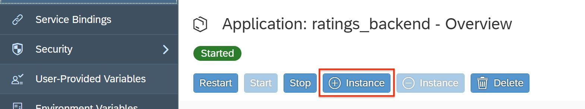

- - - -
Previous Exercise: [Exercise 10-Test Order New Items with User Input](../Exercise-10-Test-Order-New-Items-with-User-Input) Next Exercise: [Exercise 12 Blue Green Deployment of Comments and Ratings](../Exercise-12-Blue-Green-Deployment-of-Comments-and-Ratings)

[Back to the Overview](../README.md)
- - - -

# Exercise 11 - Autoscaling of ratings backend app

Scaling of an application is adding more resources (Memory, CPU, Disk) to it and distributing the load between multiple servers. Two types of scaling that are available are:
- Scaling Up/Vertical Scaling: change the disk and memory quota.
- Scaling Out/Horizontal Scaling: increase/decrease the number of instances.

Key benefits:
- Scaling an application ensures its ability to handle more requests, if necessary. Scalability also provides failover capabilities - if one application process crashes, the application will continue to work. First, when deploying the application, you need to define the minimum and maximum number of application processes. Then, you can scale the application up and down by starting and stopping additional application processes. In addition, you can also choose the compute unit size, which provides a certain central processing unit (CPU), main memory and disk space.


## 1. Pre-requisites
You have completed till [Exercise 06 -  Comments and Ratings](../Exercise-06-Comments-and-Ratings-Backend) and you should have the applications up and running on your SAP Cloud Platform.

In this exercise, we will be performing manual and auto scaling on the comments and ratings backend logic. Consider a scenario where the review application is used by a large number of employees just like Mary, and the memory consumption, CPU usage is increased for this application. To cater to the increasing demand for this application we need to scale up the application so that request can be fulfilled. 

Below we will be using SAP Cloud Platform cockpit and auto scaling policies to perform these operations.

## 2. Configure Manual Scaling in the SAP Cloud Platform Cockpit
We will configure the scaling manually in the SAP Cloud Platform Cockpit. PLease make sure you complete the pre-requisites as mentioned above.

1. Open your SAP Cloud Platform cockpit and go to _Org - Space - Applications_.
2. Locate the `ratings_backend` application.
3. Click on the application to go to the _Overview_ page.
4. Scroll down to see the number of instances already running for the application. It should be 1 and will show _Memory usage_ and _Disk usage_. Check the quota assigned to the application which is `256 MB`.
5. Scroll up and increase the instance of the application by clicking the _+ Instance_ button. This will do the horizontal scaling i.e scaling out.

.

6. When you scroll down you will see the instances count increased to two.

.

7. Now reduce the instance count back to 1 to ensure that we do not exceed the quota limits for the next set of exercises.

8. Now click on Change Quota under Quota Information to do the vertical scaling i.e. scaling up where we will increase the disk and memory quota from 256 MB to 512 MB.

9. Click _Save_ and you will see the quota increased.

.

10. Let’s get back the application to original state, click on change quota to reduce the quota back to `256 MB`.
11. Click _Save_.


## 3. Configure Auto Scaling in the SAP Cloud Platform Cockpit

1.	Go to your SAP Cloud Platform cockpit under _Org - Space_.
2.	Expand the _Services_ tab on left.

.

3.	Click _Service Marketplace_.
4.	Click _Application Autoscaler_, we are performing this step to create an instance of application autoscaler.

.

5.	Click _Instances_ on the left side.
6.	Click _New Instance_.

.

7.	Finish configuration by accepting default values and clicking _Next_ on the subsequent screens
8.	Enter the _instance name_ as `myautoscaling`.

.

9.	Click _Finish_, this will create a autoscaling instance for your applications to use.
10.	Click on the newly created `myautoscaling` instance.
11.	Click _Bind Instance_, we are performing this step to bind our application to this autoscaler instance.

.

12.	In the _Application_ dropdown select the ratings_backend app.
13.	Now copy the contents of `policy.json` from below, edit in Notepad++ editor and then paste it into the `Enter Parameters` text box shown on SAP Cloud Platform cockpit. Scroll down and edit `start_time` to your current time + 4 minutes. and `end_time` to your start time + 4 minutes. 

```
{
	"instance_min_count": 1,
	"instance_max_count": 2,
	"schedules": {
		"timezone": "America/Los_Angeles",
		"scaling_rules": [
			{
				"metric_type": "memoryused",
				"stat_window_secs": 60,
				"breach_duration_secs": 60,
				"threshold": 70,
				"operator": ">",
				"cool_down_secs": 60,
				"adjustment": "-1"
			}
		],
		"recurring_schedule": [
			{
			"start_time": "<Edit this:enter a suitable time in 24 hr format, your current time + 4 minutes. for ex:> 15:10",
			"end_time": "<Edit this:enter a suitable time in 24 hr format, your start time + 4 minutes. for ex:> 15:14",
				"days_of_week": [
					1,
					2,
					3,
					4,
					5,
					6,
					7
				],
				"instance_min_count": 1,
				"instance_max_count": 3,
				"initial_min_instance_count": 3
			}
		]
	}
}
```

For example if your current time is 15:13 then you should put 15:17 under start time and 15:23 as end time. We are adding this time so that once we upload this policy the application will scale up and down under this time frame.

. 

14.	Click _Save_.
15.	 Explanation of the above parameters used: Here we are increasing the instance from 1 to 3, and then bringing it down. Other parameters are mentioned below:

        schedules:	A schedule enables you to configure scaling rules for specific days or on a recurring basis. Schedule guards against expected high surges or low activity period.

        recurring_schedule:	Triggers the scaling rule recursively during the specified intervals.

        start_time:	Start time of a recurring schedule in 24-hr format (HH:MM).

        end_time:	End time of a recurring schedule in 24-hr format (HH:MM).

        days_of_week:	Trigger scaling on weekdays ranging from 1 (Monday) to 7 (Sunday). The rule will execute during the weekdays                             specified within the array.

        instance_min_count:	Minimum number of instances during the recurrence period.

        instance_max_count:	Maximum number of instances during the recurrence period.

        initial_min_instance_count:	Minimum number of instances to scale up during the start of recurrence period.

For more information on parametes refer our [help guide](https://help.sap.com/viewer/7472b7d13d5d4862b2b06a730a2df086/Cloud/en-US/c8023eb0995e42a68697f4262218a032.html). 

16.	You can now see your application under _Referencing Apps_.

.

17.	Click on your `ratings_backend` application, to go back to your _Application Service Bindings_ page. Here you can see the auto scaler instance being created.
18.	Click _Overview_, on the left side.
19.	Scroll down you can see the instances of your application increased to 3 as per the defined policy and the start time mentioned.

.

20.	As per the current policy based on memory threshold, the number of application instances will come down to 2.

- - - -
© 2018 SAP SE
- - - -
Previous Exercise: [Exercise 10-Test Order New Items with User Input](../Exercise-10-Test-Order-New-Items-with-User-Input) Next Exercise: [Exercise 12 Blue Green Deployment of Comments and Ratings](../Exercise-12-Blue-Green-Deployment-of-Comments-and-Ratings)

[Back to the Overview](../README.md)
