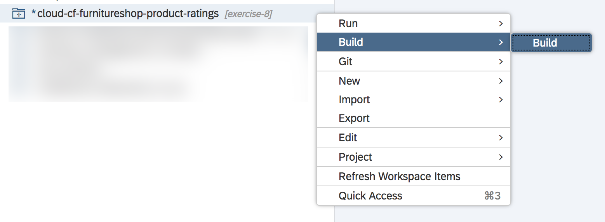
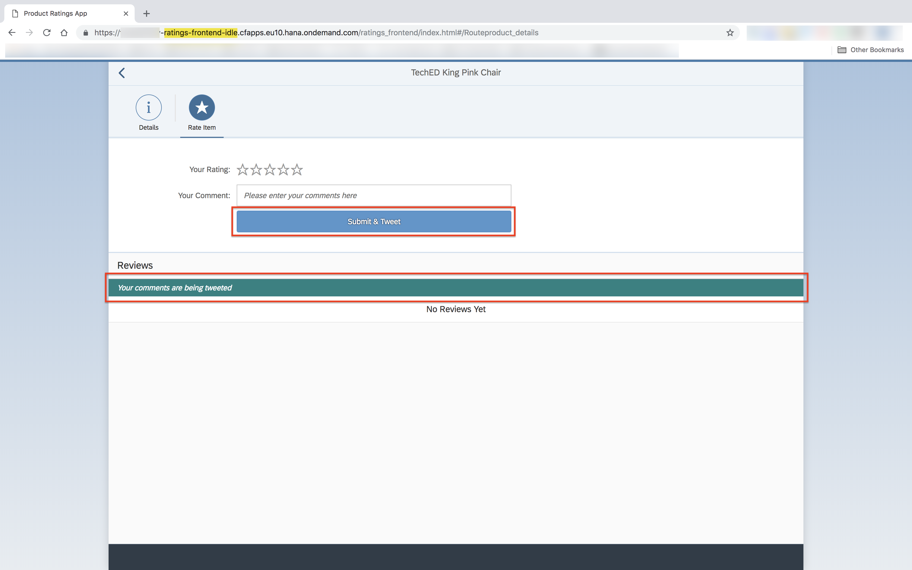
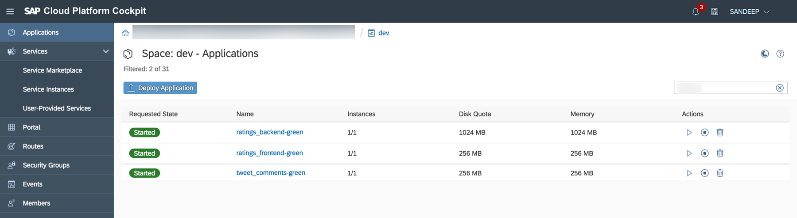

- - - -
Previous Exercise: [Exercise 11-Autoscaling of Comments and Ratings](../Exercise-11-Autoscaling-of-Comments-and-Ratings)

[Back to the Overview](../README.md)
- - - -

# Exercise 12 - Blue Green Deployment of Comments and Ratings
In this exercise you will learn about Blue Green deployment of multi-target applications (MTA).
## What is Blue Green deployment?
Blue-Green deployment is a technique that reduces downtime and risk by running two identical production environments called Blue and Green.

At any time, only one of the environments is live, with the live environment serving all production traffic. For this example, Blue is currently live and Green is idle.

As you prepare a new version of your software, deployment and the final stage of testing takes place in the environment that is not live: in this example, Green. Once you have deployed and fully tested the software in Green, you switch the router so all incoming requests now go to Green instead of Blue. Green is now live, and Blue is idle.

   


This technique can eliminate downtime due to application deployment. In addition, Blue-Green deployment reduces risk: if something unexpected happens with your new version on Green,you can immediately roll back to the last version by switching back to Blue.


## Scenario

Consider the following scenario.

At the end of Exercise-7 we  built an application which allows Mary to submit her ratings and reviews for Franck's wishlist.
At the end of Exercise-8, we built a twitter module `tweet_comments` which posts Mary's comments on to twitter.
However, Mary does not know that her ratings and reviews are being posted on twitter. Thus we have decided to update our UI to notify Mary that her reviews are being tweeted. Now, since Mary is already using the `Comments and Ratings` application we need to ensure that the newer version doesn't hinder her from using the application.

This is where Blue-Green deployment comes in. Mary is using the application deployed at the end of Exercise-8 (Blue version). We will make our changes in the code and use the SAP Cloud Platform capability to deploy an updated version of the application (Green version) through Blue-Green deployment. This will create a new application with a unique URL for you to test your changes. While you test the Green version, Mary can continue using the Blue version. Once you are satisfied with your changes, you will finish the Blue-Green deployment process at the end of which you will only have the updated version running with Mary accessing the updated version through the URL that she used to access the Blue version.

## 1. Update the UI
We will make small changes to the user interface so that Mary knows that her reviews are being posted on twitter.

1. Open the i18n.properties file using WebIDE.
     

2. Find keyword `submitButton`, as shown in the image,  and update the value from `Submit` to `Submit & Tweet`

     

    ```properties
    submitButton=Submit & Tweet
    ```
3. Add a new keyword `feedInfoToolbar` with value `Your comments are being tweeted` as shown in the image.

    

    ```properties
    feedInfoToolBar=Your comments are being tweeted
    ```

4. Open `product_details.view.xml` in WebIDE
    
  * Replace the code starting at `<List id=idReviewsList>` and ending at `</List>` tag with the following code.
     ```xml
        <List id="idReviewsList" items="{reviewsModel>/reviews}" noDataText="{i18n>noCommentsTitle}" growing="true" growingThreshold="10" growingScrollToLoad="true">
            <headerToolbar>
                <Toolbar>
                    <Title text="{i18n>reviewsTabTitle}" level="H2" />
                </Toolbar>
            </headerToolbar>
            <infoToolbar>
                <Toolbar>
                    <Label text="{i18n>feedInfoToolBar}"/>
                </Toolbar>
            </infoToolbar>
            <FeedListItem sender="{reviewsModel>username}" icon="sap-icon://person-placeholder" iconDensityAware="false" info="{reviewsModel>rating}"
                text="{reviewsModel>comments}" convertLinksToAnchorTags="All"></FeedListItem>
        </List>
     ```
4. Open the `mta.yaml` file and change the `version`, as shown in the image, to `1.0.2`.
    

    ```yaml
    version: 1.0.2
    ```

## 2. Deploying the updated version using Blue-Green deployment
knows that her reviews are being posted on twitter.

1. Right click on the **`cloud-cf-furnitureshop-product-ratings`** folder, go to `Build` and click **Build** as shown in the picture below.

   

   Once the build is completed successfully, you will see a new folder created in your Web IDE's File Explorer with the name **`mta_archives`**.

2. To download the  MTAR file use the **Export** option as shown in the image.

   

   Note:
   * Please ensure that you export `product_ratings_1.0.2.mtar` file.
   * The download may take few minutes.
   * The mtar file will be saved to your users downloads folder. You may move it to another folder for your convenience but we will further refer to the location of this file as the `mtar_location`.

3. Next you will need to log into Cloud Foundry using the Command Line Interface (CLI), which you have set up in [Exercise 01](../Exercise-01-Setup). In the terminal window type `cf login`.

    

    * Make certain that the endpoint is `https://api.cf.eu10.hana.ondemand.com` otherwise, logout using:

        `cf logout` and then log in using:

        `cf login https://api.cf.eu10.hana.ondemand.com`

4. Select `TechEd2018_OPP363` as the `org` and `OPP363_SPACE_XX` as the space.

5. Deploy the archive using Blue Green deployment with the command:

    ```
    cf bg-deploy <Path to Mtar>/product_ratings_1.0.2.mtar
    ```
    This deployment may take several minutes. At the end of the deployment you should see the following:

    

    Make a note of these commands as you will be using them in the upcoming steps. Please note that your process ID will be different than the ones shown in the image and redo the step.

    Note: If your deployment fails due to insufficient memory, then please stop your Web IDE builder on the SAP Cloud Platform Cockpit as shown in the images.

    

    


6. Open the SAP Cloud Platform cockpit to validate the application and services are running correctly.
    * Log in to the [SAP Cloud Platform cockpit](https://account.hana.ondemand.com/cockpit).
    * Navigate to the correct space by selecting the Account `TechEd2018`, the Sub account `OPP363CF`, and the space `OPP363_SPACE_XX`.
    * You should see 3 new applications started in the **Applications** tab of your space:
        * ratings_backend_green
        * ratings_frontend_green
        * tweet_comments_green

    

7. Click on `ratings_frontend_green`.
    
    You will see that the app URL for this application has the keyword 'idle' in it. This is an indication that the currently active version, the one being used by Mary, is the `ratings_frontend` app and not `ratings_frontend_green`.

8. Now, let's see how the two URLs point to two different applications.
    * In the `ratings_frontend_green` app, click on the application URL that you see.
    

    * In the `ratings_frontend_green` application, click on an Item and go to the `Rate Item` tab.
    

    * In your SAP Cloud Platform cockpit, go to the `ratings_frontend` app and click on the application URL.
    

    * In the `ratings_frontend` application, click on an Item and go to the `Rate Item` tab.
    

    This is the app that Mary is currently using. You can see that the changes we deployed are not available on the currently active version (Blue version).

9.  Now that we have verified that our Green version is working fine, we will make it the active version. In your CLI tool enter the command, that you noted in Step 6, to resume Blue Green deployment.

    ```
    cf bg-deploy -i <PROCESS ID> -a resume
    ```
    Note: If your deployment is stuck at `ratings_backend`, you may have to close the web browser tabs where you are running the `ratings_frontend` applications.

10. Once the `bg-deploy resume` is successful, go to your SAP Cloud Platform cockpit. You should now see only the *`*-green`* applications.
    

    The `bg-deploy resume` command has deleted the older version of

11. Click on `ratings_frontend_green`.
    

    The `bg-deploy resume` command has deleted the temporary routes, the ones with **idle** in them, and has mapped the active route the one that mary has, to the updated application.

    Note: If you can't see the updated view, you might have the older version in your browser cache. In such a case, open the URL in an 'Incognito' or 'Private' mode.

12. To verify that the old route is running the updated version of the application, click on `ratings_frontend_green` application's URL.

    

## Appendix

* [Further reading on Blue-Green deployment on SAP Cloud Platform](https://help.sap.com/viewer/65de2977205c403bbc107264b8eccf4b/Cloud/en-US/764308c52e68488dac848bae93e9137b.html)
* [Blue-Green deployment on Cloud Foundry]((https://docs.cloudfoundry.org/devguide/deploy-apps/blue-green.html))
- - - -
© 2018 SAP SE
- - - -

Previous Exercise: [Exercise 11-Autoscaling of Comments and Ratings](../Exercise-11-Autoscaling-of-Comments-and-Ratings)

[Back to the Overview](../README.md)
