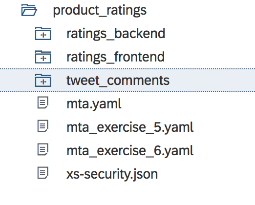
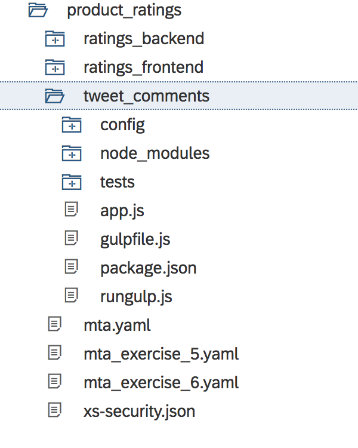
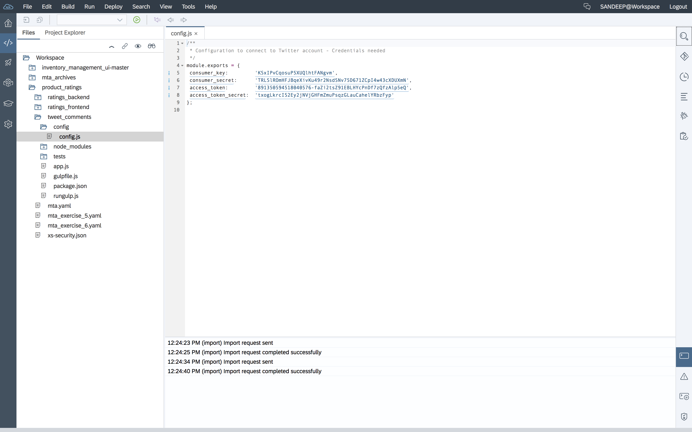
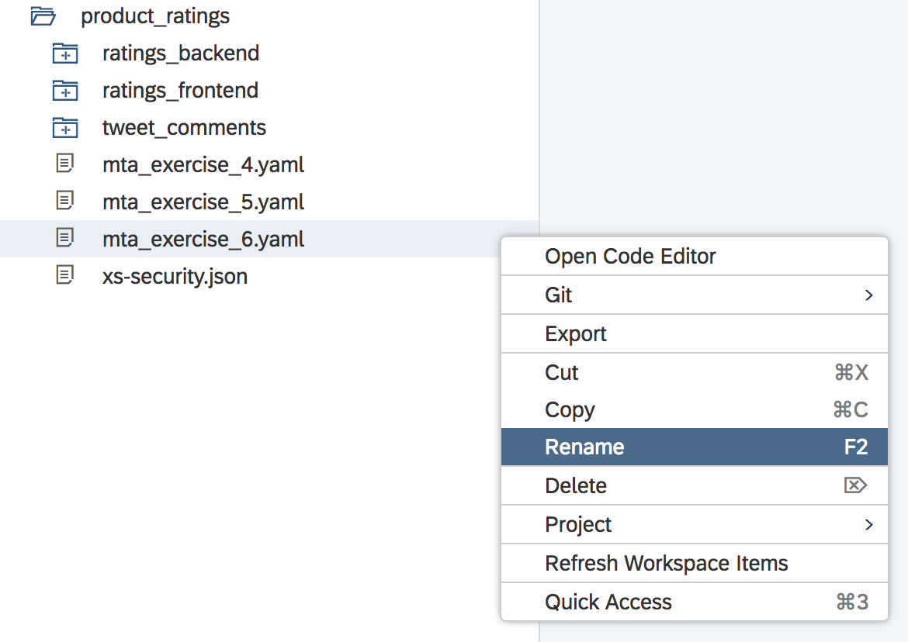
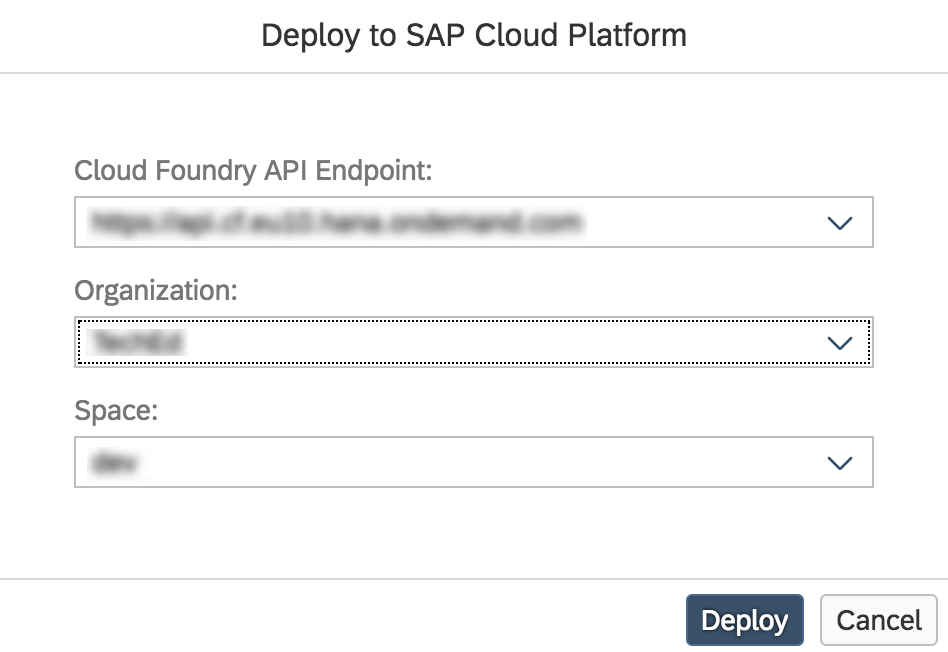
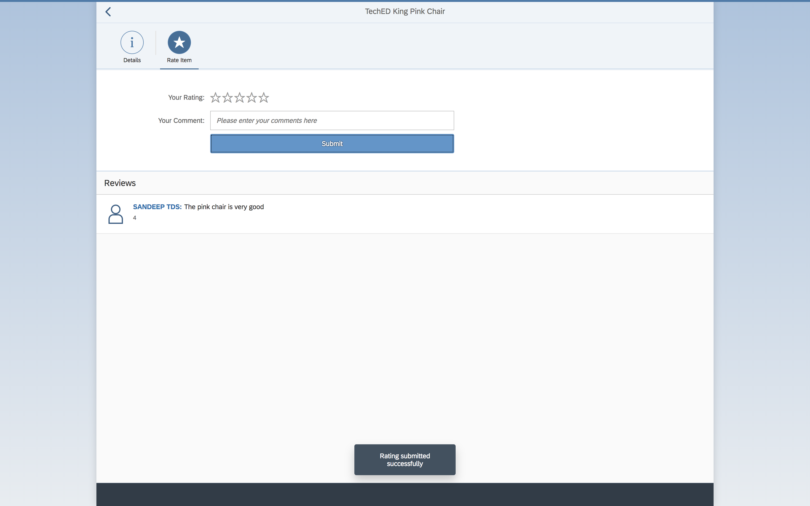

- - - -
Previous Exercise: [Exercise 5 - Comments and Ratings Frontend](../Exercise5_Comments_and_Ratings_Frontend) Next Exercise: [Exercise 7 - Autoscaling of Comments and Ratings](../Exercise7_Autoscaling_of_Comments_and_Ratings)

[Back to the Overview](../README.md)
- - - -

# Exercise 6 - Tweet Comments Backend

Mary who is a loyal customer of home furniture franchise has access to the customer portal to provide ratings and comments on the wishlist which Franck has uploaded. Based on the feedback from customers Franck would add highly rated items into his furniture store.

The user interface to provide ratings and comments was completed in Exercise 5 and the backend (Node.js module) to store ratings and comments was completed in Exercise 4.

Once the comments are published on to RabbitMQ by Excercise 4, in this module we pick the same message from the queue and publish it to Twitter.

## 1. Developer Guide

1. Source code for this Nodejs module was cloned as has part of Exercise 4.
    * Click the development icon on the navigation view, the cloned application is displayed; expand the application.

        

2. Our focus for this exercise is tweet_comments module and enhance it further.

    

    * For a Node.js application `package.json` file is the core and it lists all the packages that your module depends on. For every application there is launch file which gets executed when the program is deployed.

        This launch file is specified in `script` property under a start tag; in our case it is `app.js`.

        

    * Uncomment the code in `app.js`, notice the connection to RabbitMQ instance, creation of channel and consume the incoming messages from the queue are achieved this block of code.

        

        Once the message is received the same is posted on to Twitter.

    * The keys to configure Twitter account is saved in `config.js` under the `config` folder.

        

    * Now once Mary posts comments on products, the queue waiting in this module would read the message and post it to Twitter.

### 2. Deploying the Application
In this section you will build and deploy the application that you have built in Exercise 6.

1. Using your File Explorer in Web IDE, rename the **`mta.yaml`** file to **`mta_exercise_5.yaml`** as shown in the picture below.

   

2. Using your File Explorer in Web IDE, rename the **`mta_exercise_6.yaml`** file to **`mta.yaml`** as shown in the picture below.

   

3. Using your File Explorer in Web IDE, right click on the **`product_ratings`** folder, go to `Build` and click **Build** as shown in the picture below.

   

   Once the build is completed, you will see a new folder created in your Web IDE's File Explorer with the name **`mta_archives`**.

4. Using your File Explorer in Web IDE, right-click on the generated .mtar file **`product_ratings`**, and go to Deploy &rarr; and click on **Deploy to SAP Cloud Platform** as shown in the picture below.

    

5. In the popup that appears, please enter the following details and click _Deploy_.

    

    ```
    Cloud Foundry API Endpoint: ``//TODO: Add the end point
    Organization: ``//TODO: Add your organization
    Space: Select your space from the drop down list
    ```
6. //TODO: @Sanjay to add the generic line about checking the services and logs as done in the earlier exercise.

7. Once your application is deployed launch the url for ratings_frontend app.

8. Give the product a rating and comment and click on submit.

    

9.  In your web browser, go to this [twitter handle](https://twitter.com/sapfurnishop)  to see your comment posted as a tweet.

    


    Twitter handle URL: https://twitter.com/sapfurnishop

- - - -
© 2018 SAP SE
- - - -

Previous Exercise: [Exercise 5 - Comments and Ratings Frontend](../Exercise5_Comments_and_Ratings_Frontend) Next Exercise: [Exercise 7 - Autoscaling of Comments and Ratings](../Exercise7_Autoscaling_of_Comments_and_Ratings)

[Back to the Overview](../README.md)
