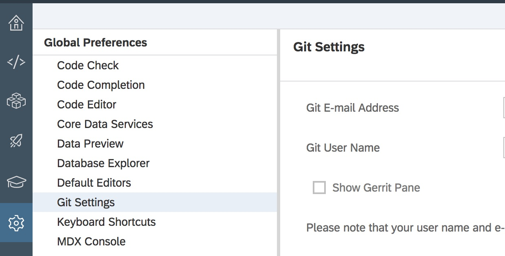
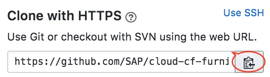
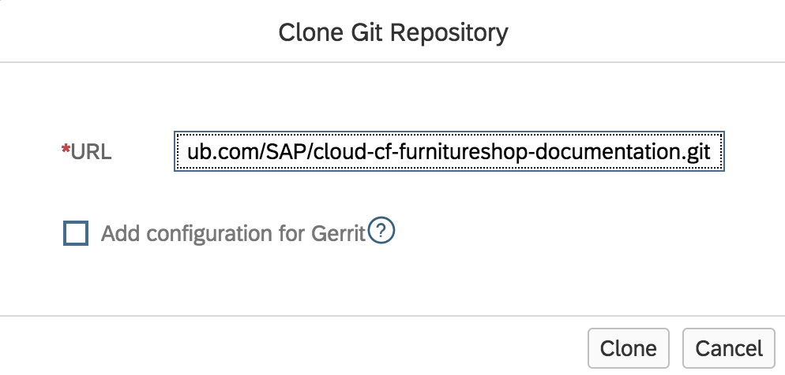
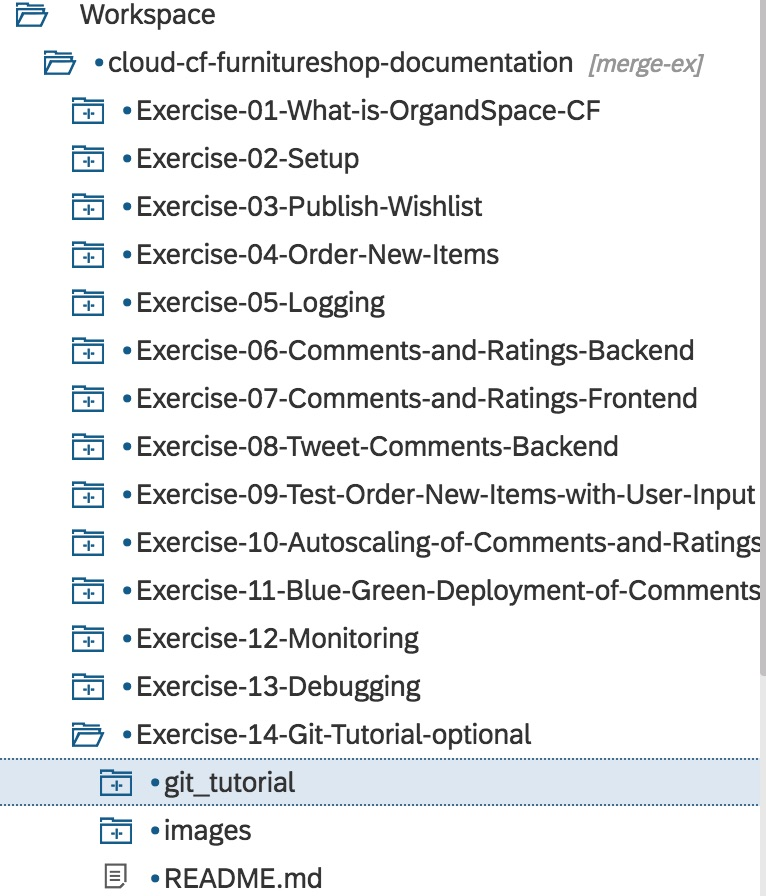
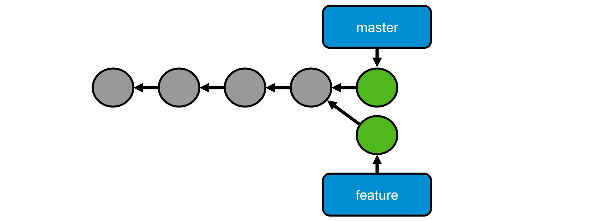
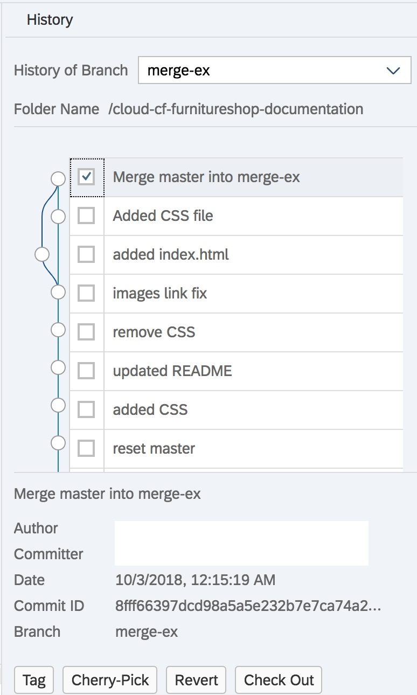

- - - -
Previous Exercise:  [Exercise 12 - Blue Green Deployment of Comments and Ratings](../Exercise-12-Blue-Green-Deployment-of-Comments-and-Ratings) Next Exercise: [Building MTAR Applications On Your Local Machine](../Optional-Exercise-Local-MTAR-Build)

[Back to the Overview](../README.md)
- - - -
# Exercise 14 - Git Tutorial (optional)
## Purpose of this tutorial
The pupose of this tutorial is to get the reader up to speed on how to use Git as fast as possible so that they are able
to work with the repositories used in the rest of the hands-on session. This tutorial will not deep dive into what Git is
or how it is different from other version control systems. If you would like to master Git and learn how to use Git as an
SAP developer please attend the excellent, free openSAP course [SAP Cloud Platform Version Control with Git](https://open.sap.com/courses/git1).

The goals of this tutorial are as follows:
1. Learn about Git and GitHub.
2. Discover repositories on GitHub.
3. Clone a repository from GitHub to your WebIDE tenant.
4. Learn about branches in Git.
5. Work with branches by creating a new branch and adding commits to that branch.
6. Merge one branch with another branch.
7. Rebase one branch onto another branch.

Let's get started ...

## Step 1. Learn about Git and GitHub.
Git is a distributed version control system. This means that unlike central source code version control or document management
systems where developers and content providers share files in a central repository, users work with files locally on their
laptop, computer or device and only upload their changes to a shared repository when they need to.

In a distributed version control system, the developer works on his local repository while occaisionally fetching code 
changes uploaded by other developers from the central repository. As a result, Git provides a mechanism to commit changes, 
merge those changes into exisitng code, and then resolve any conflicts. 

One of the strategies used to handle multiple code changes is the use of branches. Branches allow developers to develop new
features and bug fixes without changing the shared code (called the origin master branch). The developer can then synchronize
their local copy of the shared code (called the master branch) and then merge their changes from the feature or bug fix branch 
with their master branch.

## Step 2. Discover repositories on GitHub.
It is now time for you to get familiar with GitHub. GitHub is a web-based hosting service for version control using Git. 
It offers all of the distributed version control and source code management of Git as well as adding its own features.

1. Visit [SAP@GitHub](https://www.github.com/SAP) to view over 200 SAP projects on GitHub. These projects provide code and 
instructions on how to run it. Optionally, visit the [Explore GitHub](https://www.github.com/explore) page to find even more 
projects.


1. Next, search for cloud cf repositories from SAP. Type `org:SAP cloud-cf` in the search box. Locate the three repositories 
we will use for this session:
    * cloud-cf-furnitureshop-documentation
    * cloud-cf-furnitureshop-demo
    * cloud-cf-furnitureshop-product-ratings
    
1. If you are not already a member of GitHub, sign up by clicking the `sign up` link.
    
## Step 3. Clone a repository from GitHub to your WebIDE tenant.


In this exercise you will configure WebIDE to connect to GitHub and clone a repository.
1. Open Web IDE, select **Preferences**, select **Git Settings**, enter your GitHub account email address and user name.
   
   

1. Select **Development** to show the developer view of WebIDE. Right click on **Workspace** and select **Git**, select **Clone Repository**.

1. Switch back to **GitHub** and select the [documentation repository](https://github.com/SAP/cloud-cf-furnitureshop-documentation).

1. Click on the **Clone or download** button and then click on the **copy to clipboard** button.
   

1. Switch back to the Web IDE tab. Paste the web URL to the git repository into the **Clone Git Repository** dialog. 
   * Do **not** tick *Add configuration for Gerrit*. 
   * Click **Clone**.
    
    

1. Expand the repository folder in WebIDE. Open the folder **Exercise-14-Git-Tutorial-optional**. Open the folder **git-tutorial**.

    

Note: there should not be any files in the `master` branch of the **git-tutorial** folder.

## Step 4 Learn about branches in Git.
In WebIDE, when a change is made to a file and saved, it is only saved to the WebIDE environment and does not become part 
of the Git repository. In order for the change to be incorporated in the repository it must be added to a commit. 
In WebIDE, you do this by first saving the file and then staging the file by clicking the **Stage** tick box next to the file 
name in the Git pane. Next you need to add a message that describes what you are committing and then you will need to click 
the **Commit** button.


In Git, a branch is a pointer to a commit. In the `master` branch for the current repository (`cloud-cf-furnitureshop-documentation`) it is pointing to the latest commit made to this repository. 


You can discover the latest commit and the commit history by selecting the project folder for the repository and then clicking 
on **Git History** in the tool bar on the right of the IDE.

## Step 5 Create a new branch.
In this exercise we will create a new **feature branch** for this repository. Imagine for a moment that you are working on a
new feature for a product your development team is responsible for. Using Git, you decide to create a new **feature branch** 
for the new **feature** you will develop. You decide to use a feature branch because you do not wish to modify the source code 
in the master branch directly until your feature is completed and tested. This way, you will minimize the disruptive effect 
of your change to the work of other developers in your team.


1. In WebIDE, select the project folder for the project `cloud-cf-furnitureshop-documentation`.

1. Open the Git pane by selecting the **Git Pane** button on the toolbar to the right of the IDE.

1. The Git pane will display the name of the repository you are working on and the name of the branch (`master`) that you 
are currently viewing. Next to the **branch** selection is a **+** sign for adding new braches. Click the **+** sign to add a new branch.

1. In the **Create a New Local Branch** dialog select `master` as the source branch and give the new branch the name: 
`step-5-create-branch-ex`.

1. Expand to the **git-tutorial** folder as described above and right click on the folder. Add a new HTML file: 
select **New**, select **File**, name the file `index.html`.

1. Copy the following HTML in to the file:
    ```
    <!DOCTYPE html>
    <html lang ="en">
        <head>
            <meta http-equiv="Content-Type" content="text/html; charset=utf-8"/>
            <title>An Empty Web Page</title>
        </head>
        <body>
            <h1>This web page is blank.</h1>
            <h2>(Well, mostly blank, anyway.)</h2>
            <ul>
                <li>"You can observe a lot by watching" -- Yogi Berra</li>
            </ul>
        </body>
    </html>
    ``` 
1. Save, stage and commit the changes.

## Step 6 Merge the changes into the master branch.
Now that you have completed and tested your feature, you want to merge the feature into the master branch and share it 
with other developers.

1. Add a new commit to the `master` branch:
    1. Select the **git-tutorial** folder and right click on the folder.

    1. Select **New**, select **File**, name the file `style.css`

    1. Copy the following CSS in to the file: 
        ```
        h1 {
            color:blue;
            text-align: left;
        }
        h2 {
            color:red;
        }
        ```
    1. Save, stage and commit the changes.

1. View the branches using the **Git History** pane:
    * Select the project folder `cloud-cf-furnitureshop-documentation` and click the **Git History** button to open the pane.
    * Open the **History of Branch** drop down list and select the `master` and the `step-5-create-branch-ex` branches.
    * Observe how the feature branch now deviates from the master branch.
    
    
    
1. Merge the changes onto the master branch: 
    * Select the **git-tutorial** folder and open the Git pane.
    * Make sure the `step-5-create-branch-ex` branch is selected and click the **Merge** button.
    * Merge the `step-5-create-branch-ex` branch onto the `master` branch.
    
1. The **Merge** will create a new commit on the `step-5-create-branch-ex` branch to reference the changes made by the merge.
View the **Git History** for the two branches by following the same steps described above. Select the **Merge** commit and 
observe that the commit is only referenced by the `step-5-create-branch-ex` branch.

    

1. Fast-forward merge the `master` branch onto the `step-5-create-branch-ex` branch.
    * Select the **git-tutorial** folder and select the `master` branch form the **Git pane**.
    * Merge the `master` branch onto the `step-5-create-branch-ex` branch.
    * Observe that both branches now point to the same branch.
    * You may now delete the `step-5-create-branch-ex` branch.

1. Check your work: if you would like to make certain that you have achieved the right solution and can compare the `master`
branch to the `step-5-create-branch` solution branch. A brief visual inspection should show that the files are the same in both branches.


The exercise above demonstrated how you, as a developer, can build new features and then merge those features into the main 
product code once the feature is fully developed, tested and bug-fixed. Normally, after the merge, the `master` branch would 
changes would be **pushed** back to the origin repository to make them available to other developers however we are not allowing
changes to our sample repository.

## Step 7 Rebase one branch onto another branch.
In some circumstances, it is better to retain all the commits that went into developing the feature and adding these commits 
to the `master` branch in sequence. This avoids issues when trying to audit the commit history where teams use multiple branches
to develop features and bug-fixes. To accomplish this you would use **Rebase** instead of **Merge** to incorporate changes from one branch
into another.

1. Reset the `master` branch by deleting the HTML and CSS files. Stage and commit these changes.

1. Repeat Step 5 and 6 above to create the two different branches but without **Merging** the `step-5-create-branch-ex` branch
into the `master` branch.

1. Instead, choose **Rebase**. Notice that after the rebase, in the **Git History** pane, that the commits are no longer
split and merged but follow a straight line.

1. Perform a fast-forward merge of the `master` branch onto the `step-5-create-branch-ex` branch and delete the `step-5-create-branch-ex`
branch.

You should now have the same result in the master branch but with a commit history that tells a linear story of commits.

## Appendix

* openSAP: [SAP Cloud Platform Version Control with Git](https://open.sap.com/courses/git1).
* [GitHub definition on Wikipedia](https://en.wikipedia.org/wiki/GitHub).
- - - -
© 2018 SAP SE
- - - -

Previous Exercise:  [Exercise 12 - Blue Green Deployment of Comments and Ratings](../Exercise-12-Blue-Green-Deployment-of-Comments-and-Ratings) Next Exercise: [Building MTAR Applications On Your Local Machine](../Optional-Exercise-Local-MTAR-Build)

[Back to the Overview](../README.md)
