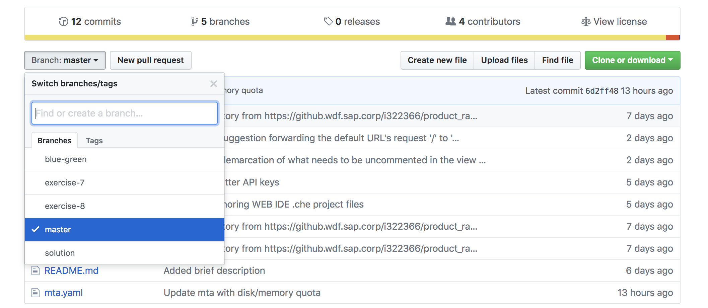
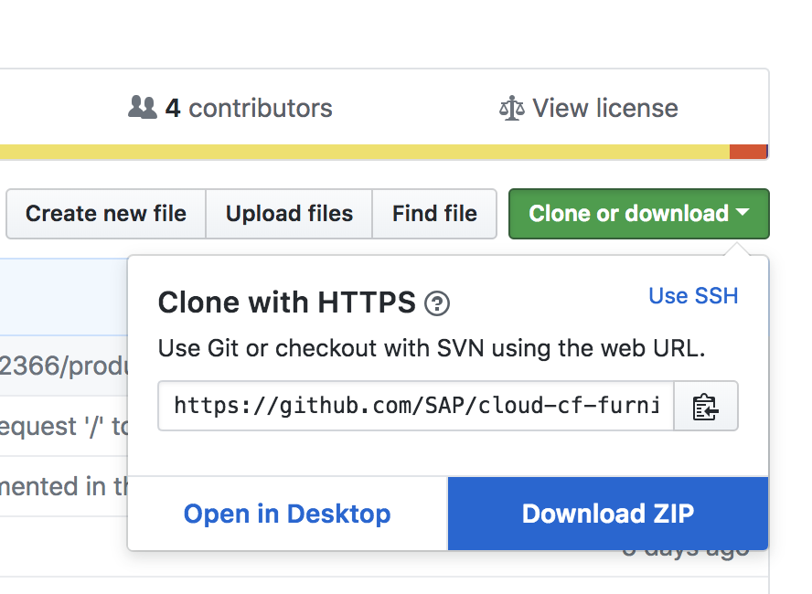
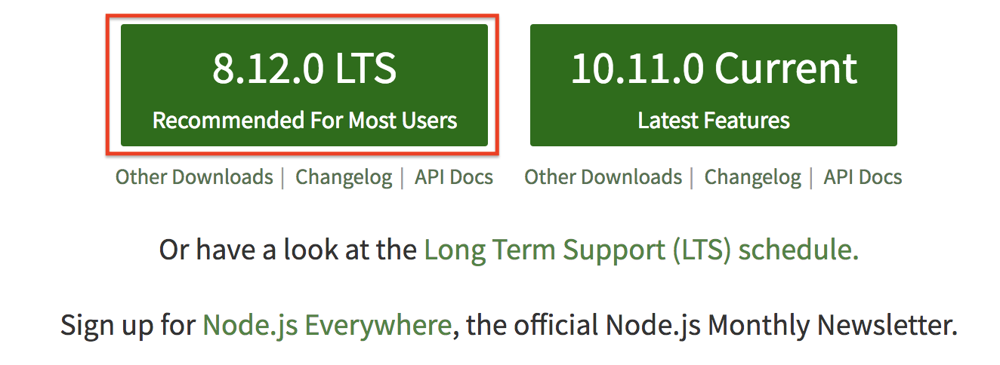

# Building MTAR Applications On Your Local Machine

In this document, we will go over the steps required to build an MTAR application on your local system and deploy it through Cloud Foundry - Command Line Interface (CF CLI) tool.

## 1. Setup

To ensure that you system is capable of building mtar files locally we need to set it up first.

1. **JAVA** - The systems provided to you should already have JAVA running. To verify that you have it running properly on your system, execute the following command in your terminal (or) command prompt
    ```bash
    java -version
    ```
    You should see the version of JAVA that you are running

2. **Node & NPM** - The systems provided to you should already have Node and NPM running. To verify that you have them running properly on your system, execute the following command in your terminal (or) command prompt
    ```bash
    node --version
    ```
    ```bash
    npm --version
    ```
    You should see the version of Node and NPM that you are running

3. CF CLI - The systems provided to you should already have CF CLI running. To verify that you have it running properly on your system, execute the following command in your terminal (or) command prompt
    ```bash
    cf version
    ```
    You should see the version of CF CLI that you are running


4. Download the MTA Builder JAR.
    * Download the MTA builder JAR file from [here](https://tools.hana.ondemand.com/additional/mta_archive_builder-1.1.7.jar) .
    * Rename the the downloaded file to `mta.jar`.

## 2. Building An MTAR Locally For A Project

1. To build an MTAR, you will need your project to be present locally. You may either clone your GIT project, or simply download the project as a ZIP.

2. To clone your GIT Project Locally, copy the project's GIT URL and follow the steps mentioned in this [link](https://git-scm.com/book/en/v2/Git-Basics-Getting-a-Git-Repository).

3. To download the project as an archive follow these steps:
    * You can use the same GitHub-URL as the one provided to you for cloning.
   ```url
   Example - https://github.com/SAP/cloud-cf-furnitureshop-product-ratings.git
   ```
    * From the branches list, select the branch that you wish to work on.
       

    * Click on the Clone or *Download Button* on the top-right corner and then click on **Download Zip**
        

4. Extract the project archive that you've downloaded

5. Open your CF CLI tool and navigate to the folder you extracted in the previous step. Verify that you are in the correct directory by ensuring the presence of mta.yaml file inside it.

6. Execute the following command
    ```bash
    java -jar <PATH TO MTA.JAR>/mta.jar --build-target=CF build
    ```
    This will create a `.mtar` file in your current working directory.

7. Once your build is successfully , use the following command to deploy your app to your SAP Cloud Platform - Cloud Foundry Space.
    ```bash
    cf deploy <Name of the mta>.mtar
    ```

## Appendix

If your system doesn't have **JAVA, Node, NPM or CF CLI** please refer to the points mentioned in this section.

1. In case JAVA isn't running please follow these links to setup JAVA on your system:
    * [Windows](https://docs.oracle.com/javase/8/docs/technotes/guides/install/install_overview.html#A1096936)
    * [MacOS X](https://docs.oracle.com/javase/8/docs/technotes/guides/install/mac_jdk.html)
    * [Linux](https://docs.oracle.com/javase/8/docs/technotes/guides/install/install_overview.html#A1097144)

2.  In case Node or NPM isn't running please follow these steps:
    * Go to the [Nodejs Org website](https://nodejs.org/en/).
    * Download the version which is recommended for most users, as seen in the image.
    
    * Launch the installed file and complete your installation using the wizard.
    * You may have to update your npm, thus to update your npm use the following command
        ```bash
        npm update
        ```
    * If you are unable to install node correctly please refer to this [link](https://docs.npmjs.com/getting-started/installing-node#1-install-nodejs--npm)

3. In case your CF CLI is not setup please follow these steps:
    * Follow the steps mentioned in this [link](https://github.com/SAP/cloud-cf-furnitureshop-documentation/tree/master/Exercise-02-Setup#6-install-the-cloudfoundy-cli) if you haven't set up CF CLI tool
    * Once you've installed your CF CLI tool, follow the steps mentioned in the 4th point [here](https://github.com/SAP/cloud-cf-furnitureshop-documentation/tree/master/Exercise-11-Blue-Green-Deployment-of-Comments-and-Ratings#2-deploying-the-updated-version-using-blue-green-deployment) to login into your SAP Cloud Platform - Cloud Foundry Space.

4. If you plan to clone your git project, please follow the steps mentioned [here](https://git-scm.com/downloads) to setup git on your local system.

   Note: For the purpose of this exercise, we recommend you download the project as an archive from GitHub.

- - - -
© 2018 SAP SE
- - - -